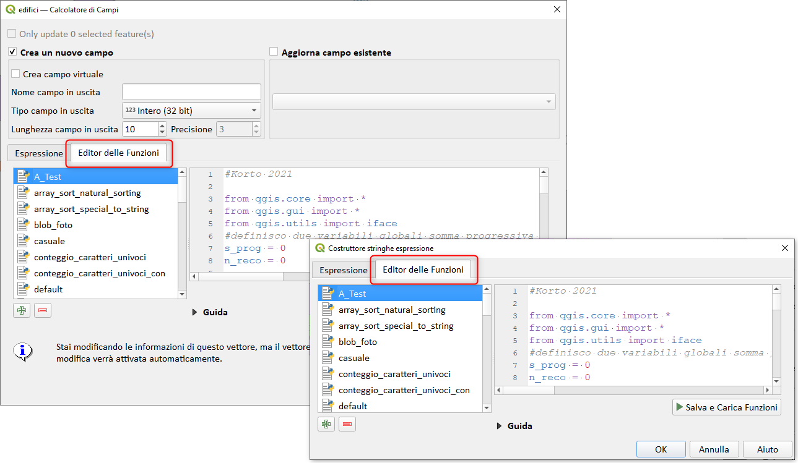
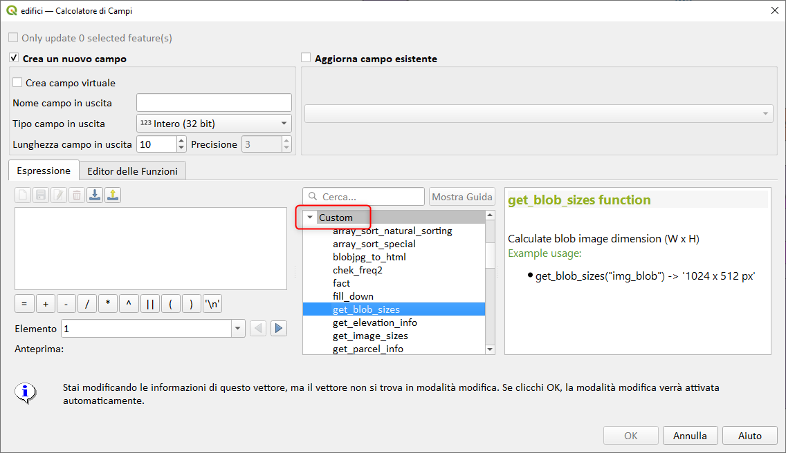

---
tags:
  - concetti
  - propedeutico
  - fieldCalc
  - custom
---

# Editor delle funzioni

Con la scheda `Editor delle funzioni` , puoi scrivere le tue funzioni in linguaggio `Python`. Ciò fornisce un modo pratico e comodo per soddisfare esigenze particolari che non sarebbero coperte dalle funzioni predefinite.

La scheda è raggiungibile dall'interfaccia del Calcolatore di Campi o da qualsiasi interfaccia che permetta l'accesso al `Costruttore stringhe espressione`:

## Creare una nuova funzione

1. premere il pulsante  per aggiungere nuovo file;
2. immettere un nome da utilizzare nel modulo che si apre e premere OK;
3. un nuovo elemento con il nome fornito viene aggiunto nel pannello di sinistra della scheda Editor funzioni; questo è un file Python sul file modello QGIS e memorizzato nella /python/expressions cartella sotto la directory del profilo utente attivo;
4. il pannello di destra mostra il contenuto del file: un modello di script Python.
5. aggiorna il codice e il suo aiuto in base alle tue esigenze; 
6. premere il pulsante `Salva e carica funzioni`. La funzione che hai scritto viene aggiunta all'albero delle funzioni nella scheda `Espressione`, per impostazione predefinita nel gruppo `Custom`

NB: Le funzioni Python personalizzate sono memorizzate nella directory del profilo utente, il che significa che ad ogni avvio di QGIS, caricherà automaticamente tutte le funzioni definite con il profilo utente corrente. Tieni presente che le nuove funzioni vengono salvate solo nella cartella `C:\Users\nomeUtente\AppData\Roaming\QGIS\QGIS3\profiles\default\python\expressions` e non nel file di progetto. Se condividi un progetto che utilizza una delle tue funzioni personalizzate dovrai condividere anche il file `*.py`.

## Eliminare una funzione personalizzata

1. abilita la scheda `Editor delle funzioni`;
2. selezionare la funzione nell'elenco; 
3. premere l'icona , la funzione verrà rimossa dall'elenco e il file corrispondente viene eliminato dalla cartella del profilo utente.

per maggiori info, vai alla [guida QGIS](https://docs.qgis.org/testing/en/docs/user_manual/expressions/expression.html?#function-editor)

## Esempi

Nella sezione [`Funzioni Custom`](https://hfcqgis.opendatasicilia.it/gr_funzioni/custom/custom_unico/) ci sono oltre 15 esempi di funzioni personalizzate, grazie a **Giulio Fattori**