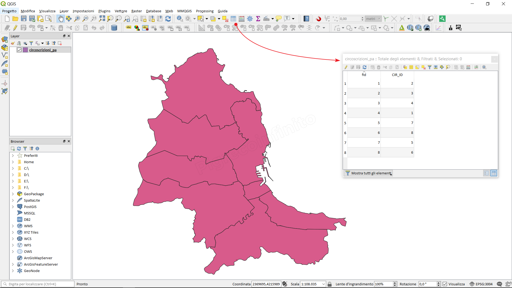
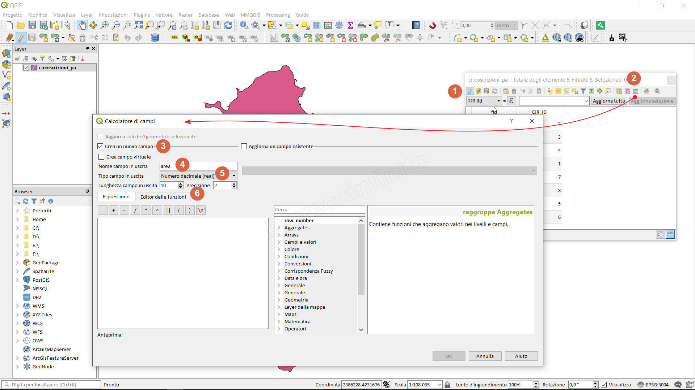
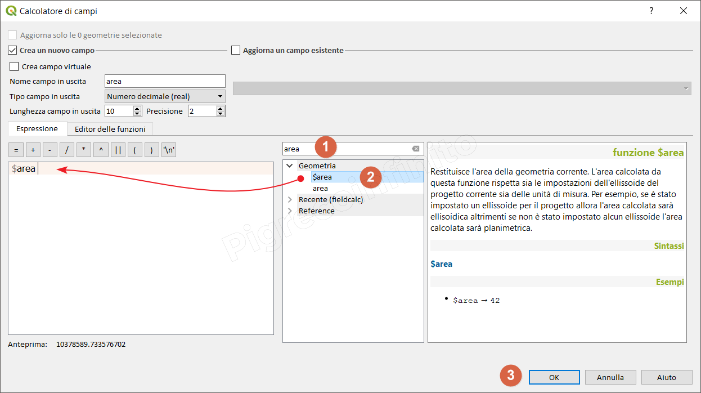
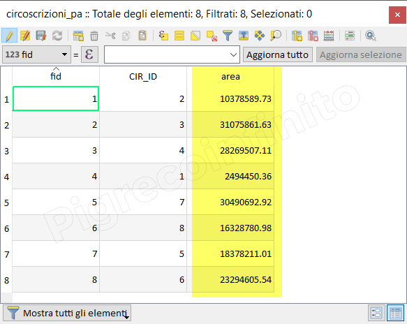

---
tags:
  - aggiungi colonna area
---

# Come aggiungere colonna con area [m²]

Facciamo un esempio, geopackage con vettore poligonale:

selezionare il layer (presente nel _Layer Panel_), tasto destro mouse 'Apri tabella attributi' oppure cliccare sull'icona  oppure tasto funzione F6

1. attivare editing;
2. aprire calcolatore di campi 
3. crea nuovo campo;
4. digittare nome campo **area**;
5. tipo campo uscita Real;
6. lunghezza uscita 10 e 2;

1. nella casella ricerca digitiamo il nome della funzione: **area**
2. doppio clic sulla funzione **\$area** per aggiungerla;
3. **OK** per eseguire;

verrà aggiunta la colonna _area_ e popolata con la funzione [\$area](../gr_funzioni/geometria/geometria_unico.md#area)

il geopackage è scaricabile [qui](../prova_tu/dati_esempi.zip)

