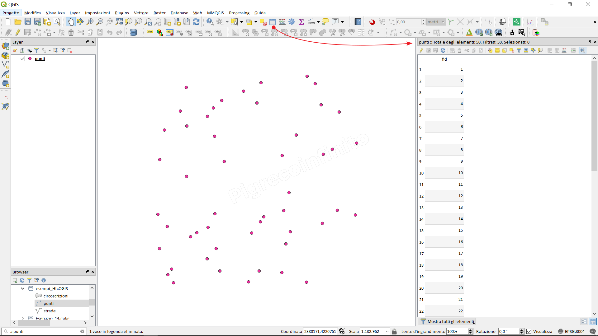
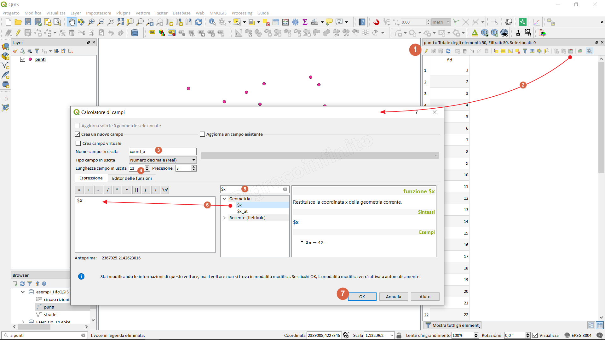
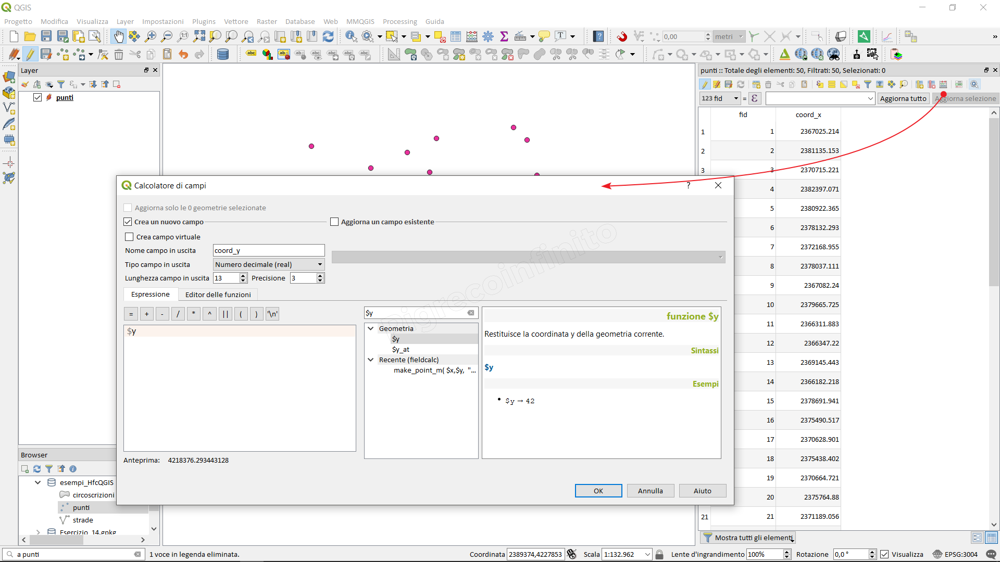
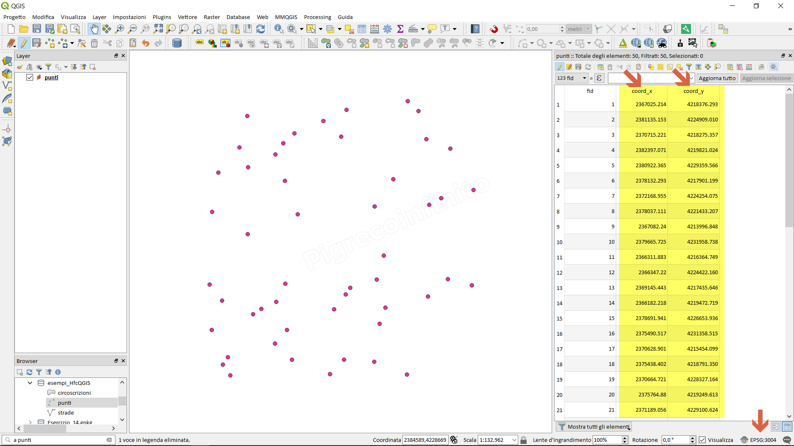

---
tags:
  - aggiungi attributo x e y
---

# Come aggiungere le coordinate x e y alla tabella attributi

Facciamo un esempio, geopackage con vettore puntuale:

selezionare il layer (presente nel _Layer Panel_), tasto destro mouse 'Apri tabella attributi' oppure cliccare sull'icona  oppure tasto funzione F6

1. attivare editing;
2. aprire calcolatore di campi 
3. crea nuovo campo e digittare nome campo **coord_x**;
4. tipo campo uscita Real e lunghezza uscita 13 e 2;
5. cercare la funzione [$x](../gr_funzioni/geometria/geometria_unico.md#x);
6. doppio clic sul risultato della ricerca per inserire la funzione;
7. OK per eseguire; verrà aggiunta la colonna coord_x e popolata;

ripere gli stessi passi per la **coord_y** e usare la funzione [\$y](../gr_funzioni/geometria/geometria_unico.md#y):

ecco evidenziate le due colonne con le coordinate:

il geopackage è scaricabile [qui](../prova_tu/dati_esempi.zip)
