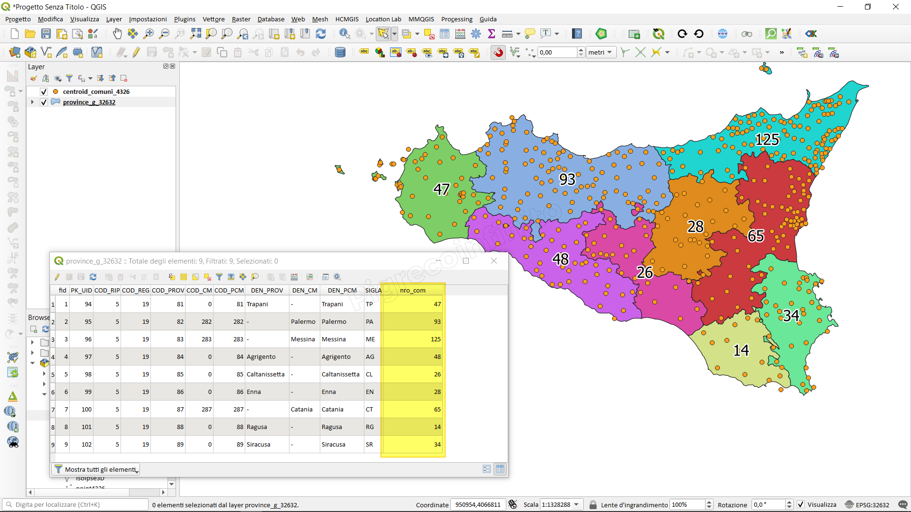

---
tags:
  - aggregare
  - intersects
  - transform
  - SR
---

## Aggregare con SR differenti

La funzione [aggregate](../gr_funzioni/aggrega/aggrega_unico.md#aggregate) del gruppo **aggrega** lavora solo con vettori che hanno stesso SR (Sistema di Riferimento) altrimenti restituisce `NULL`, in questo esempio useremo la funzione [transform](../gr_funzioni/geometria/geometria_unico.md#transform) per ovviare a questo apparente problema.

Esempio:

supponiamo di avere due layer: i _centroid-comuni_ (EPSG 4326) e _province_ ISTAT (EPSG 32632) della sola Sicilia; aggiungere un campo **nro_com** nel layer _province_ e popolarlo con il numero dei comuni.

[](../img/esempi/aggrega_con_sr_diff/aggr_sr_diff1.png)

avviare il calcolatore di campi e creare un nuovo campo 'nro_com' Integer (9) e popolarlo con la seguente espressione:

```
aggregate(
layer:='centroid_comuni_4326', 
aggregate:= 'count', 
expression:="fid", 
filter:= intersects ($geometry, transform(geometry (@parent), 'EPSG:32632', 'EPSG:4326'))) 
```

oppure con questa espressione, il risultato è lo stesso:

```
aggregate(
layer:='centroid_comuni_4326', 
aggregate:= 'count', 
expression:="fid", 
filter:= intersects (transform($geometry, 'EPSG:4326', 'EPSG:32632'), geometry (@parent)))
```

!!! Danger "Nota bene"
    La funzione **$geometry**, all'interno della funzione di aggregazione, è la `geometria corrente` del **layer:='centroid_comuni_4326'** e quindi la **geometry (@parent)** rappresenta la geometria del layer poligonale. 

[](../img/esempi/aggrega_con_sr_diff/aggr_sr_diff2.png)

## Osservazioni

Nella funzione [aggregate](../gr_funzioni/aggrega/aggrega_unico.md#aggregate) tutto ciò che si trova entro le sue parentesi riguarda il relativo `layer:=`, quindi se utilizzassimo la funzione `$geometry` questa sarebbe relativa al `layer:=`, mentre per richiamare una geometria esterna (relativa al layer genitore, cioè quello in cui abbiamo avviato il costruttore di espressioni) occorre utulizzare l'espressione `geometry(@parent)`. In questo esempio `$geometry` è la geometria del `layer:=centroid_comuni_4326` mentre l'altra geometria è `geometry(@parent)` relativa al layer _province_.