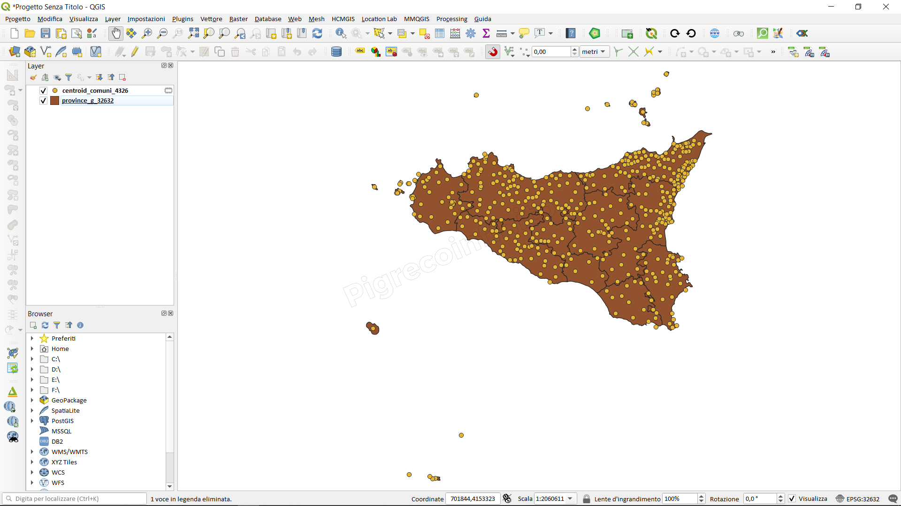

## Aggregare con SR differenti

La funzione **aggregate** del gruppo **aggrega** lavora solo con vettori (sovrapposti) che hanno stesso SR altrimenti restituisce NULL, in questo esempio useremo la funzione **transform** per ovviare a questo apparente problema.

Esempio:

supponiamo di avere due layer: i _centroid-comuni_ (EPSG 4326) e _province_ ISTAT (EPSG 32632) della sola Sicilia; aggiungere un campo **nro_com** nel layer _province_ e popolarlo con il numero dei comuni.



avviare il calcolatore di campi e creare un nuovo campo 'nro_com' Integer (9) e popolarlo con la seguente espressione:

```
aggregate(
layer:='centroid_comuni_4326', 
aggregate:= 'count', 
expression:="fid", 
filter:= intersects ($geometry, transform(geometry (@parent), 'EPSG:32632', 'EPSG:4326'))) 
```

oppure con questa espressione, il risultato è lo stesso:

```
aggregate(
layer:='centroid_comuni_4326', 
aggregate:= 'count', 
expression:="fid", 
filter:= intersects (transform($geometry, 'EPSG:4326', 'EPSG:32632'), geometry (@parent)))
```

**NB:** la funzione **$geometry**, all'interno della funzione di aggregazione, è la `geometria corrente` del **layer:='centroid_comuni_4326'** e quindi la **geometry (@parent)** rappresenta la geometria del layer poligonale. 


