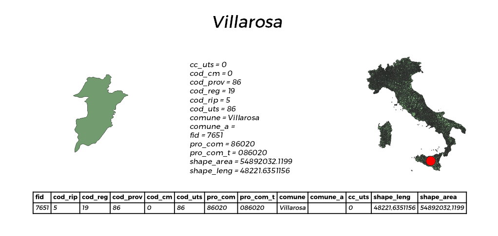

## Atlas con righe tabella attributi in verticale

Alcune volte nasce l'esigenza di stampare la tabella attributi di un atlante in verticale e non nel classico modo in orizzontale:

[](../img/esempi/atlas_righe_verticali/img_01.png)

Espressione da usare:

```python
replace()
   replace(
      replace (
         map_to_hstore( attributes())
            ,'"',''),
                '=>',' = '),
                   ',','\n')
```

dove l'espressione che crea una struttura `a mappa` è:

```
map_to_hstore( attributes()) → '"cod_reg"=>"1","cod_rip"=>"1","den_reg"=>"Piemonte","fid"=>"…'
```

le funzioni `replace()` servono a modificare l'output, cioè a togliere i doppi apici,  la freccia e aggiungere il vai a capo.

**NB:** I campi sono ordinati alfabeticamente!

---

Funzioni e variabili utilizzate:

* [replace](../gr_funzioni/stringhe_di_testo/stringhe_di_testo_unico.md#replace)
* [map_to_hstore](../gr_funzioni/maps/maps_unico.md#map_to_hstore)
* [attributes](../gr_funzioni/record_e_attributi/record_e_attributi_unico.md#attributes)
