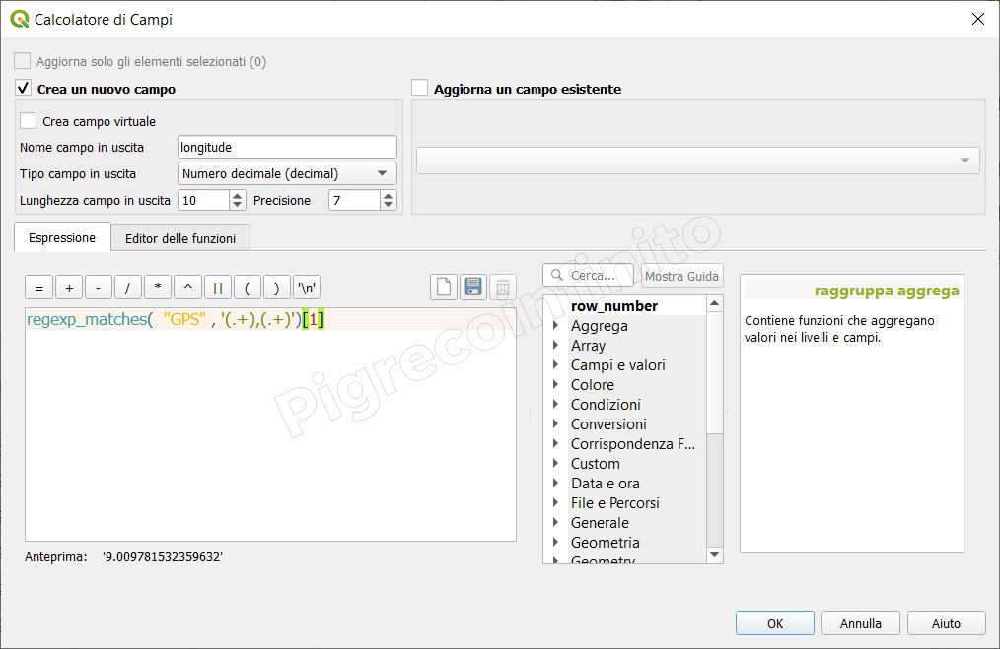
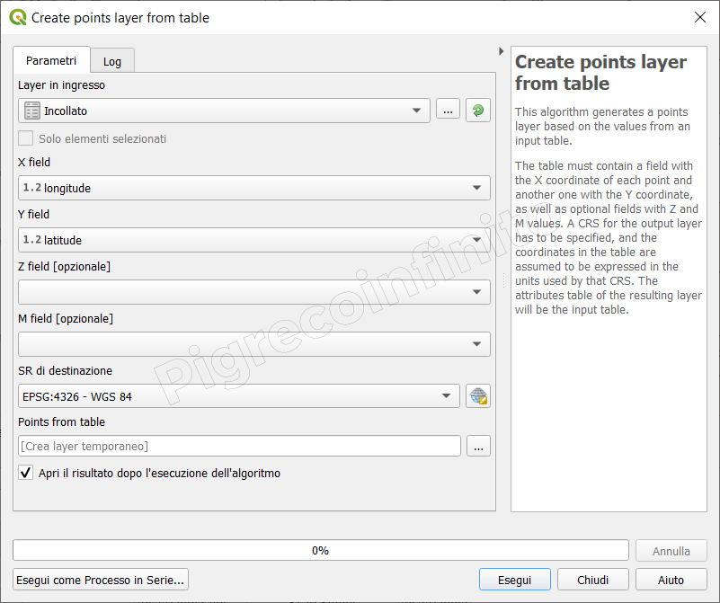

---
tags:
  - campi
  - attributi
  - tabella
  - coordinate
---

# Da un campo di coordinate a due campi

Alcune volte abbiamo a che fare con un campo che contiene entrambe le coordinate separate da una virgola `44.8636937,10.0077403`, come questa di sotto:

DATA|NOME|GPS
----|----|---
01/02/20|cucu|44.852747416606434,10.028176383697463
02/02/20|ciao|44.044566892850995,12.055562011167229
03/02/20|arrivederci|41.83774391119999,13.131616192302847
04/02/20|pluto|41.08389804418973,16.013252812971114
05/02/20|paperino|38.336008270894254,16.06188803019758

Una tabella cosi fatta non è immediatamente utilizzabile in un GIS, occorre separare le due coordinate in due campi distinti, come sotto:

DATA|NOME|GPS|latitude|longitude
----|----|---|--------|-------
01/02/20|cucu|44.852747416606434,10.028176383697463|44.852747416606434|10.028176383697463
02/02/20|ciao|44.044566892850995,12.055562011167229|44.044566892850995|12.055562011167229
03/02/20|arrivederci|41.83774391119999,13.131616192302847|41.83774391119999|13.131616192302847
04/02/20|pluto|41.08389804418973,16.013252812971114|41.08389804418973|16.013252812971114
05/02/20|paperino|38.336008270894254,16.06188803019758|38.336008270894254|16.06188803019758

vediamo come farlo usando il calcolatore di campi:

1. aggiungere un nuovo campo `latitude`, tipo `Real` con lunghezza 10 e precisione 7;
2. utilizzare la seguente espressione: `regexp_matches(  "GPS" , '(.+),(.+)')[0]`;
3. aggiungere un nuovo campo `longitude`, tipo `Real` con lunghezza 10 e precisione 7;
4. utilizzare la seguente espressione: `regexp_matches(  "GPS" , '(.+),(.+)')[1]`;

Infine, per tracciare i punti, utilizzare l'algoritmo `Create points layer from table` ed utilizzare i due campi `longitude` e `latitude`.

---

Funzioni e variabili utilizzate:

- [regexp_match](../gr_funzioni/condizioni/condizioni_unico.md#regexp_match)
