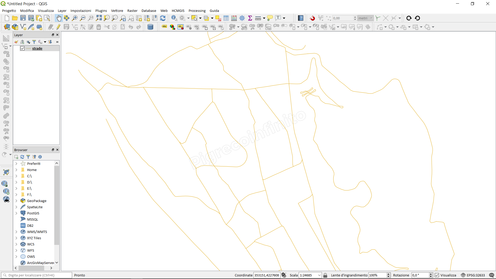
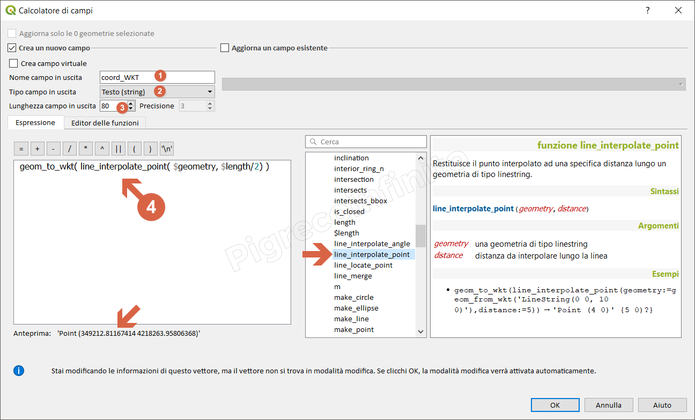
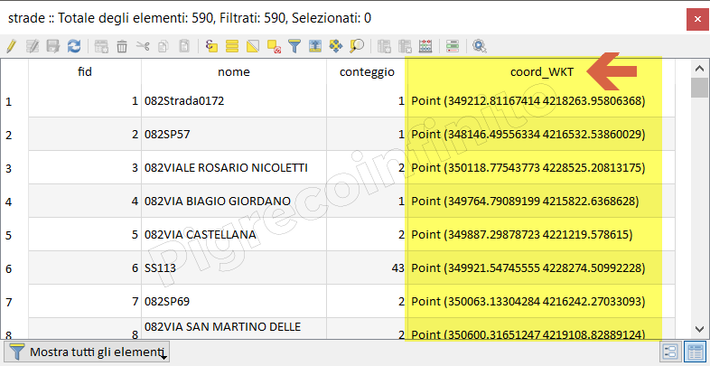
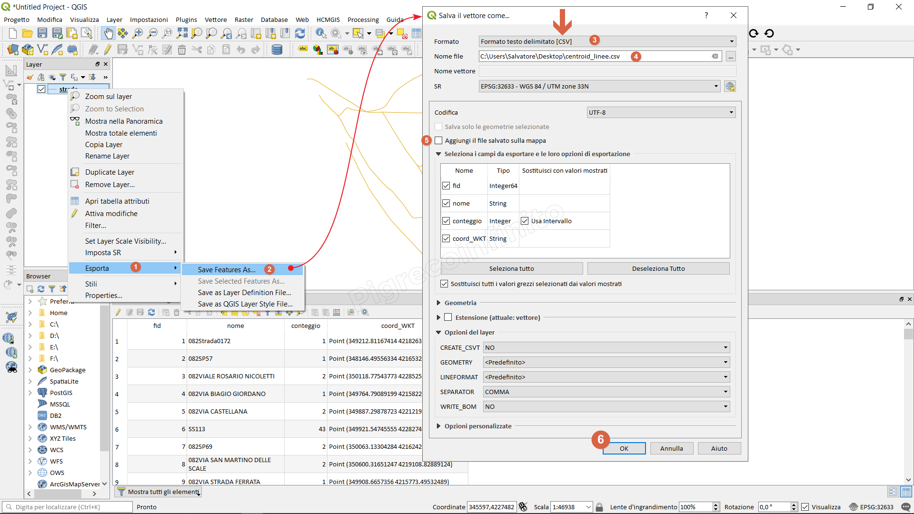
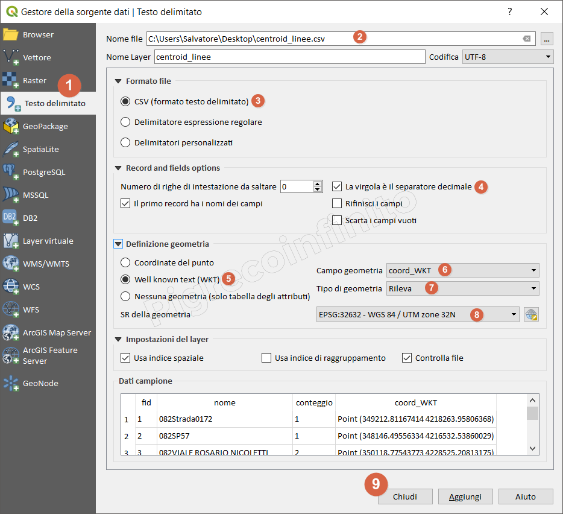
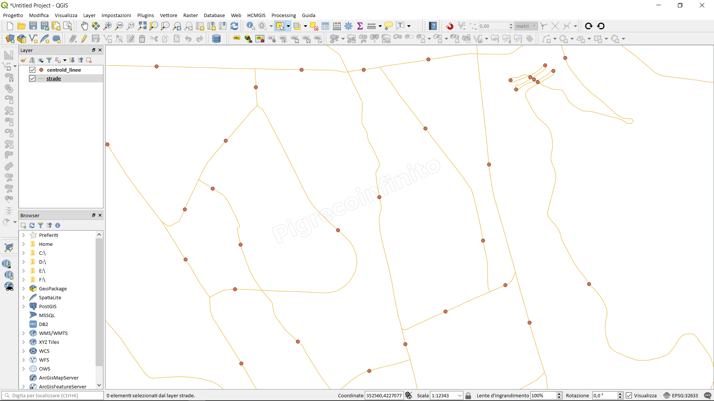

---
tags:
  - linee
  - centroidi
  - wkt
  - valori
  - csv
---

# Ottenere i centroidi lungo le linee

Come ottenere i centroidi di linee curve lungo le linee stesse?

[](../img/esempi/centroid_linee/centroid_linee1.png)

avviare il calcolatore di campi e creare un nuovo campo `coord_WKT` testuale e popolarlo con la seguente espressione:

```
geom_to_wkt( line_interpolate_point( $geometry, $length/2) )
```

[](../img/esempi/centroid_linee/centroid_linee2.png)

ecco la tabella attributi:

[](../img/esempi/centroid_linee/centroid_linee3.png)

Esportare lo strato in formato CSV:

[](../img/esempi/centroid_linee/centroid_linee4.png)

Importialo il nuovo strato CSV come testo delimitato:

[](../img/esempi/centroid_linee/centroid_linee5.png)

Ecco il risultato finale, i centroidi sono lungo le linee:

[](../img/esempi/centroid_linee/centroid_linee6.png)

il geopackage è scaricabile [qui](https://github.com/gbvitrano/HfcQGIS/blob/master/esempi/dati_esempi.zip?raw=true)

---

Funzioni e variabili utilizzate:

* [$geometry](../gr_funzioni/geometria/geometria_unico.md#geometry)
* [$length](../gr_funzioni/geometria/geometria_unico.md#length)
* [line_interpolate_point](../gr_funzioni/geometria/geometria_unico.md#line_interpolate_point.)
* [geom_to_wkt](../gr_funzioni/geometria/geometria_unico.md#geom_to_wkt)