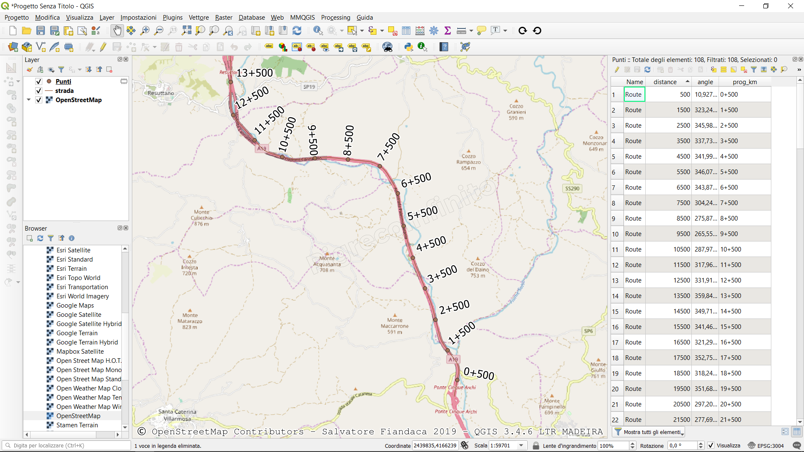

# Formattare le distanze chilometriche progressive 

Vettore lineare (strade) e vettore puntuale con distanze progressive, la tabella degli attributi ha un campo **distance** che rappresenta le `distanze progressive` espresse in metri, in questo esempio popoleremo - usando il calcolatore di campi di QGIS - un nuovo campo (prog_km) con le `distanze chilometriche progressive` in stile autostrade.



## espressione

```
CASE 
WHEN  "prog" <10  THEN '0+00' ||"prog"  
WHEN  "prog" <100  THEN '0+0' ||"prog" 
WHEN  "prog" <1000  THEN '0+' ||"prog" 
WHEN  "prog" <10000  THEN left( "prog",1)||'+'|| right( "prog" ,3)
WHEN  "prog" <100000  THEN left( "prog",2)||'+'|| right( "prog" ,3)
WHEN  "prog" <1000000  THEN left( "prog",3)||'+'|| right( "prog" ,3)
ELSE 'valore oltre 1000 km'
END
```

## Prova tu

[dati e progetto](https://github.com/opendatasicilia/HfcQGIS-md/raw/main/docs/prova_tu/rotazione_pattern_lineare.zip)

---

Funzioni e variabili utilizzate:

* [CASE](../gr_funzioni/condizioni/condizioni_unico.md#CASE)
