---
tags:
  - moduli
  - filtro
  - form
  - relazioni
---

# Creare moduli con filtro dinamico (anche multi-selezione)

Una delle novità introdotte nella QGIS 3.2 è la [Form drill-down (a cascata) WIDGET Value Relation (Relazione valore)](https://hfcqgis.opendatasicilia.it/release/novita_32/#form-drill-down-a-cascata-widget-value-relation-relazione-valore) che permette di creare delle Form con filtro dinamico, in questo esercizio vedremo come realizzare una Form semplice e una multiselezione.

[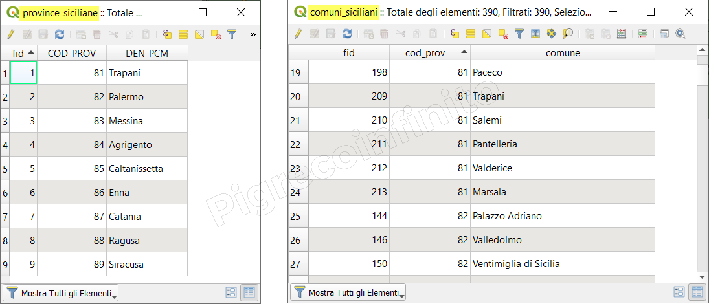](../img/esempi/drilldown_form/img_00.png)

[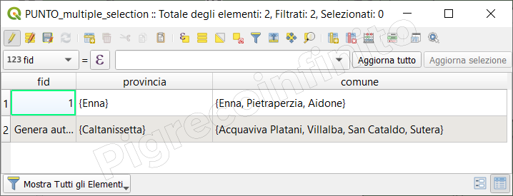](../img/esempi/drilldown_form/img_03.png)

## Form semplice selezione 1:1

[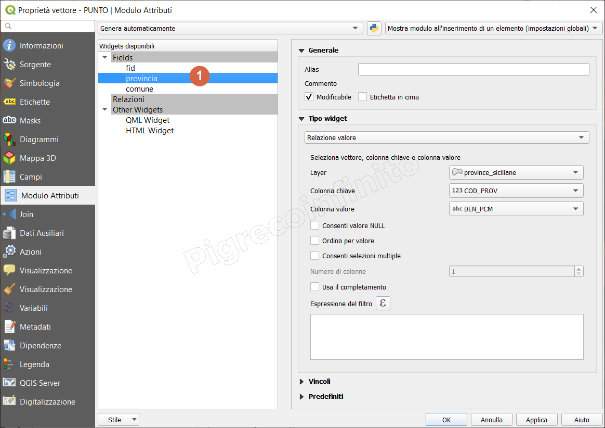](../img/esempi/drilldown_form/img_06.png)

[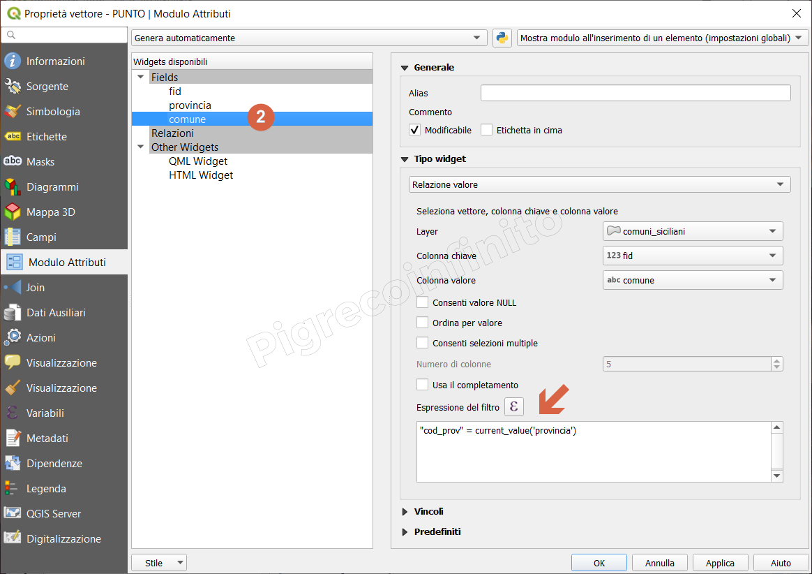](../img/esempi/drilldown_form/img_07.png)

- espressione da usare:

```
"cod_prov" = current_value('provincia')
```

[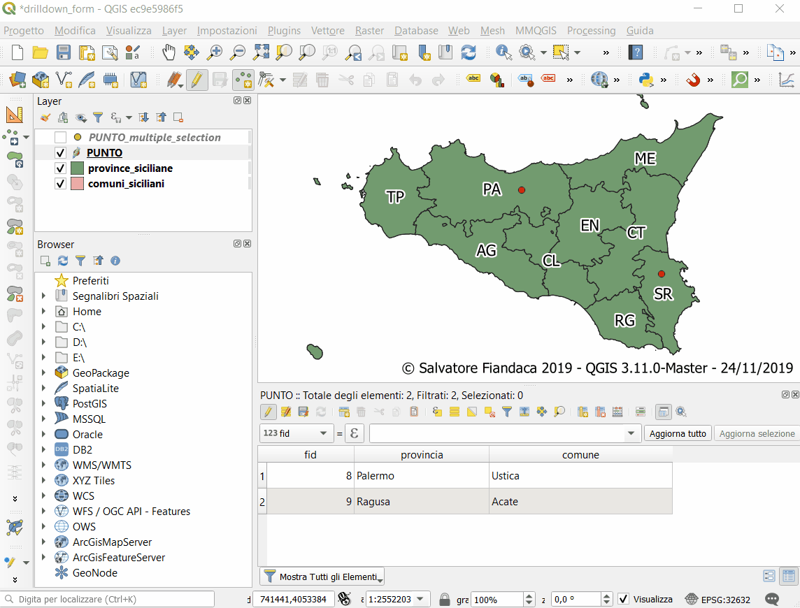](../img/esempi/drilldown_form/drill3.gif)

## Form avanzato n:m

[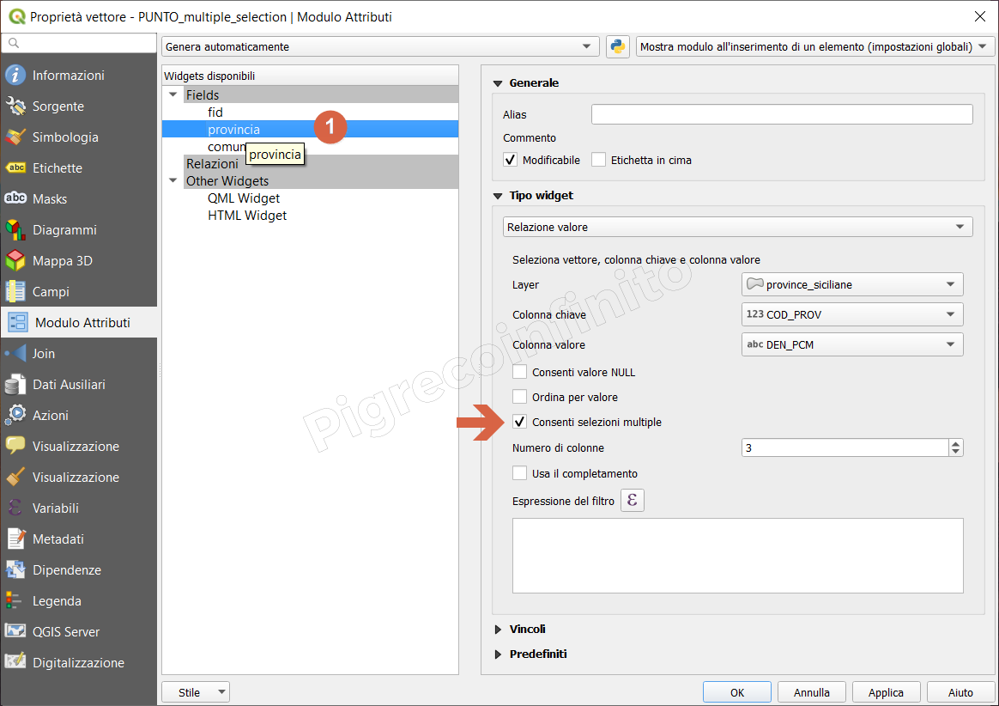](../img/esempi/drilldown_form/img_04.png)

[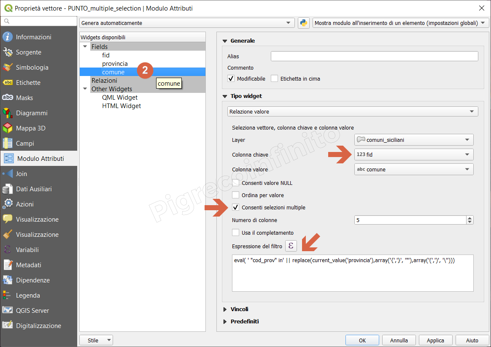](../img/esempi/drilldown_form/img_05.png)

- espressione da usare:

```
eval( ' "cod_prov" in' || replace(current_value('provincia'),array('{','}', '"'),array('(',')', '\'')))
```

Espressione di [Pedro Venâncio](https://twitter.com/PedroNGV) con suggerimento di [Alexandre Neto](https://twitter.com/AlexNetoGeo) - 
[Lista QGIS dev](http://osgeo-org.1560.x6.nabble.com/QGIS-Developer-Drill-down-forms-with-multiple-selections-option-td5422867.html)


[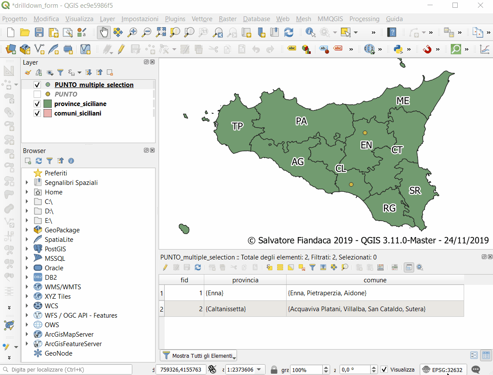](../img/esempi/drilldown_form/drill2.gif)

## Form avanzato con spatial join 1:m

[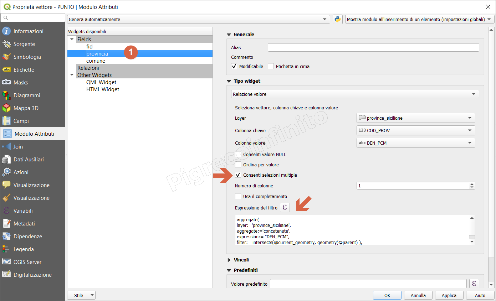](../img/esempi/drilldown_form/img_01.png)

- espressione da scrivere in `Espressione filtro` nel primo campo della form:
  
```
aggregate( 
layer:='province_siciliane', 
aggregate:='concatenate', 
expression:= "DEN_PCM", 
filter:= intersects(@current_geometry, geometry(@parent) )
) 
```

o più semplicemente (e anche più performante)

```
intersects( @current_geometry ,$geometry)
```

- Nel caso volessimo filtrare **la feature più vicina** (quindi non necessariamnete intersecante):

```
minimum(distance(@current_geometry ,$geometry)) = distance(@current_geometry ,$geometry)
```

[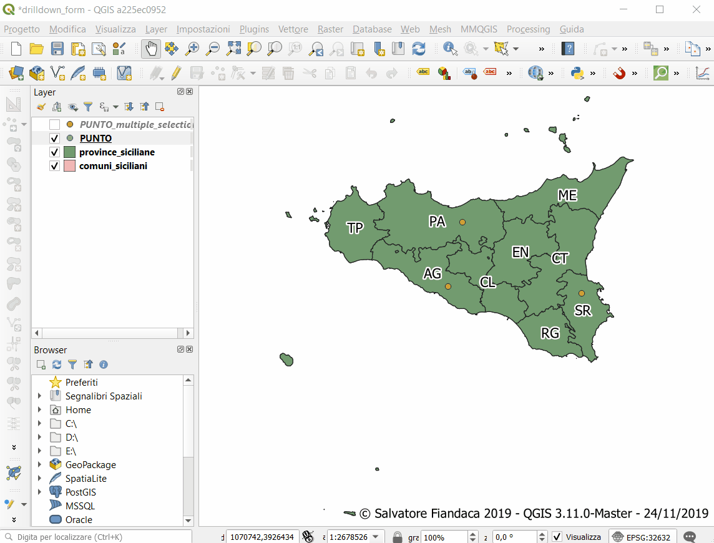](../img/esempi/drilldown_form/drill4.gif)


[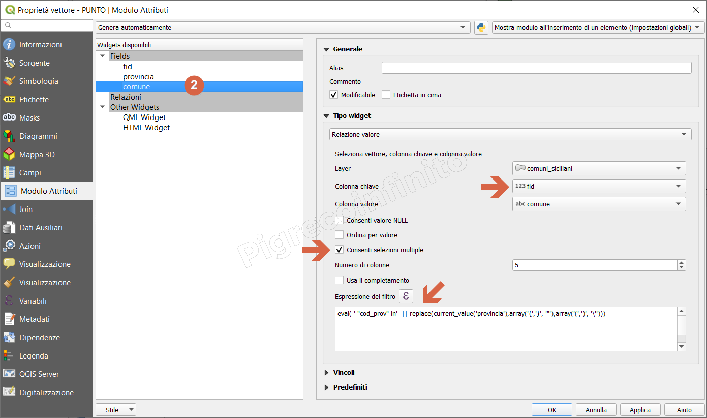](../img/esempi/drilldown_form/img_02.png)

- espressione da scrivere in `Espressione filtro` nel secondo campo della form:

```
eval( ' "cod_prov" in' || replace(current_value('provincia'),array('{','}', '"'),array('(',')', '\'')))
```

Espressione di [Pedro Venâncio](https://twitter.com/PedroNGV) con suggerimento di [Alexandre Neto](https://twitter.com/AlexNetoGeo) - 
[Lista QGIS dev](http://osgeo-org.1560.x6.nabble.com/QGIS-Developer-Drill-down-forms-with-multiple-selections-option-td5422867.html)

[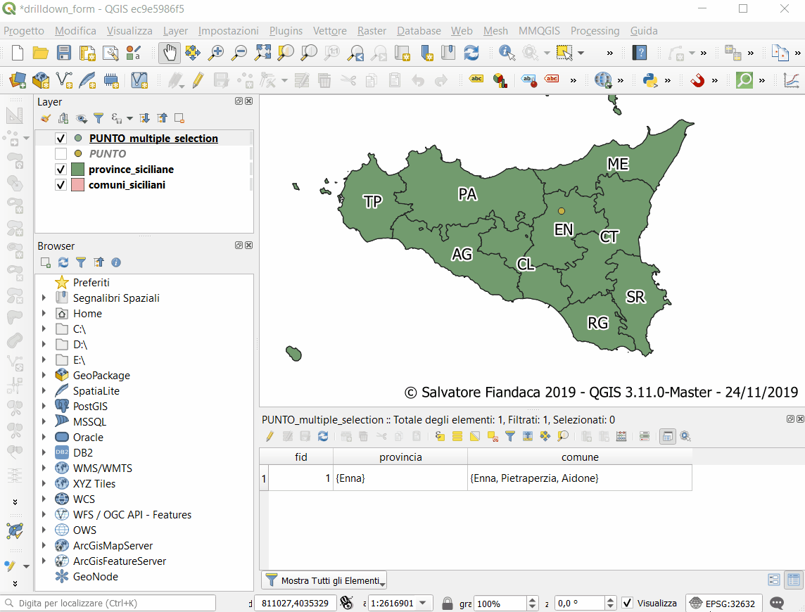](../img/esempi/drilldown_form/drill1.gif)

funzione [aggregate](http://hfcqgis.opendatasicilia.it/it/latest/gr_funzioni/aggregates/aggregate.html)


# Prova tu

[Geopackage con dati e progetto](../prova_tu/drilldown_form_multiple.zip)
Nel GeoPackage sono state memorizzate i tre stili usati per il form!!!

# Riferimenti

[Lista QGIS dev](http://osgeo-org.1560.x6.nabble.com/QGIS-Developer-Drill-down-forms-with-multiple-selections-option-td5422867.html)

Issue: https://github.com/qgis/QGIS/issues/33046

---

Funzioni e variabili utilizzate:

* [aggregate](../gr_funzioni/aggrega/aggrega_unico.md#aggregate)
* [eval](../gr_funzioni/generale/generale_unico.md#eval)
* [array](../gr_funzioni/array/array_unico.md#array)
