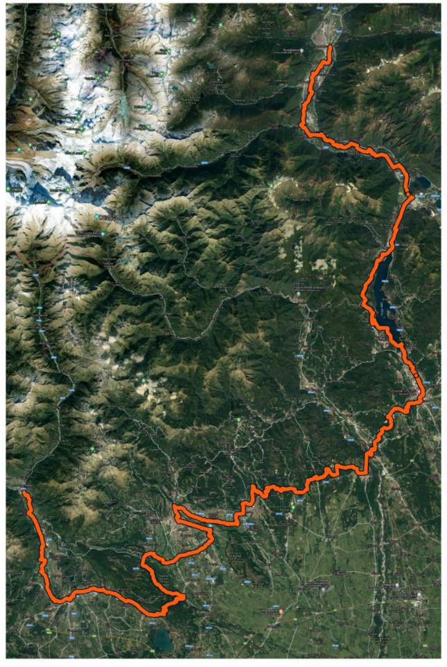
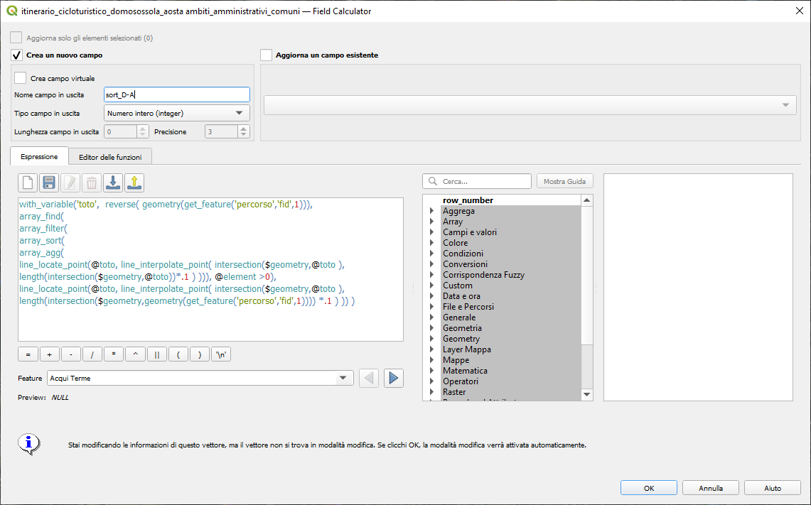
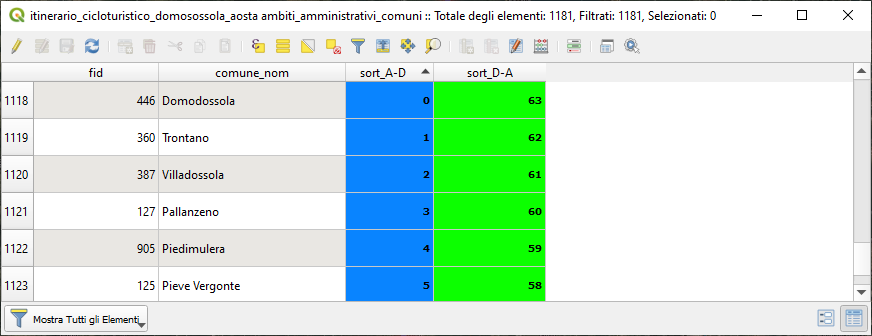
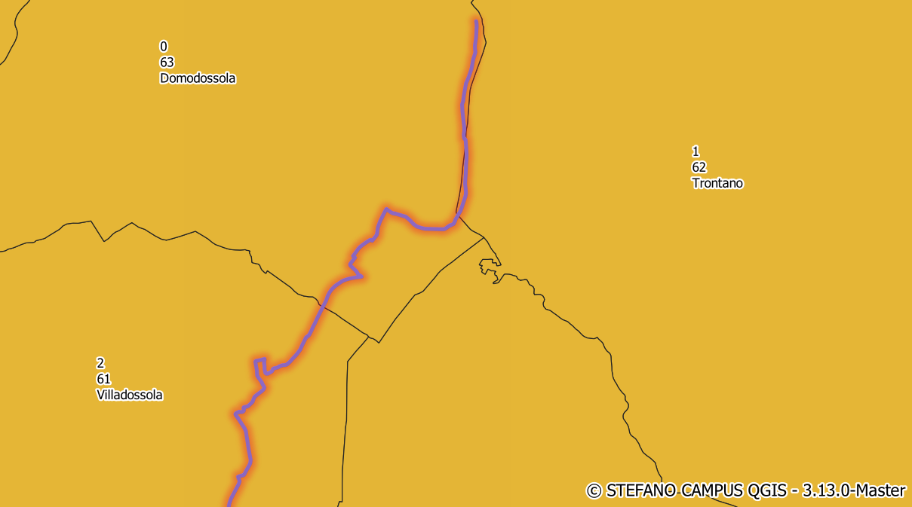

## Elenco ordinato di Comuni attraversati da un itinerario

Come ottenere l'elenco ordinato dei Comuni attraversati da un itinerario.

Esempio:

A partire da un itinerario ciclabile, determinare i Comuni attraversati da questa linea, in ordine di intersezione, partendo da un origine seguendo il percorso per arrivare alla destinazione, avendo quindi una lista ordinata.



avviare il calcolatore di campi (dopo aver selezionato il layer poligonale) e creare un nuovo campo `sort_D-A` numerico e popolarlo con la seguente espressione:

```
with_variable('toto',  reverse( geometry(get_feature('percorso','fid',1))),
    array_find( 
        array_filter(
            array_sort(
                array_agg(
                    line_locate_point(@toto, line_interpolate_point( intersection($geometry,@toto ), 
                    length(intersection($geometry,@toto))*0.1 ))
                         )
                      ), @element >0),
                    line_locate_point(@toto, line_interpolate_point( intersection($geometry,@toto ), 
                    length(intersection($geometry,@toto)) *0.1 ))
                )
)   
```

L'espressione popolerà solo le celle in cui esiste l'intersezione tra percorso e poligono comunale, le altre celle rimarranno `NULL`.
Il valore rappresenterà, a partire da `0`, l'ordine dei Comuni (0,1,2,3....50...).

Logica dell'espressione:

Per ogni intersezione, tra linea percorso e poligoni comunali, calolo un punto lungo la linea posto ad una distanza pari al 10% dell'intera intersezione e la uso per determinare la lunghezza totale a partire dall'origine dell'intero percorso. Lunghezze maggiori indicano poligoni comunali attraversati dopo rispetto a quelli con lunghezza minore.

Step:

seleziono il layer `itinerario_cicloturistico_domosossola_aosta ambiti_amministrativi_comuni` presente nella TOC, clicco sull'icona del calcolatore di campi:

1. nome del campo in uscita: `sort_D-A`
2. tipo di campo in uscita: `integer`;
3. scrivo espressione di sopra;




ecco la tabella attributi:



Poligoni comunali



Maggiori dettagli nel [blog](https://pigrecoinfinito.com/2020/05/20/elenco-ordinato-di-comuni-attraversati-da-un-itinerario-domodossola-aosta/) post su Pigrecoinfinito: 

### prova tu

[dati e progetto QGIS 3.12](https://mega.nz/file/lUgwhIIA#gEwH2RpsdkNFGWM6qvqDFnXcMS6IIlfqhnkJnH3m164)
