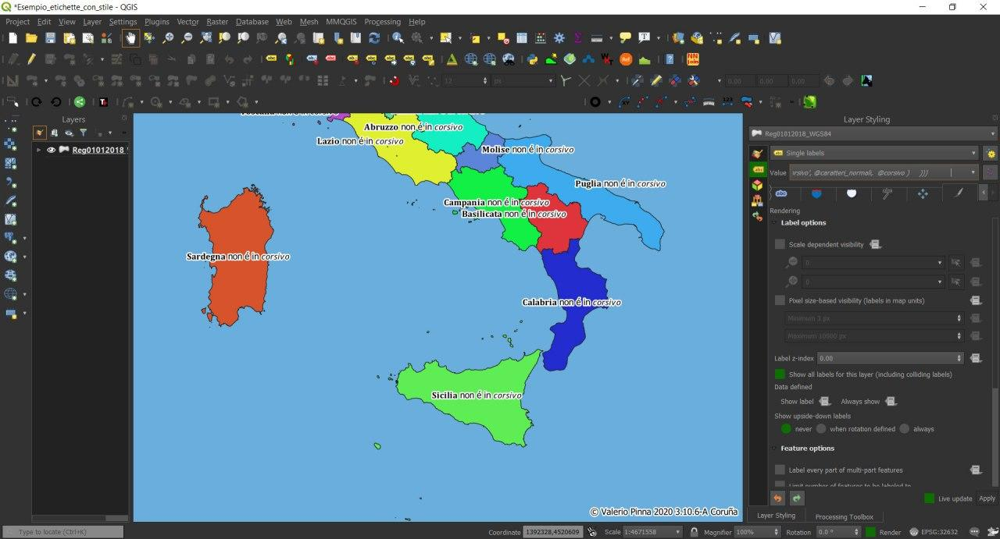
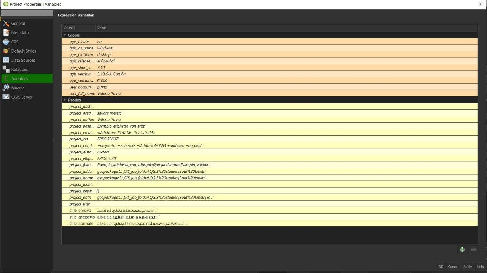
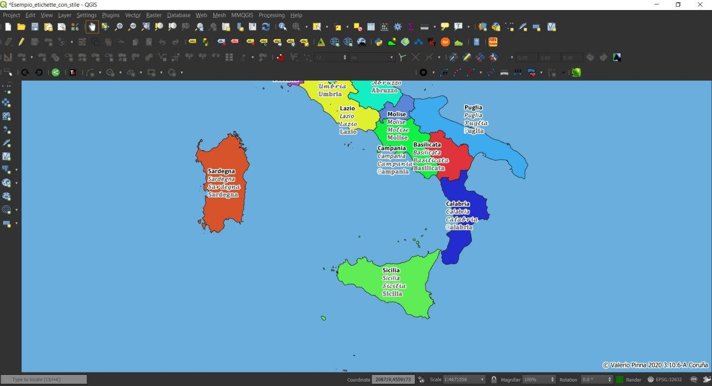

# Etichette formattate con diversi stili all'interno del testo

Una richiesta che spesso si ritrova nei canali social della Comunitá **QGIS** é quella di poter creare delle etichette al cui interno solo una parte del testo é formattata con uno stile diverso dal resto della stringa.  In **QGIS**, infatti, é possibile utilizzare gli strumenti offerti dal sistema per formattare in grassetto o corsivo l’intera etichetta ma non é possibile, di default, applicare lo stile ad una sola parte del testo. 
Una soluzione a questo problema é offerta dal **Calcolatore di campi**, dimostrando ancora una volta la potenza di questo strumento. <br>
Esistono in rete diversi siti che offrono la possibilitá di formattare automaticamente un testo e di espostarlo con un semplice copia-incolla. Qui verranno utilizzati **Boldtext** (LINK 1) per il grassetto e **Lingojam** (LINK 2) per il corsivo e per alcuni altri esempi di stili per per creare stringhe alfabetiche formattate da utilizzare nella nostra espressione. 



L’espressione da utilizzare nell’etichetta in corrispondenza della casella Valore é la seguente:

```
with_variable(
  'caratteri_normali',
  array('a','b','c','d','e','f','g','h','i','j','k','l','m','n','o','p','q','r','s','t','u','v','w','x','y','z','A','B','C','D','E','F','G','H','I','J','K','L','M','N','O','P','Q','R','S','T','U','V','W','X','Y','Z','0','1','2','3','4','5','6','7','8','9'),

with_variable(
'corsivo',
array('𝘢','𝘣','𝘤','𝘥','𝘦','𝘧','𝘨','𝘩','𝘪','𝘫','𝘬','𝘭','𝘮','𝘯','𝘰','𝘱','𝘲','𝘳','𝘴','𝘵','𝘶','𝘷','𝘸','𝘹','𝘺','𝘻','𝘈','𝘉','𝘊','𝘋','𝘌','𝘍','𝘎','𝘏','𝘐','𝘑','𝘒','𝘓','𝘔','𝘕','𝘖','𝘗','𝘘','𝘙','𝘚','𝘛','𝘜','𝘝','𝘞','𝘟','𝘠','𝘡','0','1','2','3','4','5','6','7','8','9'),

with_variable(
    'grassetto',
    array('𝗮','𝗯','𝗰','𝗱','𝗲','𝗳','𝗴','𝗵','𝗶','𝗷','𝗸','𝗹','𝗺','𝗻','𝗼','𝗽','𝗾','𝗿','𝘀','𝘁','𝘂','𝘃','𝘄','𝘅','𝘆','𝘇','𝗔','𝗕','𝗖','𝗗','𝗘','𝗙','𝗚','𝗛','𝗜','𝗝','𝗞','𝗟','𝗠','𝗡','𝗢','𝗣','𝗤','𝗥','𝗦','𝗧','𝗨','𝗩','𝗪','𝗫','𝗬','𝗭','𝟬','𝟭','𝟮','𝟯','𝟰','𝟱','𝟲','𝟳','𝟴','𝟵'),

with_variable('scrittura_a_mano', 

array('𝒶','𝒷','𝒸','𝒹','𝑒','𝒻','𝑔','𝒽','𝒾','𝒿','𝓀','𝓁','𝓂','𝓃','𝑜','𝓅','𝓆','𝓇','𝓈','𝓉','𝓊','𝓋','𝓌','𝓍','𝓎','𝓏','𝒜','𝐵','𝒞','𝒟','𝐸','𝐹','𝒢','𝐻','𝐼','𝒥','𝒦','𝐿','𝑀','𝒩','𝒪','𝒫','𝒬','𝑅','𝒮','𝒯','𝒰','𝒱','𝒲','𝒳','𝒴','𝒵','𝟢','𝟣','𝟤','𝟥','𝟦','5','𝟨','𝟩','𝟪','𝟫'),

with_variable('stiloso',
array('𝕒','𝕓','𝕔','𝕕','𝕖','𝕗','𝕘','𝕙','𝕚','𝕛','𝕜','𝕝','𝕞','𝕟','𝕠','𝕡','𝕢','𝕣','𝕤','𝕥','𝕦','𝕧','𝕨','𝕩','𝕪','𝕫','𝔸','𝔹','ℂ','𝔻','𝔼','𝔽','𝔾','ℍ','𝕀','𝕁','𝕂','𝕃','𝕄','ℕ','𝕆','ℙ','ℚ','ℝ','𝕊','𝕋','𝕌','𝕍','𝕎','𝕏','𝕐','ℤ','𝟘','𝟙','𝟚','𝟛','𝟜','𝟝','𝟞','𝟟','𝟠','𝟡'),
	
   replace("Name", @caratteri_normali, @grassetto) 
	|| '\n'  ||  
	replace("Name", @caratteri_normali, @corsivo)
    || '\n'  ||  
    replace("Name", @caratteri_normali, @scrittura_a_mano)
     || '\n'  ||  
    replace("Name", @caratteri_normali, @stiloso)
  
)))))
```

## Vediamo come opera

Per ogni stile che si vuole utilizzare é necessario creare una variabile usando la funzione `with_variable` contenente un’`array` composta da tutti i caratteri (maiuscolo, minuscolo e numeri).<br>
La prima variabile creata contiene i caratteri normali, non formattati, mentre le altre variabili nell’espressione contengono serie di caratteri formattati nei diversi stili. Per creare queste array si deve semplicemente copiare e incollare il contenuto della prima array coi caratteri normali in uno dei siti suddescritti e una volta creato il testo formattato copiarlo nella nuova array. <br>
Una volta preparato il gruppo di variabili con gli stili a propria scelta, passiamo alla seconda parte dell’espressione.

`replace("Name", @caratteri_normali, @grassetto)`

Utilizzando la funzione `replace`, semplicemente chiediamo al sistema di restituirci la stringa qui rappresentata da `"den_reg"` sostituendo ai caratteri normali (@caratteri_normali) i caratteri corrispondenti contenuti nella seconda variabile (@grassetto).<br>
Per applicare un diverso stile si deve semplicemente sostituire seconda variabile con lo stile scelto. 
Utilizzando la funzione `concat` o il simbolo di concatenazione `||` si possono costruire anche etichette complesse con diversi stili di formattazione all’interno della stessa stringa. Un esempio di questo é presentato poco piú avanti dove vedremo una soluzione alternativa allo stesso problema.

**Soluzione con variabili di progetto**

Per rendere gli stili disponibili a tutti i layer del progetto é possibile utilizzare le variabili personalizzate di progetto, cosí da richiamare i diversi stili velocemente all’interno dell’espressione. 

**Step 1**

All’interno delle proprietá del progetto, nella scheda Variabili, creare una nuova variabile per ciascuno degli stili, contenente l’intera serie di caratteri separati dalla virgola. 



**Step 2** 

L’espressione in questo caso sará semplificata, semplicemente richiamando la stringa contenuta nella variabile di progetto e convertendola in array con la funzione `string_to_array`. 

```
with_variable('caratteri_normali',
string_to_array(@stile_normale) ,

with_variable('grassetto',
string_to_array(@stile_grassetto) ,

with_variable('corsivo',
string_to_array(@stile_corsivo) ,


replace("DEN_REG", @caratteri_normali,  @grassetto ) || 
' non é in ' || 
replace('corsivo', @caratteri_normali,  @corsivo )
 )))
```



L’idea di questo esempio e stata suggerita da una risposta su **GIS.Stackexchange** (LINK 3) data dall’utente [bugmenot123](https://gis.stackexchange.com/users/51035/bugmenot123) che ringrazio per la geniale soluzione proposta.

Grazie a _**Salvatore Fiandaca**_ per avermi proposto di scrivere questo esempio e per il suo suggerimento per  proporre anche la soluzione con variabili di progetto.

**Link utili:**

1. <https://boldtext.io/>
2. <https://lingojam.com/ItalicTextGenerator>
3. <https://gis.stackexchange.com/questions/357234/styling-substring-of-label-with-different-style-without-creating-two-separate-la?fbclid=IwAR3n94vGBAe9MMoayzLTkGjdlimq7Dkbefm0lAzuSPSbS_kLpxq88w6Eixk>

Realizzato da **Valerio Pinna** (grazie mille!)

### Prova tu

Geopackage è [qui](https://github.com/opendatasicilia/HfcQGIS-md/raw/main/docs/esempi/etichette_con_stile.gpkg)

---

Funzioni e variabili utilizzate:

* [with_variable](../gr_funzioni/variabili/with_variable.md)
* [array](../gr_funzioni/array/array_unico.md#array)
* [string_to_array](../gr_funzioni/array/array_unico.md#string_to_array)
* [replace](../gr_funzioni/stringhe_di_testo/stringhe_di_testo_unico.md#replace)
