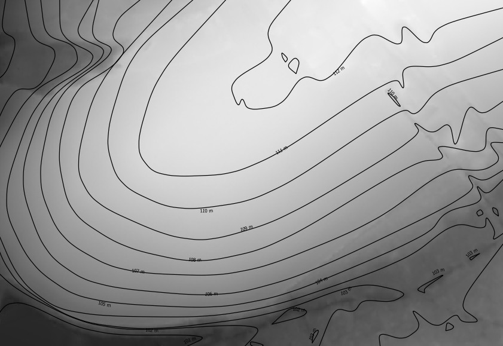
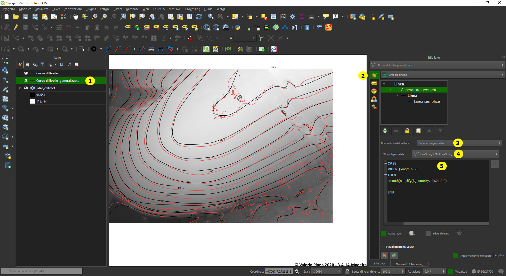
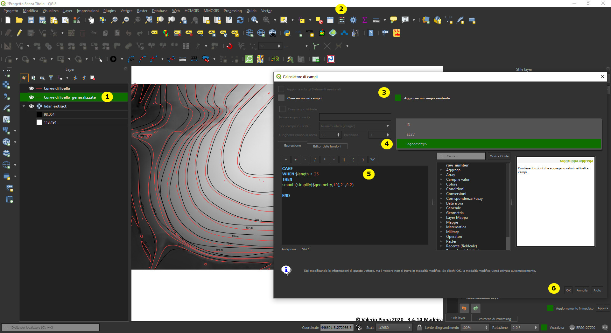

## Vestizione generalizzata delle linee di contorno

Quando si creano linee di contorno a partire da un modello digitale del terreno spesso la geometria lineare risultante si presenta ricca di asperitá. 
Esistono diversi algoritmi o plugin che permettono di generalizzare e semplificare le linee al fine di renderle piú adatte ad un loro uso su mappe stampate o schermate. 

In questo esempio l'operazione di semplificazione e smussamento della vestizione delle linee verrá fatto ricorrendo alle _espressioni e al generatore di geometrie_, cosi da non intervenire direttamente sulla geometria e mantenere il dataset originario del vettore.  
 


espressione da usare:

```
CASE
WHEN $length > 25 
THEN 
smooth(simplify($geometry,10),21,0.2)
END
```

Vediamo le diverse parti che compongono l'espressione:


- `$length > 25` : seleziona e visualizza solamente le linee di lunghezza maggiore di 25 m. Questo consente di eliminare piccoli oggetti areali. 

- `simplify($geometry,10)` : semplifica una geometria rimuovendo alcuni dei nodi usando una soglia basata sulla distanza. Il valore 10 corrisponde alla tolleranza, ossia la deviazione massima dai segmenti rettilinei per i punti da rimuovere
 
- `smooth(simplify($geometry,10),21,0.2)` : smussa la geometria semplificata dall'espressione precedente. 21 corrisponde al numero di iterazioni di smussatura, mentre 0.2 é il valore di offset che controlla che controlla quanto la geometria smussata seguirá strettamente la geometria originale.



1.	Seleziona il layer contenente le curve di livello. 
2.	Nel Pannelo Stile Layer seleziona la scheda Simbologia
3.	In Tipo simbolo del vettore seleziona Generatore Geometria
4.	In Tipo di geometria seleziona LineString/MultiLineString
5.	Copia l’espressione nel riquadro

La simbologia del layer si aggiornerá automaticamente. In questo modo é possibile cambiare alcuni dei valori inseriti e verificare in tempo reale il risultato. 

Una volta trovata la combinazione migliore di valori che restituisce la simbologia che si preferisce, é possibile utilizzare la stessa espessione nel Calcolatore di campi per `aggiornare` la Geometria:


  

1.	Seleziona il layer contenente le curve di livello. 
2.	Apri il Calcolatore di campi
3.	Spunta l'opzione Aggiorna un campo esistente
4.	Nel menú a tendina seleziona `geometry`.
5.	Copia l’espressione nel riquadro
6.  Clicca ok

## Prova tu

Il geopackage è scaricabile [qui](https://github.com/gbvitrano/HfcQGIS/raw/master/prova_tu/HFCQGIS-Smoothing_example.gpkg) 

--

Realizzato da [Valerio Pinna](https://www.facebook.com/valerio.pinna.5811)
