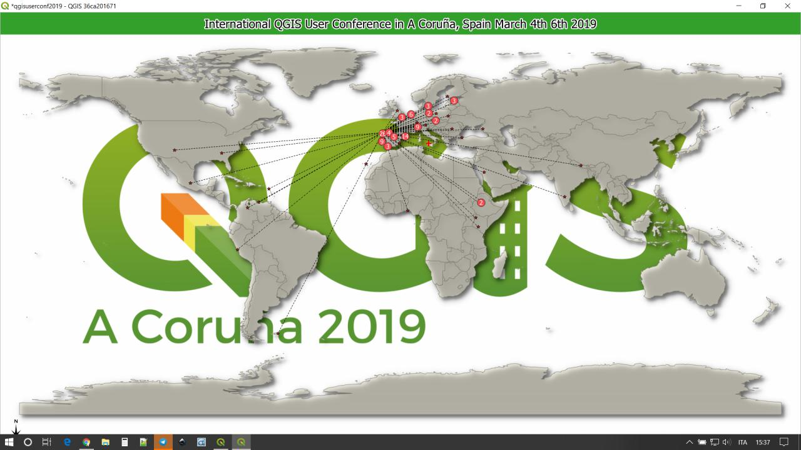
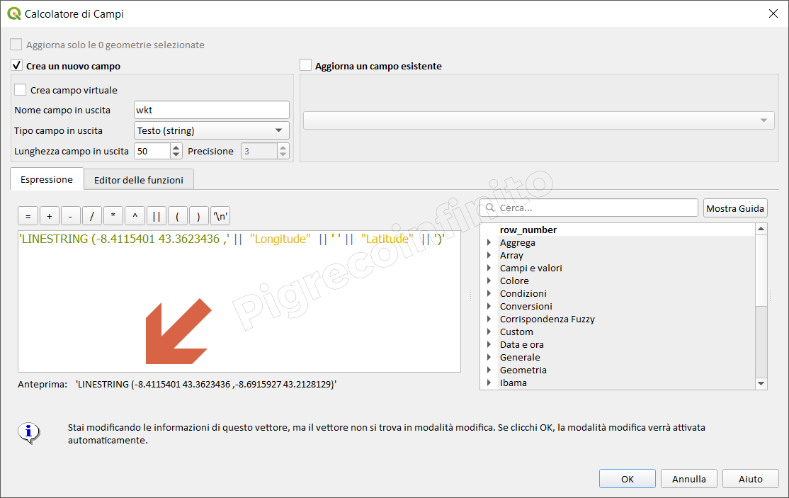
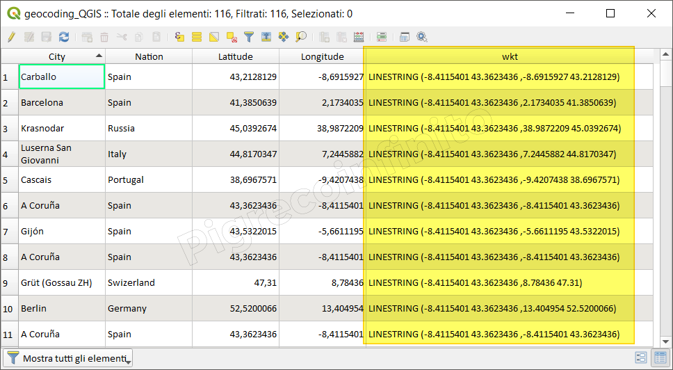
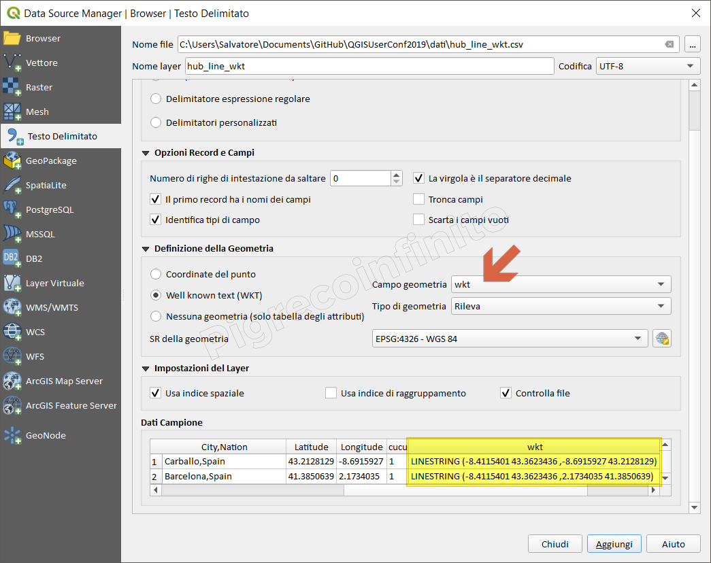

---
tags:
  - linee
  - hub-line
  - wkt
---
# Unisci con linee Hub lines

Come creare `hub lines` usando il calcolatore di campi di QGIS

[](../img/esempi/hub_lines/hub_lines_00.jpg)
****
`#QGISUserConf2019` `A Coruña`

Tabella di partenza: **A Coruña** da usare come `hub`

City                 | Nation     | Latitude   | Longitude
---------------------|------------|------------|-----------
Carballo             | Spain      | 43.2128129 | -8.6915927
Barcelona            | Spain      | 41.3850639 | 2.1734035
Krasnodar            | Russia     | 45.0392674 | 38.9872209
Luserna San Giovanni | Italy      | 44.8170347 | 7.2445882
Cascais              | Portugal   | 38.6967571 | -9.4207438
**A Coruña**         | Spain      | 43.3623436 | -8.4115401
Gijón                | Spain      | 43.5322015 | -5.6611195
**A Coruña**         | Spain      | 43.3623436 | -8.4115401
Grüt (Gossau ZH)     | Swizerland | 47.31      | 8.78436
Berlin               | Germany    | 52.5200066 | 13.404954
**A Coruña**         | Spain      | 43.3623436 | -8.4115401
Valencia             | Spain      | 39.4699075 | -0.3762881
Madrid               | Spain      | 40.4167754 | -3.7037902
Oviedo               | Spain      | 43.3619145 | -5.8493887

Creare un campo **WKT** testuale di 50 caratteri e popolare il campo con la seguente espressione:

```
'LINESTRING (-8.4115401 43.3623436 ,' ||  "Longitude"  || ' ' ||  "Latitude"  || ')'
```

[](../img/esempi/hub_lines/hub_lines_02.png)

otterremo la tabella:

[](../img/esempi/hub_lines/hub_lines_01.png)

successivamente importata in QGIS come testo delimitato e geometria di tipo WKT

[](../img/esempi/hub_lines/hub_lines_03.png)

## Prova tu

[dati](https://github.com/pigreco/QGISUserConf2019/tree/master/dati)

---

Funzioni e variabili utilizzate:

* [doppio-pipe](../gr_funzioni/operatori/operatori_unico.md#doppio-pipe)
