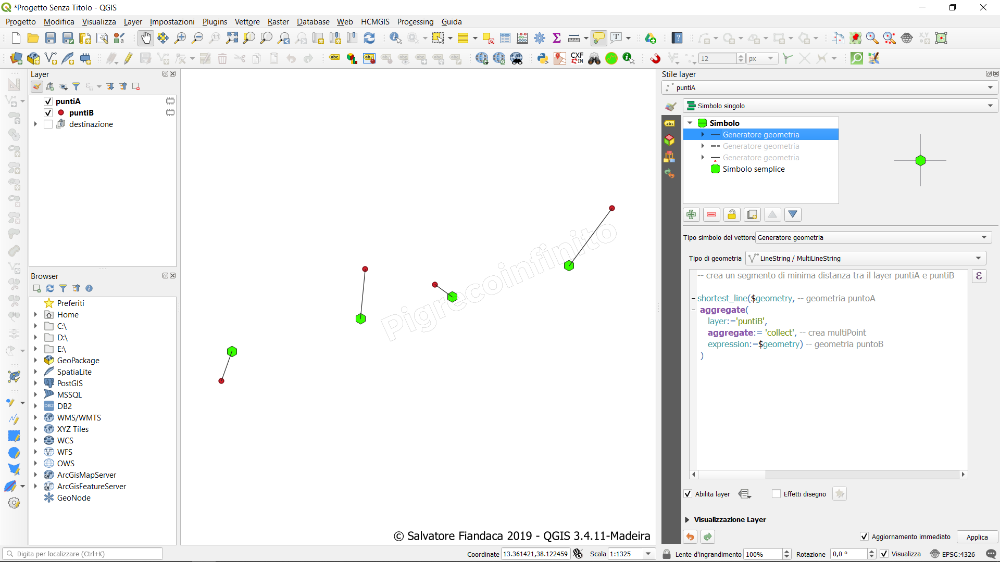
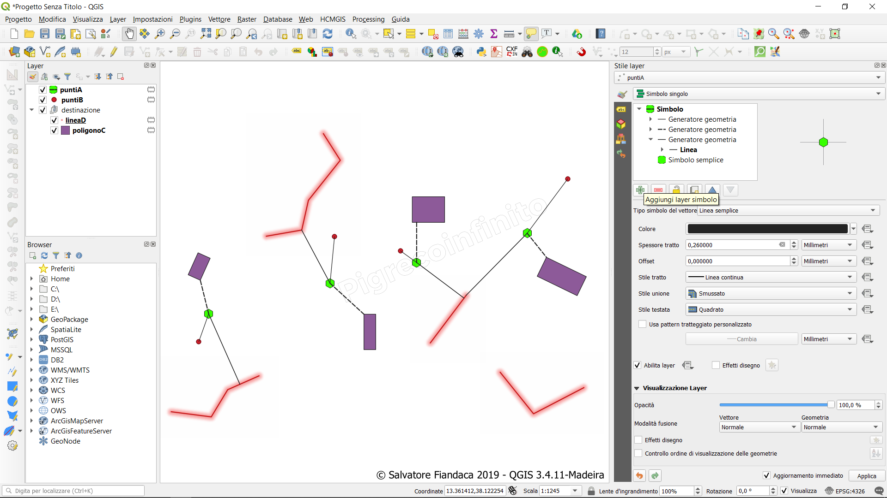
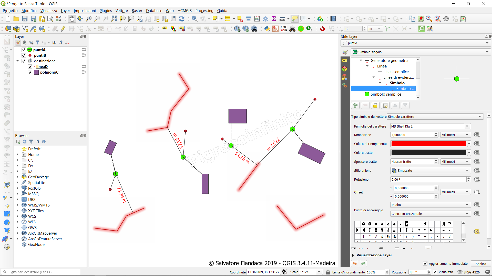

---
tags:
  - vicinanza
  - linee
  - aggregare
---

# Tracciare segmento di minima distanza usando il generatore di geometria

Dati due layer puntuali (ma potrebbero essere di qualsiasi tipologia), tracciare il segmento di minima distanza tra gli oggetti dei due layer usando il generatore di geometrie

1. Carico due layer puntuali: `puntiA` e `puntiB`
2. Tematizzo il layer `puntiA` usando il generatore di geometrie

[](../img/esempi/linea_min_distanza/min_dist_01.png)

- espressione da usare

```
-- crea un segmento di minima distanza tra il layer puntiA e puntiB

shortest_line($geometry, -- geometria puntoA
 aggregate( 
	layer:='puntiB',
	aggregate:= 'collect', -- crea multiPoint
	expression:=$geometry) -- geometria puntoB
 )
```
3. carico `poligonoC` e `lineaD`, altri due layer
4. utilizzo stessa espresione di sopra, cambio solamente il nome del layer (`poligonoC` o `lineaD` al posto di `puntiB`)

ecco il risultato:

[](../img/esempi/linea_min_distanza/min_dist_02.png)

poi, con un po' di magia è possibile aggiungere l'etichetta con il valore della lunghezza (ma questa è altra storia!!!)

[](../img/esempi/linea_min_distanza/min_dist_03.png)


## Prova tu

Geopackage è [qui](../prova_tu/minima_distanza_tra_oggetti_qgis38.gpkg)
NB: occorre >= QGIS 3.8, nel gpkg trovare anche il progetto QGIS!!!

---

Funzioni e variabili utilizzate:

* [aggregate](../gr_funzioni/aggrega/aggrega_unico.md#aggregate)
* [shortest_line](../gr_funzioni/geometria/geometria_unico.md#shortest_line)
* [\$geometry](../gr_funzioni/geometria/geometria_unico.md#geometry)
