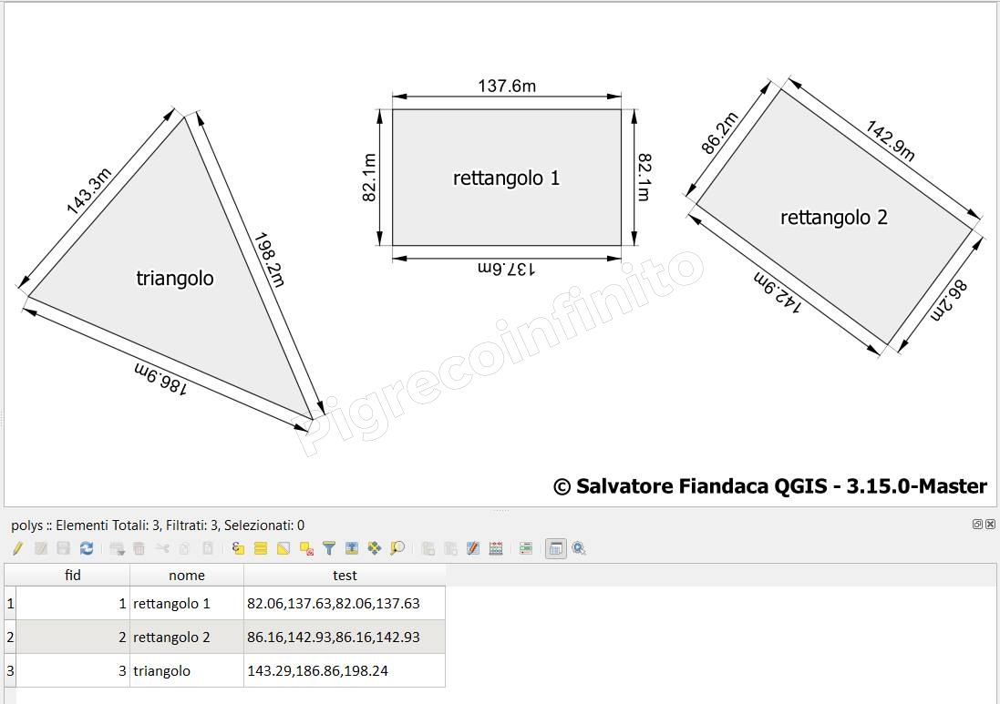

---
tags:
  - linee
  - array
---

# Lunghezze dei lati di un poligono

Dato un layer poligonale, come ottenere una lista di valori delle lunghezze dei lati del poligono.

[](../img/esempi/lunghezza_lati_poligono/img_01.png)

Creare un campo testuale (nello screenshot è `test`) sufficientemente lungo e popolarlo con la seguente espressione:

Espressione:

```
array_to_string(
        array_foreach(
            array_foreach(
                generate_series(1, num_geometries( segments_to_lines($geometry))),
                geometry_n(segments_to_lines($geometry),@element)), 
                    round(length(@element),2))
                ) 
```

**Nel linguaggio umano significa:** crea,per ogni poligono, un `array` e popolalo con la geometria dei singoli lati del poligono, infine calcola la loro lunghezza e mettili in una lista.

Osservazioni:

1. l'epsressione è generica, si puo' usare con qualsiasi poligono;
2. per poligoni con molti lati, i calcoli richiesti sono lunghi.

Geometrie:

Generare, per ogni poligono, un `array` con le geometrie dei lati del poligono:

```
array_foreach(
    generate_series(1, num_geometries( segments_to_lines($geometry))),
                geometry_n(segments_to_lines($geometry),@element)
            )
```

questa espressione ci permette di fare una serie di interrogazioni come:

1. qual è il lato più lungo e quanto vale la lunghezza;
2. applicare tutte le funzioni geometriche relative alla geometria del lato, esempio:
   1. azimuth di un lato;
   2. centroide di un lato;
   3. coordinate di un vertice del lato n;
   4. ecc...

IL tema (la quotatura) è scaricabile da qui: <https://plugins.qgis.org/styles/5/>

---

Funzioni e variabili utilizzate:

* [segments_to_lines](../gr_funzioni/geometria/geometria_unico.md#make_rectangle_3points)
* [num_geometries](../gr_funzioni/geometria/geometria_unico.md#num_geometries)
* [length](../gr_funzioni/geometria/geometria_unico.md#length_1)
* [round](../gr_funzioni/matematica/matematica_unico.md#round)
* [geometry_n](../gr_funzioni/geometria/geometria_unico.md#geometry_n)
* [segments_to_lines](../gr_funzioni/geometria/geometria_unico.md#segments_to_lines)
* [array_to_string](../gr_funzioni/array/array_unico.md#array_to_string)
* [generate_series](../gr_funzioni/array/array_unico.md#generate_series)
* [array_foreach](../gr_funzioni/array/array_unico.md#array_foreach)
* [\$geometry](../gr_funzioni/geometria/geometria_unico.md#geometry)