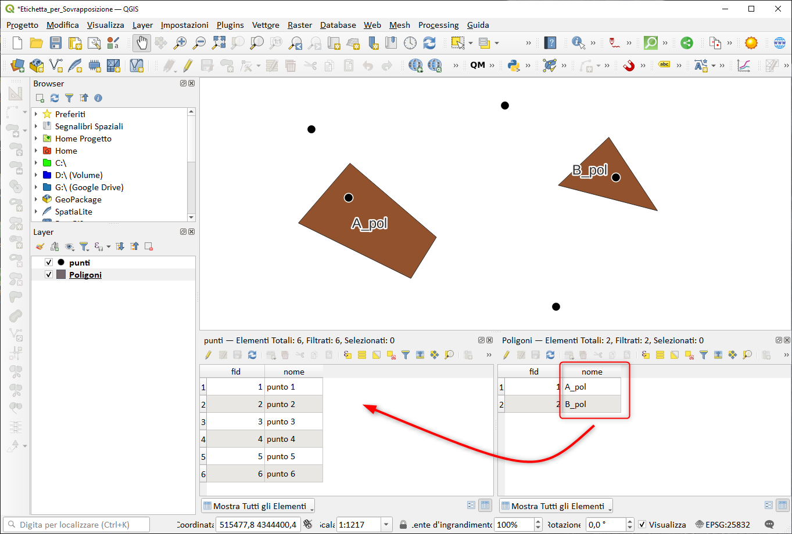

---
tags:
  - prossimità
  - sovrapposizione
  - poligoni
  - array
  - overlay
---

# Prendere un attributo da un altro layer sovrapposto

Supponiamo di avere un layer di punti e che alcuni di essi sono sovrapposti ad un altro layer poligonale: come prendere un attributo del layer poligonale e aggiungerlo nel layer di punti.

```
overlay_intersects('nomeLayerPoligonale',"nomeAttributoLayer Poligonale")[0]
```



NB: le funzioni `overlay_*` restituiscono quasi sempre un `array`, quindi, per prendere il primo valore occorre usare la notazione Python `[0]`

nel caso ci fossere più punti che si intersecassero coi poligoni, utilizzare questa espressione:

```
array_to_string(
    overlay_intersects('nomeLayerPoligonale',"nomeAttributoLayer Poligonale")
                )
```

che aggiungerà la lista dei punti sovrapposti.


**OSSERVAZIONE**: il ragionamento espresso sopra è valido per tutte le funzioni `overlay_*`, dove `*` è un predicato geometrico (_contains, crosses, disjoint, equals, intersects, nearest, touches e within_); quindi se volessimo prendere un attributo da punti più vicini, basterebbe utilizzare le stesse espressioni di sopra, ma utilizzando l'espressione `overlay_nearest`.

Esempio aggiunto per gentile richiesta di [Giulio Fattori](https://github.com/Korto19) (grazie)


## dati e progetto

[scarica Geopackage](../img/esempi/prendere_attributo_da_layer_sovrapposto/Etichetta_per_sovrapposizione.gpkg)

---

Funzioni e variabili utilizzate:

* [array_to_string](../gr_funzioni/arrayarray_unico.md#array_to_string)
* [overlay_intersects](../gr_funzioni/geometria/geometria_unico.md#overlay_intersects)
