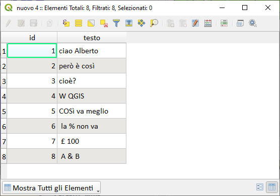
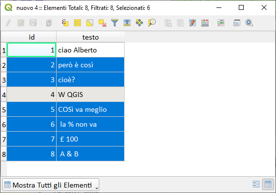

# Ricerca caratteri speciali

I caratteri speciali sono tutti quelli che non trovi sulla tastiera. Simboli, lettere accentate, icone che si dissociano dall’alfabeto tradizionale.

L'alfabeto tradiziona minuscolo,maiuscolo e numeri:

```
a,b,c,d,e,f,g,h,i,j,k,l,m,n,o,p,q,r,s,t,u,v,w,x,y,z
A,B,C,D,E,F,G,H,I,J,K,L,M,N,O,P,Q,R,S,T,U,V,W,X,Y,Z
0,1,2,3,4,5,6,7,8,9
```

Vediamo come selezionare i record in cui un campo contiene dei caratteri speciali. Una tecnica per selezionare i record che contengono almeno un carattere speciale è quello di ricercare tutti i caratteri che NON fanno parte dell'insiene scritto sopra; oppure, di ricercare un insieme di caratteri specificati.

Ecco un esempio:

[](../img/esempi/ricerca_caratteri_speciali/img_01.png)

## prima tecnica

creare un pattern per _escludere_ i caratteri da cercare `[^A-Za-z0-9\\s]`

L'espressione da utilizzare è:

```
regexp_substr("testo",'[^A-Za-z0-9\\s]') <> ''
```

dove:

- `[^A-Za-z0-9\\s]` significa, evita (`^`) l'insieme (cioè dalla A alla Z maiuscolo e minuscolo e i numeri)
- `\\s` significa spazio

## seconda tecnica

creare un pattern con i caratteri da cercare `[àèéìòù£$%]`, naturalmente l'elenco può crescere.

L'espressione da utilizzare è:

```
regexp_substr("testo",'[àèéìòù£$%]') <> ''
```

## risultato

in entrambi i casi, e per questo esempio, la soluzione è la stessa

[](../img/esempi/ricerca_caratteri_speciali/img_02.png)

per fare test con i `regex`: <https://regex101.com/>

Grazie a Valerio Pinna

---

Funzioni e variabili utilizzate:

* [regexp_substr](../gr_funzioni/stringhe_di_testo/stringhe_di_testo_unico.md#regexp_substr)
* [<>](../gr_funzioni/operatori/operatori_unico.md#diverso)
