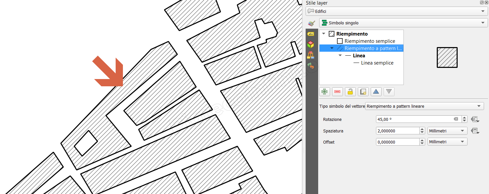
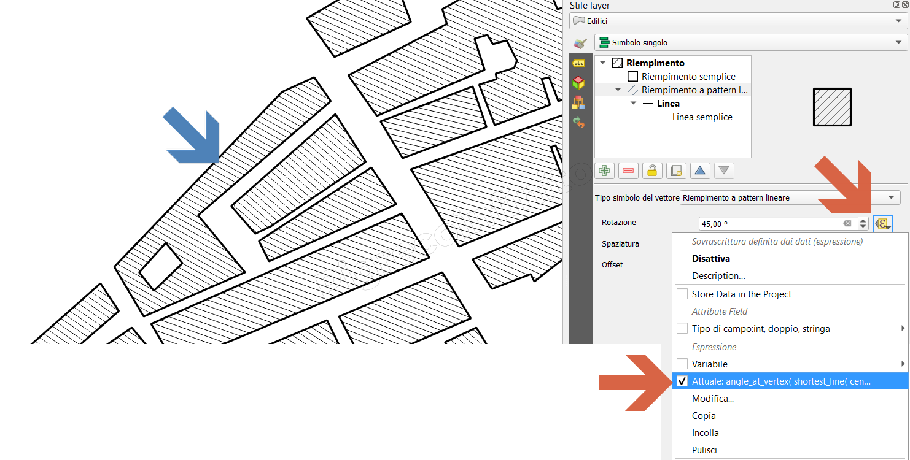
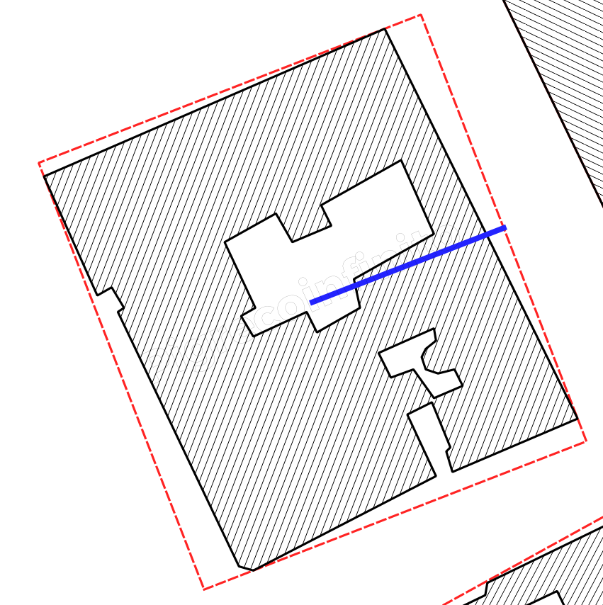
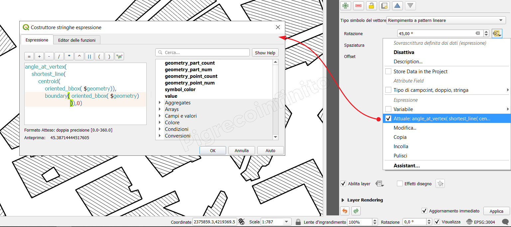

---
tags:
  - linee
  - vestizione
---

# Rotazione di pattern lineare

Campire degli edifici con pattern lineari e rotazione dipendente dalle feature

[](../img/esempi/rotazione_pattern_lineare/rotaz_01.png)

in questo screenshot si nota che il pattern lineare ha una rotazione costante di 45° per tutti gli edifici, per edifici con lato a 45° (vedi frecia) il pattern risulta parallelo e quindi non bello a vedersi.

Vediamo come calcolare un angolo diverso per ogni edificio in modo da limitare il parallelismo del pattern lineare:

[](../img/esempi/rotazione_pattern_lineare/rotaz_02.png)

l'espressione da usare è:

```
angle_at_vertex(shortest_line(centroid(oriented_bbox($geometry)), boundary(oriented_bbox($geometry))),0)
```

## nel linguaggio umano significa:

calcola l'angolo del segmento (in blue) più corto tra il centroide del bounding box orientato (tratteggio rosso) e il bounding box stesso.

[](../img/esempi/rotazione_pattern_lineare/rotaz_04.png)

espressione:

[](../img/esempi/rotazione_pattern_lineare/rotaz_03.png)

prova tu usando in file qml:

[file QML](https://github.com/opendatasicilia/HfcQGIS-md/raw/main/docs/prova_tu/rotazione_pattern_lineare.zip)

---

Funzioni e variabili utilizzate:

* [angle_at_vertex](../gr_funzioni/geometria/geomatria_unico.md#angle_at_vertex)
* [shortest_line](../gr_funzioni/geometria/geomatria_unico.md#shortest_line)
* [centroid](../gr_funzioni/geometria/geomatria_unico.md#centroid)
* [oriented_bbox](../gr_funzioni/geometria/geomatria_unico.md#oriented_bbox)
* [boundary](../gr_funzioni/geometria/geomatria_unico.md#boundary)
* [\$geometry](../gr_funzioni/geometria/geomatria_unico.md#geometry)

