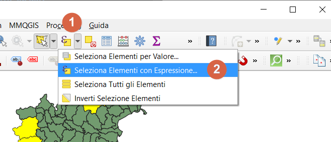
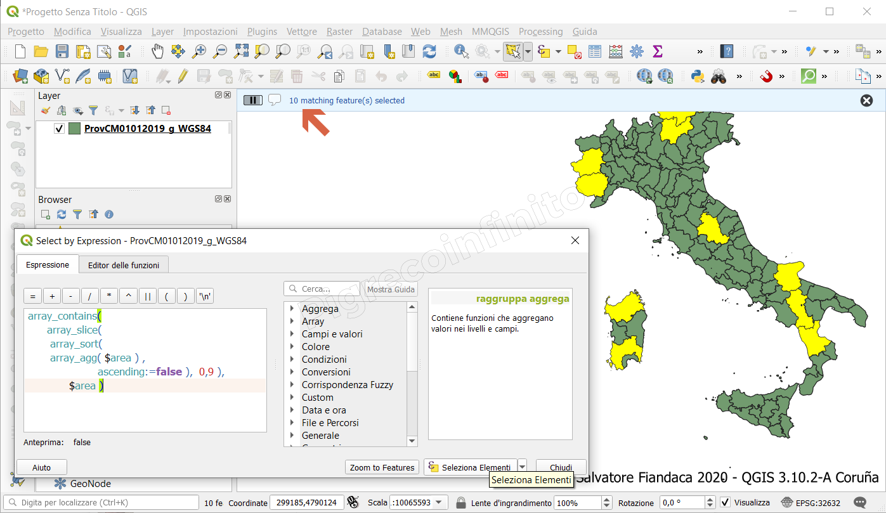
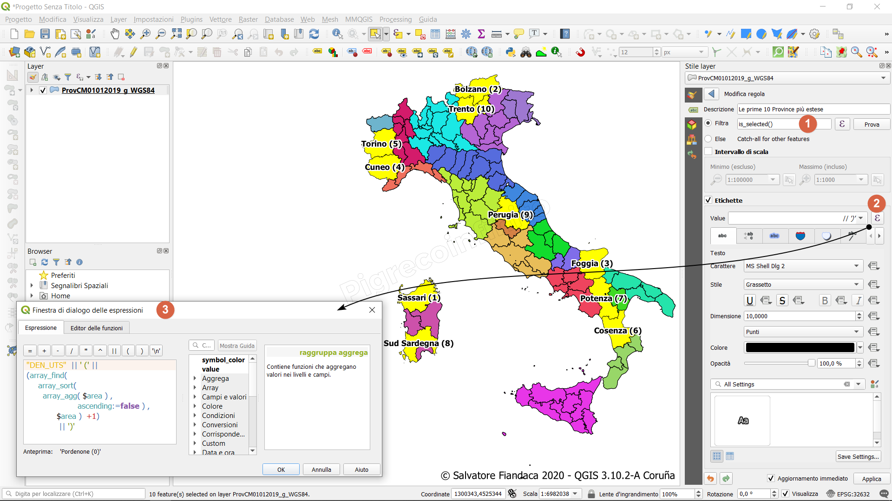

---
tags:
  - selezionare
  - poligoni
  - etichette
  - area
---

# Selezionare i primi 10 poligoni più grandi

Supponiamo di dover selezionare i primi 10 poligoni (per esempio le prime 10 province più estese d'Italia) usando la `selezione per espressione` di QGIS:

[](../img/esempi/selezionare_primi_n_valori/selnvalori0.png)

- Espressione da usare

```
 array_contains( 
    array_slice(  
     array_sort( 
      array_agg($area), 
                ascending:=false ), 0,9 ),
          $area)
```

Nel linguaggio umano significa:

Prendi i primi 10 (da 0 a 9) elementi (valore area) contenuti in un array ordinato in senso decrescente.

[](../img/esempi/selezionare_primi_n_valori/selnvalori1.png)


## Etichettatura

Etichettare con il nome della provincia e il numero sequenziale

Etichettiamo tramite regola e usiamo come filtro `is_selected()`, come espressione:

```
 "DEN_UTS"  || ' (' || 
 (array_find(  
      array_sort( 
		array_agg( $area ) , 
		               ascending:=false ) ,
			  $area ) +1)
			   || ')'
```

**NB:** +1 perché l'indice inizia da 0

[](../img/esempi/selezionare_primi_n_valori/selnvalori2.png)

---

Funzioni e variabili utilizzate:

* [doppio-pipe](../gr_funzioni/operatore/operatore_unico.md#doppio-pipe)
* [uguale](../gr_funzioni/operatore/operatore_unico.md#uguale)
* [array_contains](../gr_funzioni/array/array_unico.md#array_contains)
* [array_slice](../gr_funzioni/array/array_unico.md#array_slice)
* [array_sort](../gr_funzioni/array/array_unico.md#array_sort)
* [array_agg](../gr_funzioni/array/array_unico.md#array_agg)
* [\$area](../gr_funzioni/geometria/geometria_unico.md#array_sort)
* [\$geometry](../gr_funzioni/geometria/geometria_unico.md#geometry)