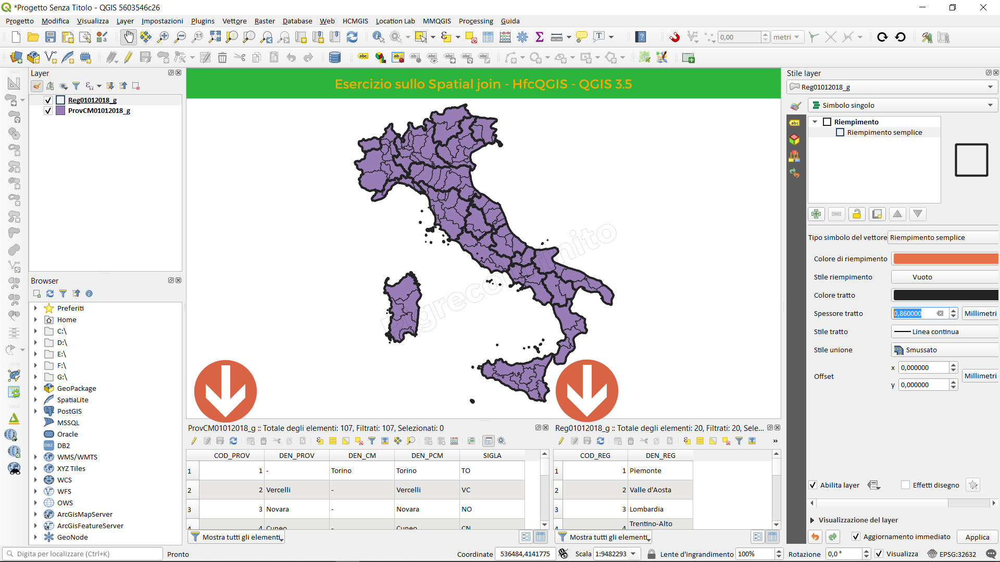
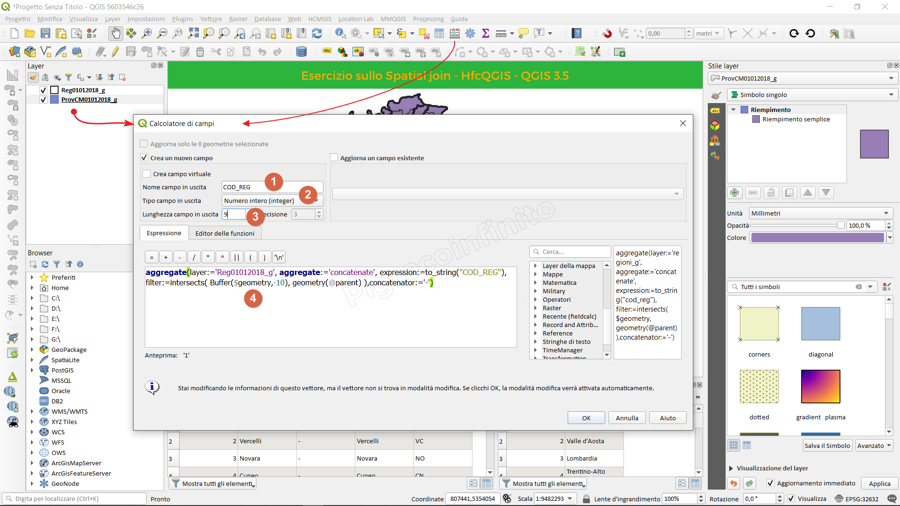
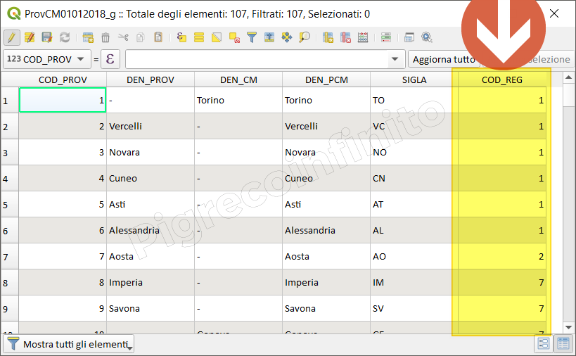
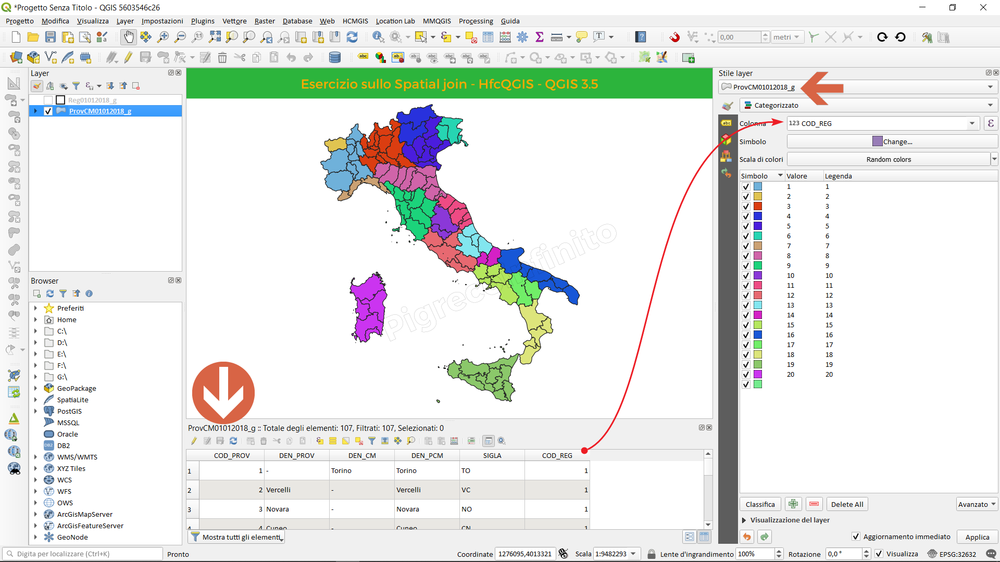

---
tags:
  - spatial-join
  - aggregare
---

# Spatial join 

L’unione spaziale di attributi è un problema frequente in ambito GIS - si tratta di trasferire attributi da un layer ad un altro basandosi solo sulle loro reciproche relazioni spaziali. In QGIS questa feature può essere avviata attraverso lo strumento **Unisci attributi per posizione** 

Esempio:

supponiamo di avere due layer: le _province_ e _regioni_ ISTAT, trasferire l'attributo '**COD_REG**' dal vettore _regione_ al vettore _province_.

[](../img/esempi/spatial_join/spatial_join1.png)

avviare il calcolatore di campi e creare un nuovo campo 'COD_REG' Integer (9) e popolarlo con la seguente espressione:

```
aggregate(layer:='Reg01012018_g', aggregate:='concatenate', expression:=to_string("COD_REG"), 
filter:=intersects( Buffer($geometry,-10), geometry(@parent) ),concatenator:='-') 
```

L'espressione di sopra in linguaggio umano:

aggrega, usando il layer _Reg01012018_g_, il campo _COD_REG_ in modo da rispettare la relazione spaziale (filter:=) tra regioni `($geometry)` e province`(geometry(@parent))`.

Step:

seleziono il layer _ProvCM01012018_g_, clicco sull'icona del calcolatore di campi:

1. nome del campo in uscita: COD_REG
2. tipo di campo in uscita: Integer;
3. lunghezza campo: 9
4. scrivo espressione di sopra;


[](../img/esempi/spatial_join/spatial_join2.png)

ecco la tabella attributi:

[](../img/esempi/spatial_join/spatial_join3.png)

Tematizzo con i valori del nuovo campo:

[](../img/esempi/spatial_join/spatial_join4.png)

**OSSERVAZIONE**:

1. ottengo il risultato sperato solo perché ho utilizzato il Buffer negativo altrimenti avrei ottenuto un risultato diverso (ovvero tutti le regioni che si intersecavano con la provincia);
2. il calcolatore di campi permette di aggiungere un campo nuovo nella stessa tabella attributi, cosa che è molto utile per questi lavori.
3. un risultato del genere NON è possibile ottenerlo cosi rapidamente.

---

Funzioni e variabili utilizzate:

* [@parent](../gr_funzioni/variabili/parent.md)
* [aggregate](../gr_funzioni/aggrega/aggrega_unico.md#aggregate)
* [geometry](../gr_funzioni/geometria/geometria_unico.md#geometry)
* [to_string](../gr_funzioni/stringhe_di_testo/stringhe_di_testo_unico.md#to_string)
* [intersects](../gr_funzioni/geometria/geometria_unico.md#intersects)
* [\$geometry](../gr_funzioni/geometria/geometria_unico.md#geometry)
