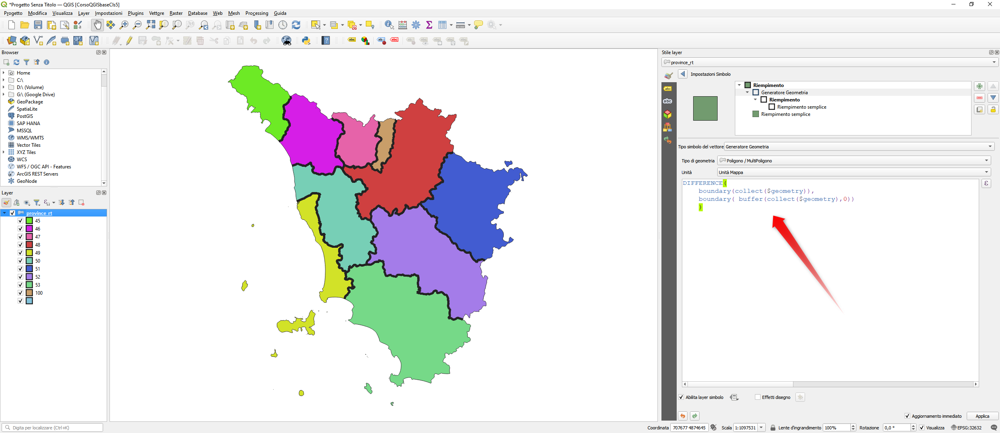

---
tags:
  - prossimità
  - aggrecare
  - stile
  - contorni
---

# Come aggiungere un unico contorno ad un layer poligonale

Per aggiungere un unico contorno allo stile di un layer poligonale con elementi adiacenti (vedi immagine sotto), solitamente si duplica il layer e su questo si cambia il tema per ottenere unico contorno (per esempio usando lo stise `Elementi fusi`). In questo esempio vedremo come evitare di duplicare il layer e di creare, tramite espressioni, un unico contorno complessivo o raggruppato secondo un attributo.

[](../img/esempi/tema_unico_contorno/img_00.png)

Per ottenere l'unico contorno occorre aggiungere un layer nell'impostazione del simbolo e modificarlo in `Generatore Geometria`, come espressione utilizzare:

```
buffer(collect($geometry),0)
```

[](../img/esempi/tema_unico_contorno/img_01.png)

toglier lo sfondo e lasciare solo il contorno.

nel caso volessimo raggruppare per un attributo (`"COD_PROV"`), ecco un esempio:

[](../img/esempi/tema_unico_contorno/img_02.png)

espressione utilizzata:

```
buffer(collect($geometry,"COD_PROV"),0)
```

ma se volessimo solo il contorno interno tra i poligoni adiacenti, allora occorre utilizzare la seguente espressione:

```
DIFFERENCE(
	boundary(collect($geometry)), 
	boundary( buffer(collect($geometry),0))
			)
```
oppure:

```
intersection(
    aggregate(
      layer:=@layer_name,
      aggregate:='collect',
      expression:=$geometry,
      filter:="cod_prov" != attribute(@parent,'cod_prov')),
    $geometry)
```

dove `COD_PROV` è un attributo del layer (vedi tweet: <https://twitter.com/bogind2/status/1538381147436204032>)

ottenendo:

[](../img/esempi/tema_unico_contorno/img_03.png)

---

Funzioni e variabili utilizzate:

* [collect](../gr_funzioni/aggrega/aggrega_unico.md/#collect)
* [buffer](../gr_funzioni/geometria/geometria_unico.md#buffer)
* [difference](../gr_funzioni/geometria/geometria_unico.md#difference)
* [$geometry](../gr_funzioni/geometria/geometria_unico.md#geometry)
