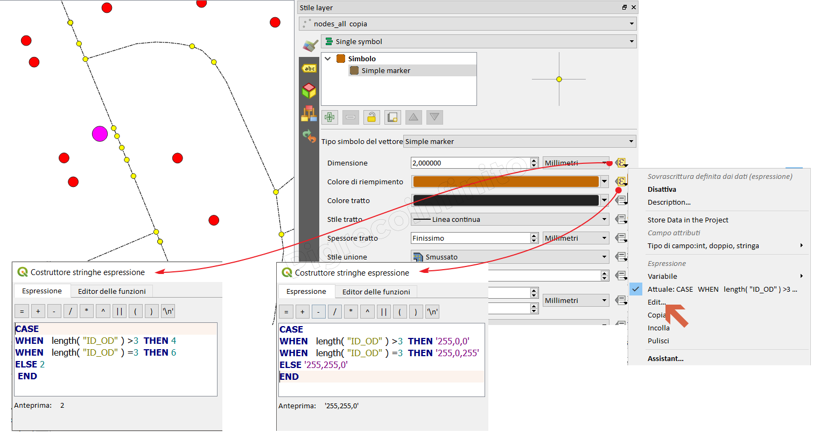
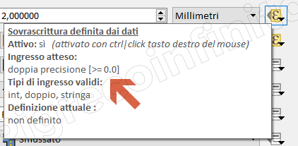
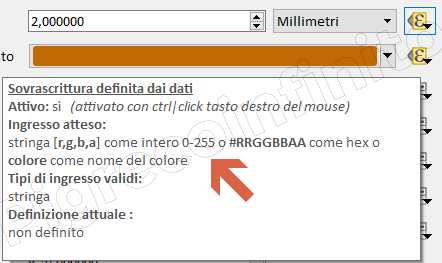

---
tags:
  - vestizione
  - condizioni
  - punti
---

# Tematizzare utilizzando la sovrascrittura definita dai dati 

Ad uno shapefile puntuale attribuire al simbolo colori diversi in funzione di un campo e la dimensione in funzione di un altro campo.

[](../img/esempi/tematizzare/tematizzare1.png)

nella Dimensione (mouse sull'icona  comparirà)

[](../img/esempi/tematizzare/tematizzare2.png)

quindi l'ingresso atteso è un numero reale che genereremo con la seguende condizione:

```
CASE 
WHEN   length( "ID_OD" ) >3  THEN 4
WHEN   length( "ID_OD" ) =3  THEN 6
ELSE 2
END
```

nella Colore di riempimento (mouse sull'icona  comparirà)

[](../img/esempi/tematizzare/tematizzare3.png)

quindi l'ingresso atteso è una stringa [r,g,b,a] con interi oppure come hex che genereremo con la seguende condizione:
```
CASE 
WHEN   length( "ID_OD" ) >3  THEN '255,0,0'
WHEN   length( "ID_OD" ) =3  THEN '255,0,255'
ELSE '255,255,0'
END
```

---

Funzioni e variabili utilizzate:

* [CASE](../gr_funzioni/condizioni/condizioni_unico.md#CASE)
* [length](../gr_funzioni/geometria/geometria_unico.md#length_1)
