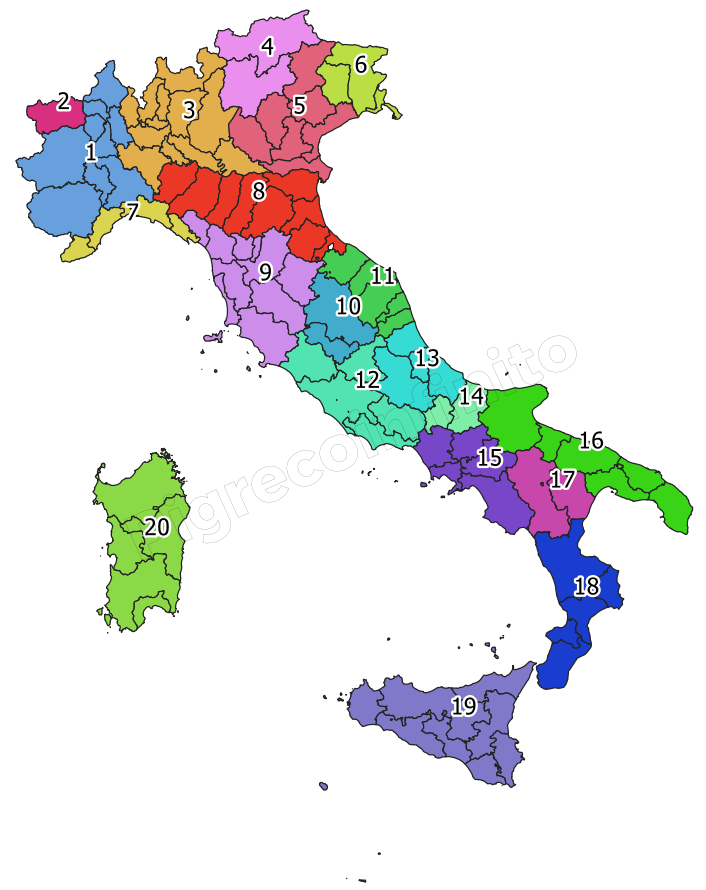
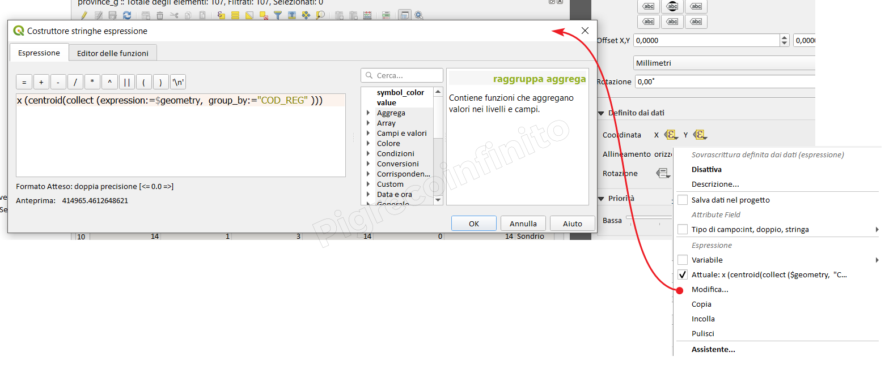

## Etichettare più poligoni con unica label

Etichettare con l'attributo `"COD_REG"` lo strato province italiane ISTAT (QGIS >=3.0)

Per poter etichettare più feature, con una unica label, occorre che nella tabella attributi sia presente un campo con valori ripetuti (nel nostro esempio si ripetono i valori del campo `"COD_REG"`):

Vediamo come realizzare tutto ciò:

Come campo etichetta seleziono `"COD_REG"` e poi dalla scheda _Posizionamento_ sezione _Definito dai dati_.

Nelle Coordinate x e y scrivere la seguente espressione:

`x (centroid(collect (expression:=$geometry,  group_by:="COD_REG" )))`

ripetere la stessa cosa per la y:

`y (centroid(collect (expression:=$geometry,  group_by:="COD_REG" )))`

Funzioni utilizzate (cercare le funzioni nella guida):

1. x, y : estrae la coordinate x o y dal centroide;
2. centroid: estrai il centroide di una feature;
3. collect: crea unica feature secondo un raggruppamento.
