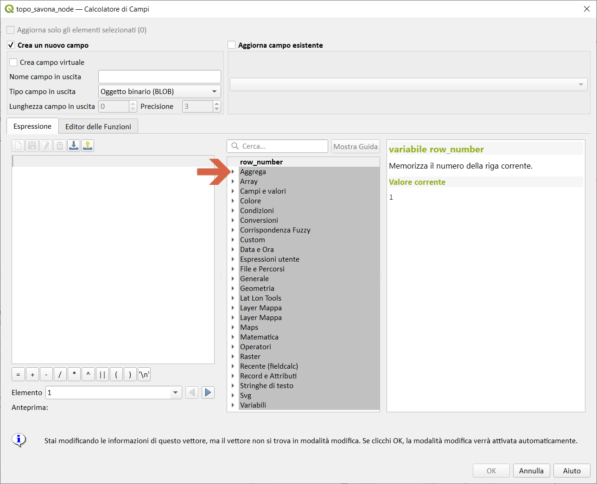

# Gruppo Aggrega

Contiene funzioni che aggregano valori nei livelli e campi. A partire da **QGIS 2.16** il motore di espressioni supporta l'uso di [parametri con nome](http://changelog.qgis.org/en/qgis/version/2.16.0/#named-parameters-expressions).

| Funzione  | Descrizione|
|----------:|:-----------|
|[aggregate](aggregate.md)|Restituisce un valore aggregato calcolato usando elementi da un altro vettore|
|[array_agg](array_agg.md)|Restituisce un array di valori aggregati da un campo o espressione|
|[collect](collect.md)|Restituisce la geometria a parti multiple di geometrie aggregate da una espressione|
|[concatenate](concatenate.md)|	Restituisce tutte le stringhe aggregate tratte da un campo o da una espressione unite con un delimitatore|
|[concatenate_unique](concatenate_unique.md)|Restituisce tutte le stringhe uniche tratte da un campo o da una espressione unite con un delimitatore|
|[count](count.md)|Restituisce il conteggio degli elementi corrispondenti|
|[count_distinct](count_distinct.md)|Restituisce il conteggio dei valori differenti|
|[count_missing](count_missing.md)|Restituisce il conteggio dei valori mancanti (nulli)|
|[iqr](iqr.md)|Restituisce lo scarto interquartile calcolato da un campo o espressione|
|[majority](majority.md)|Restituisce la maggioranza aggregata di valori (valore più comunemente presente) da un campo o espressione|
|[max_length](max_length.md)|Restituisce la lunghezza massima delle stringhe di un campo o espressione|
|[maximum](maximum.md)|Restituisce il valore massimo aggregato da un campo o espressione|
|[mean](mean.md)|Restituisce il valore medio aggregato da un campo o espressione|
|[median](median.md)|Restituisce il valore mediano aggregato da un campo o espressione|
|[min_length](min_length.md)|Restituisce la lunghezza minima delle stringhe di un campo o espressione|
|[minimum](minimum.md)|Restituisce il valore minimo aggregato da un campo o espressione.|
|[minority](minority.md)|Restituisce la minoranza aggregata di valori (valore meno comunemente presente) da un campo o espressione|
|[q1](q1.md)|Restituisce il primo quartile calcolato da un campo o espressione|
|[q3](q3.md)|Restituisce il terzo quartile calcolato da un campo o espressione|
|[range](range.md)|Restituisce l'intervallo aggregato di valori (massimo - minimo) da un campo o espressione|
|[relation_aggregate](relation_aggregate.md)|Restituisce un valore aggregato calcolato usando tutte le geometrie figlie corrispondenti da un altro vettore|
|[stdev](stdev.md)|Restituisce il valore di deviazione standard aggregato da un campo o espressione|
|[sum](sum.md)|Restituisce il valore sommato aggregato da un campo o espressione|

## Nota bene

Grazie ai [_parametri denominati_](http://changelog.qgis.org/en/qgis/version/2.16.0/#named-parameters-expressions) non è più indispensabile seguire, nella sintassi, l'ordine degli argomenti, ecco un esempio:

La sintassi prevede due possibilità:

1. quella classica, senza l'uso dei paramentri denominati (l'ordine è fondamentale);
    1. `count_distinct(expression, group_by, filter)`
2. con i parametri denominati (l'ordine non è più fondamentale): 
    1. `count_distinct(filter:= ,_expression:= ,group_by:=)`
