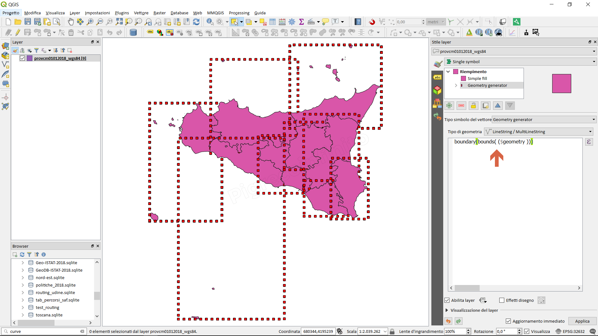
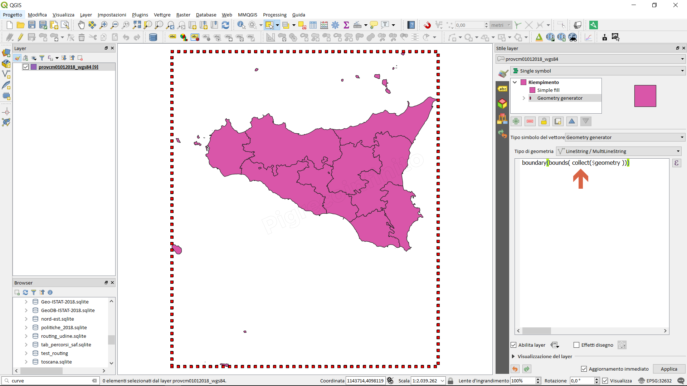
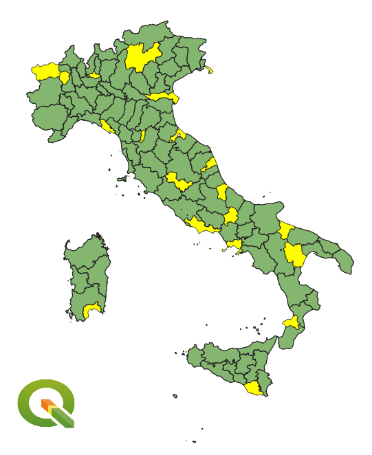
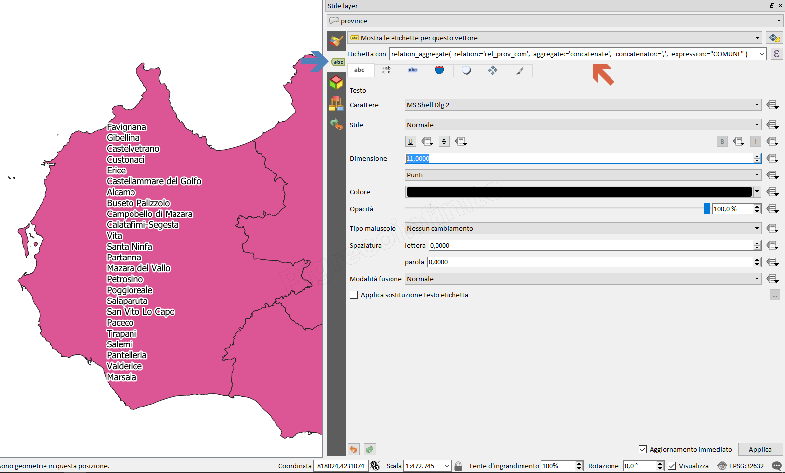

# Gruppo Aggrega

!!! Abstract
    **Contiene funzioni che aggregano valori nei livelli e campi.**

---

## aggregate

Restituisce un valore aggregato calcolato usando elementi da un altro vettore.

Sintassi:

- aggregate(*<span style="color:red;">layer</span>, <span style="color:red;">aggregate</span>, <span style="color:red;">expression</span>, <span style="color:red;">filter</span>, <span style="color:red;">concatenator</span>*)

Argomenti:

- *<span style="color:red;">layer</span>* una stringa, rappresentante o un nome di un layer o un ID di layer
- *<span style="color:red;">aggregate</span>* una stringa corrispondente all'aggregato da calcolare. Opzioni valide sono:

    - count
    - count_distinct
    - count_missing
    - min
    - max
    - sum
    - mean
    - median
    - stdev
    - stdevsample
    - range
    - minority
    - majority
    - q1: primo quartile
    - q3: terzo quartile
    - iqr: inter quartile range
    - min_length: minima lunghezza stringa
    - max_length: massima lunghezza stringa
    - concatenate: unisce stringhe con un concatenatore
    - collect: crea una geometria multiparte aggregata

* *<span style="color:red;">expression</span>* sotto-espressione o nome campo da aggregare
* *<span style="color:red;">filter</span>* espressione filtro opzionale per limitare gli elementi usati per calcolare l'aggregato. I campi e la geometria provengono dagli elementi del vettore unito. Si può accedere all'elemento sorgente con la variabile `@parent`.
* *<span style="color:red;">concatenator</span>* stringa opzionale da usare per unire i valori per il raggruppamento 'concatenate'


Esempi:

```
aggregate(layer:='province_g',aggregate:='sum',expression:=$area) → somma le aree di tutte le province valore mq (se EPSG proiettato)
aggregate(layer:='province_g',aggregate:='sum',expression:=$area/1000000) → somma le aree di tutte le province valore in kmq (se EPSG proiettato)
aggregate(layer:='province_g',aggregate:='sum',expression:=$area/1000000, filter:= "COD_REG" =19)  → somma tutti i valori dell'area delle province limitatamente alla regione Sicilia ("COD_REG"=19)
aggregate(layer:='province_g',aggregate:='concatenate',expression:= "DEN_PCM" , concatenator:=',')  → Elenco separato da virgole di tutte le denominazioni delle Province per tutte le geometrie nel vettore Regione
aggregate(layer:='province_g',aggregate:='concatenate',expression:= "DEN_PCM" ,concatenator:=',',filter:=intersects( centroid($geometry), geometry(@parent))) → Elenco separato delle denominazioni delle Province per ogni geometria del vettore Regione (cioè il  @parent)'
```


Osservazioni

i nomi dei layer vanno scritti tra apici semplici (`'nome_layer'`) mentre i nomi dei campi con doppi apici (`"nome_campo"`)


Altri esempi:

Come realizzare una spatial-join con aggregazione usando solo il calcolatore di campi [qui](https://medium.com/@salvatorefiandaca/qgis-3-0-funzioni-di-aggregazione-9c8c389985c5)

---

## array_agg

Restituisce un array di valori aggregati da un campo o espressione.

Sintassi:

- array_agg(_<span style="color:red;">expression</span>[,<span style="color:red;">group_by</span>][,<span style="color:red;">filter</span>][,<span style="color:red;">order_by</span>_])

[ ] indica componenti opzionali

Argomenti:

* _<span style="color:red;">expression</span>_ sotto espressione o campo da aggregare
* _<span style="color:red;">group_by</span>_ espressione opzionale da usarsi per raggruppare i calcoli aggregati
* _<span style="color:red;">filter</span>_ espressione opzionale da usare per filtrare gli elementi usati per calcolare il valore aggregato
* _<span style="color:red;">order_by</span>_ espressione opzionale da usare per ordinare gli elementi usati per calcolare il valore aggregato. Da predefinito, gli elementi verranno restituiti in un ordine non specificato.

Esempi:

* `array_agg( "DEN_PCM" ,group_by:= "COD_REG" ) → lista di valori del "DEN_PCM", ragguppata per il campo "COD_REG"`


Nota bene

Per prendere un valore specifico dell'array: 
- `array_agg("z")[0]` → 148,03 è il primo valore dell'array, indice 0;
- `array_agg("z")[1]` → 164,21 è il secondo valore dell'array, indice 1;
- ecc...

Osservazioni

---

## collect

Restituisce la geometria a parti multiple di geometrie aggregate da una espressione

Sintassi:

- collect(_<span style="color:red;">expression</span>, <span style="color:red;">group_by</span>, <span style="color:red;">filter</span>_)

Argomenti:

* _<span style="color:red;">expression</span>_ espressione geometria da aggregare
* _<span style="color:red;">group_by</span>_ espressione opzionale da usarsi per raggruppare i calcoli aggregati
* _<span style="color:red;">filter</span>_ espressione opzionale da usare per filtrare gli elementi usati per calcolare il valore aggregato

Esempi:

* `collect( $geometry ) → geometria a parti multiple delle geometrie aggregate`


Nota bene

--

Osservazioni

--





---

## concatenate

Restituisce tutte le stringhe aggregate tratte da un campo o da una espressione unite con un delimitatore.

Sintassi:

- concatenate(_<span style="color:red;">expression</span>, <span style="color:red;">group_by</span>, <span style="color:red;">filter</span>, <span style="color:red;">concatenator</span>_)

Argomenti:

* _<span style="color:red;">expression</span>_ sotto espressione o campo da aggregare
* _<span style="color:red;">group_by</span>_ espressione opzionale da usarsi per raggruppare i calcoli aggregati
* _<span style="color:red;">filter</span>_ espressione opzionale da usare per filtrare gli elementi usati per calcolare il valore aggregato
* _<span style="color:red;">concatenator</span>_ stringa opzionale da usarsi per unire i valori

Esempi:

* `concatenate( expression:="DEN_PCM",group_by:="COD_REG",concatenator:=',') → lista separata da virgola di "DEN_PCM", raggruppata dal campo "COD_REG"`


Nota bene

--

Osservazioni

---

## concatenate_unique

Restituisce tutte le stringhe aggregate univoche tratte da un campo o da una espressione unite con un delimitatore.

Sintassi:

- concatenate_unique(_<span style="color:red;">expression</span>_, _<span style="color:red;">group_by</span>_, _<span style="color:red;">filter, concatenator</span>_)

Argomenti:

* _<span style="color:red;">expression</span>_ sotto espressione o campo da aggregare
* _<span style="color:red;">group_by</span>_ espressione opzionale da usarsi per raggruppare i calcoli aggregati
* _<span style="color:red;">filter</span>_ espressione opzionale da usare per filtrare gli elementi usati per calcolare il valore aggregato
* _<span style="color:red;">concatenator</span>_ stringa opzionale da usarsi per unire i valori

Esempi:

* `concatenate_unique( expression:="DEN_PCM",group_by:="COD_REG",concatenator:=',') → lista separata da virgola di "DEN_PCM", raggruppata dal campo "COD_REG"`


Nota bene

--

Osservazioni

---

## count

Restituisce il conteggio degli elementi corrispondenti.

Sintassi:

- count(_<span style="color:red;">expression</span>, <span style="color:red;">group_by</span>, <span style="color:red;">filter</span>_)

Argomenti:

* _<span style="color:red;">expression</span>_ sotto espressione o campo da aggregare
* _<span style="color:red;">group_by</span>_ espressione opzionale da usarsi per raggruppare i calcoli aggregati
* _<span style="color:red;">filter</span>_ espressione opzionale da usare per filtrare gli elementi usati per calcolare il valore aggregato

Esempi:

* `count ( expression:= "DEN_PCM" ,group_by:= "COD_REG") → conta le "DEN_PCM", raggruppate per il campo "COD_REG"`


Nota bene

La sintassi prevede due possibilità:
1. quella classica, senza l'uso dei paramentri denominati (l'ordine è fondamentale);
    1. count(_<span style="color:red;">expression</span>, <span style="color:red;">group_by</span>, <span style="color:red;">filter</span>_)
2. con i parametri denominati (l'ordine non è più fondamentale): 
    1. count(_<span style="color:red;">filter:=</span> ,<span style="color:red;">expression:=</span> ,<span style="color:red;">group_by:=</span>_ )

Osservazioni

---

## count_distinct

Restituisce il conteggio dei valori differenti.

Sintassi:

- count_distinct(_<span style="color:red;">expression</span>, <span style="color:red;">group_by</span>, <span style="color:red;">filter</span>_)

Argomenti:

* _<span style="color:red;">expression</span>_ sotto espressione o campo da aggregare
* _<span style="color:red;">group_by</span>_ espressione opzionale da usarsi per raggruppare i calcoli aggregati
* _<span style="color:red;">filter</span>_ espressione opzionale da usare per filtrare gli elementi usati per calcolare il valore aggregato

Esempi:

* `count_distinct(expression:= "DEN_PCM" ,group_by:= "COD_REG" ,filter:= "COD_REG"<5) → conta i valori differenti delle "DEN_PCM", raggruppate per il campo "COD_REG" con filtro le prime 4 Regioni`


Nota bene

La sintassi prevede due possibilità:
1. quella classica, senza l'uso dei paramentri denominati (l'ordine è fondamentale);
    1. majority(_<span style="color:red;">expression</span>, <span style="color:red;">group_by</span>, <span style="color:red;">filter</span>_)
2. con i parametri denominati (l'ordine non è più fondamentale): 
    1. majority(_<span style="color:red;">filter:=</span> ,<span style="color:red;">expression:=</span> ,<span style="color:red;">group_by:=</span>_ )

Osservazioni

--


---

## count_missing

Restituisce il conteggio dei valori mancanti (nulli).

Sintassi:

- count_missing(_<span style="color:red;">expression</span>, <span style="color:red;">group_by</span>, <span style="color:red;">filter</span>_)

Argomenti:

* _<span style="color:red;">expression</span>_ sotto espressione o campo da aggregare
* _<span style="color:red;">group_by</span>_ espressione opzionale da usarsi per raggruppare i calcoli aggregati
* _<span style="color:red;">filter</span>_ espressione opzionale da usare per filtrare gli elementi usati per calcolare il valore aggregato

Esempi:

* ` count_missing( filter:= "COD_REG">=10,expression:= "DEN_PCM" , group_by:= "COD_REG") → conta i valori mancanti (nulli) delle "DEN_PCM", raggruppate per il campo "COD_REG" con filtro le ultime 10 Regioni`


Nota bene

La sintassi prevede due possibilità:
1. quella classica, senza l'uso dei paramentri denominati (l'ordine è fondamentale);
    1. count_missing(_<span style="color:red;">expression</span>, <span style="color:red;">group_by</span>, <span style="color:red;">filter</span>_)
2. con i parametri denominati (l'ordine non è più fondamentale): 
    1. count_missing(_<span style="color:red;">filter:=</span> ,<span style="color:red;">expression:=</span> ,<span style="color:red;">group_by:=</span>_ )

--

Osservazioni

---

## iqr

Restituisce lo scarto interquartile calcolato da un campo o espressione.

Sintassi:

- iqr(_<span style="color:red;">expression</span>, <span style="color:red;">group_by</span>, <span style="color:red;">filter</span>_)

Argomenti:

* _<span style="color:red;">expression</span>_ sotto espressione o campo da aggregare
* _<span style="color:red;">group_by</span>_ espressione opzionale da usarsi per raggruppare i calcoli aggregati
* _<span style="color:red;">filter</span>_ espressione opzionale da usare per filtrare gli elementi usati per calcolare il valore aggregato

Esempi:

* ` iqr(  "j_tot_maschi" , "COD_REG")  → scarto interquartile del valore "j_tot_maschi", raggruppato per il campo "COD_REG"`


Nota bene

La sintassi prevede due possibilità:
1. quella classica, senza l'uso dei paramentri denominati (l'ordine è fondamentale);
    1. iqr(_<span style="color:red;">expression</span>, <span style="color:red;">group_by</span>, <span style="color:red;">filter</span>_)
2. con i parametri denominati (l'ordine non è più fondamentale): 
    1. iqr(_<span style="color:red;">filter:=</span> ,<span style="color:red;">expression:=</span> ,<span style="color:red;">group_by:=</span>_ )
    
Osservazioni

---

## majority

Restituisce la maggioranza aggregata di valori (valore più comunemente presente) da un campo o espressione.

Sintassi:

- majority(_<span style="color:red;">expression</span>, <span style="color:red;">group_by</span>, <span style="color:red;">filter</span>_)

Argomenti:

* _<span style="color:red;">expression</span>_ sotto espressione o campo da aggregare
* _<span style="color:red;">group_by</span>_ espressione opzionale da usarsi per raggruppare i calcoli aggregati
* _<span style="color:red;">filter</span>_ espressione opzionale da usare per filtrare gli elementi usati per calcolare il valore aggregato

Esempi:

* ` majority(  "j_tot_maschi" , "COD_REG")  → valore di classe più comunemente presente, raggruppato per il campo "COD_REG"`


Nota bene

La sintassi prevede due possibilità:
1. quella classica, senza l'uso dei paramentri denominati (l'ordine è fondamentale);
    1. majority(_<span style="color:red;">expression</span>, <span style="color:red;">group_by</span>, <span style="color:red;">filter</span>_)
2. con i parametri denominati (l'ordine non è più fondamentale): 
    1. majority(_<span style="color:red;">filter:=</span> ,<span style="color:red;">expression:=</span> ,<span style="color:red;">group_by:=</span>_ )

Osservazioni

---

## max_length

Restituisce la lunghezza massima delle stringhe di un campo o espressione.

Sintassi:

- max_length(_<span style="color:red;">expression</span>, <span style="color:red;">group_by</span>, <span style="color:red;">filter</span>_)

Argomenti:

* _<span style="color:red;">expression</span>_ sotto espressione o campo da aggregare
* _<span style="color:red;">group_by</span>_ espressione opzionale da usarsi per raggruppare i calcoli aggregati
* _<span style="color:red;">filter</span>_ espressione opzionale da usare per filtrare gli elementi usati per calcolare il valore aggregato

Esempi:

* ` max_length("COMUNE", "COD_REG")  → lunghezza massima di "COMUNE", raggruppato per il campo "COD_REG"`


Nota bene

La sintassi prevede due possibilità:
1. quella classica, senza l'uso dei paramentri denominati (l'ordine è fondamentale);
    1. max_length(_<span style="color:red;">expression</span>, <span style="color:red;">group_by</span>, <span style="color:red;">filter</span>_)
2. con i parametri denominati (l'ordine non è più fondamentale): 
    1. max_length(_<span style="color:red;">filter:=</span> ,<span style="color:red;">expression:=</span> ,<span style="color:red;">group_by:=</span>_ )

Osservazioni

---

## maximum

Restituisce il valore massimo aggregato da un campo o espressione.

Sintassi:

- maximum(_<span style="color:red;">expression</span>, <span style="color:red;">group_by</span>, <span style="color:red;">filter</span>_)

Argomenti:

* _<span style="color:red;">expression</span>_ sotto espressione o campo da aggregare
* _<span style="color:red;">group_by</span>_ espressione opzionale da usarsi per raggruppare i calcoli aggregati
* _<span style="color:red;">filter</span>_ espressione opzionale da usare per filtrare gli elementi usati per calcolare il valore aggregato

Esempi:

* ` maximum("j_tot_femmine", "COD_REG")  → valore massimo di "j_tot_femmine", raggruppato per il campo "COD_REG"`


Nota bene

La sintassi prevede due possibilità:
1. quella classica, senza l'uso dei paramentri denominati (l'ordine è fondamentale);
    1. maximum(_<span style="color:red;">expression</span>, <span style="color:red;">group_by</span>, <span style="color:red;">filter</span>_)
2. con i parametri denominati (l'ordine non è più fondamentale): 
    1. maximum(_<span style="color:red;">filter:=</span> ,<span style="color:red;">expression:=</span> ,<span style="color:red;">group_by:=</span>_ )


Osservazioni

---

## mean

Restituisce il valore medio aggregato da un campo o espressione.

Sintassi:

- mean(_<span style="color:red;">expression</span>, <span style="color:red;">group_by</span>, <span style="color:red;">filter</span>_)

Argomenti:

* _<span style="color:red;">expression</span>_ sotto espressione o campo da aggregare
* _<span style="color:red;">group_by</span>_ espressione opzionale da usarsi per raggruppare i calcoli aggregati
* _<span style="color:red;">filter</span>_ espressione opzionale da usare per filtrare gli elementi usati per calcolare il valore aggregato

Esempi:

* ` mean("j_tot_femmine", "COD_REG")  → valore massimo di "j_tot_femmine", raggruppato per il campo "COD_REG"`


Nota bene

La sintassi prevede due possibilità:
1. quella classica, senza l'uso dei paramentri denominati (l'ordine è fondamentale);
    1. mean(_<span style="color:red;">expression</span>, <span style="color:red;">group_by</span>, <span style="color:red;">filter</span>_)
2. con i parametri denominati (l'ordine non è più fondamentale): 
    1. mean(_<span style="color:red;">filter:=</span> ,<span style="color:red;">expression:=</span> ,<span style="color:red;">group_by:=</span> )

Osservazioni

---

## median

Restituisce il valore mediano aggregato da un campo o espressione.

Sintassi:

- median(_<span style="color:red;">expression</span>, <span style="color:red;">group_by</span>, <span style="color:red;">filter</span>_)

Argomenti:

* _<span style="color:red;">expression</span>_ sotto espressione o campo da aggregare
* _<span style="color:red;">group_by</span>_ espressione opzionale da usarsi per raggruppare i calcoli aggregati
* _<span style="color:red;">filter</span>_ espressione opzionale da usare per filtrare gli elementi usati per calcolare il valore aggregato

Esempi:

* ` median("j_tot_femmine", "COD_REG")  → mediana della "j_tot_femmine", raggruppato per il campo "COD_REG"`


Nota bene

La sintassi prevede due possibilità:
1. quella classica, senza l'uso dei paramentri denominati (l'ordine è fondamentale);
    1. median(_<span style="color:red;">expression</span>, <span style="color:red;">group_by</span>, <span style="color:red;">filter</span>_)
2. con i parametri denominati (l'ordine non è più fondamentale): 
    1. median(_<span style="color:red;">filter:=</span> ,<span style="color:red;">expression:=</span> ,<span style="color:red;">group_by:=</span>_ )

Osservazioni

---

## min_length

Restituisce la lunghezza minima delle stringhe di un campo o espressione.

Sintassi:

- min_length(_<span style="color:red;">expression</span>, <span style="color:red;">group_by</span>, <span style="color:red;">filter</span>_)

Argomenti:

* _<span style="color:red;">expression</span>_ sotto espressione o campo da aggregare
* _<span style="color:red;">group_by</span>_ espressione opzionale da usarsi per raggruppare i calcoli aggregati
* _<span style="color:red;">filter</span>_ espressione opzionale da usare per filtrare gli elementi usati per calcolare il valore aggregato

Esempi:

* ` min_length("COMUNE", "COD_REG")  → lunghezza minima di "COMUNE", raggruppato per il campo "COD_REG"`


Nota bene

La sintassi prevede due possibilità:
1. quella classica, senza l'uso dei paramentri denominati (l'ordine è fondamentale);
    1. min_length(_<span style="color:red;">expression</span>, <span style="color:red;">group_by</span>, <span style="color:red;">filter</span>_)
2. con i parametri denominati (l'ordine non è più fondamentale): 
    1. min_length(_<span style="color:red;">filter:=</span> ,<span style="color:red;">expression:=</span> ,<span style="color:red;">group_by:=</span>_ )

Osservazioni

---

## minimum

Restituisce il valore minimo aggregato da un campo o espressione.

Sintassi:

- minimum(_<span style="color:red;">expression</span>, <span style="color:red;">group_by</span>, <span style="color:red;">filter</span>_)

Argomenti:

* _<span style="color:red;">expression</span>_ sotto espressione o campo da aggregare
* _<span style="color:red;">group_by</span>_ espressione opzionale da usarsi per raggruppare i calcoli aggregati
* _<span style="color:red;">filter</span>_ espressione opzionale da usare per filtrare gli elementi usati per calcolare il valore aggregato

Esempi:

* ` minimum("j_tot_femmine", "COD_REG")  → valore minimo di "j_tot_femmine", raggruppato per il campo "COD_REG"`


Nota bene

La sintassi prevede due possibilità:
1. quella classica, senza l'uso dei paramentri denominati (l'ordine è fondamentale);
    1. minimum(_<span style="color:red;">expression</span>, <span style="color:red;">group_by</span>, <span style="color:red;">filter</span>_)
2. con i parametri denominati (l'ordine non è più fondamentale): 
    1. minimum(_<span style="color:red;">filter:=</span> ,<span style="color:red;">expression:=</span> ,<span style="color:red;">group_by:=</span>_)


Esempio:

Selezionare le Province con minor area per ogni Regione

`$area = minimum(expression:=$area,group_by:="COD_REG")`



---

## minority

Restituisce la minoranza aggregata di valori (valore meno comunemente presente) da un campo o espressione.

Sintassi:

- minority(_<span style="color:red;">expression</span>, <span style="color:red;">group_by</span>, <span style="color:red;">filter</span>_)

Argomenti:

* _<span style="color:red;">expression</span>_ sotto espressione o campo da aggregare
* _<span style="color:red;">group_by</span>_ espressione opzionale da usarsi per raggruppare i calcoli aggregati
* _<span style="color:red;">filter</span>_ espressione opzionale da usare per filtrare gli elementi usati per calcolare il valore aggregato

Esempi:

* `minority(  "j_tot_maschi" , "COD_REG")  → valore di classe meno comunemente presente, raggruppato per il campo "COD_REG"`


Nota bene

La sintassi prevede due possibilità:
1. quella classica, senza l'uso dei paramentri denominati (l'ordine è fondamentale);
    1. minority(_<span style="color:red;">expression</span>, <span style="color:red;">group_by</span>, <span style="color:red;">filter</span>_)
2. con i parametri denominati (l'ordine non è più fondamentale): 
    1. minority(_<span style="color:red;">filter:=</span> ,<span style="color:red;">expression:=</span> ,<span style="color:red;">group_by:=</span>_)

Osservazioni

---

## q1

Restituisce il primo quartile calcolato da un campo o espressione.

Sintassi:

- q1(_<span style="color:red;">expression</span>, <span style="color:red;">group_by</span>, <span style="color:red;">filter</span>_)

Argomenti:

* _<span style="color:red;">expression</span>_ sotto espressione o campo da aggregare
* _<span style="color:red;">group_by</span>_ espressione opzionale da usarsi per raggruppare i calcoli aggregati
* _<span style="color:red;">filter</span>_ espressione opzionale da usare per filtrare gli elementi usati per calcolare il valore aggregato

Esempi:

* `q1("j_tot_maschi" , "COD_REG")  → primo quartile del valore "j_tot_maschi", raggruppato per il campo "COD_REG"`


Nota bene

La sintassi prevede due possibilità:
1. quella classica, senza l'uso dei paramentri denominati (l'ordine è fondamentale);
    1. q1(_<span style="color:red;">expression</span>, <span style="color:red;">group_by</span>, <span style="color:red;">filter</span>_)
2. con i parametri denominati (l'ordine non è più fondamentale): 
    1. q1(_<span style="color:red;">filter:=</span> ,<span style="color:red;">expression:=</span> ,<span style="color:red;">group_by:=</span>_)

Osservazioni

---

## q3

Restituisce il terzo quartile calcolato da un campo o espressione.

Sintassi:

- q3(_<span style="color:red;">expression</span>, <span style="color:red;">group_by</span>, <span style="color:red;">filter</span>_)

Argomenti:

* _<span style="color:red;">expression</span>_ sotto espressione o campo da aggregare
* _<span style="color:red;">group_by</span>_ espressione opzionale da usarsi per raggruppare i calcoli aggregati
* _<span style="color:red;">filter</span>_ espressione opzionale da usare per filtrare gli elementi usati per calcolare il valore aggregato

Esempi:

* `q3("j_tot_maschi" , "COD_REG")  → terzo quartile del valore "j_tot_maschi", raggruppato per il campo "COD_REG"`


Nota bene

La sintassi prevede due possibilità:
1. quella classica, senza l'uso dei paramentri denominati (l'ordine è fondamentale);
    1. q3(_<span style="color:red;">expression</span>, <span style="color:red;">group_by</span>, <span style="color:red;">filter</span>_)
2. con i parametri denominati (l'ordine non è più fondamentale): 
    1. q3(_<span style="color:red;">filter:=</span> ,<span style="color:red;">expression:=</span> ,<span style="color:red;">group_by:=</span>_)

Osservazioni

---

## range

Restituisce l'intervallo aggregato di valori (massimo - minimo) da un campo o espressione.

Sintassi:

- range(_<span style="color:red;">expression</span>, <span style="color:red;">group_by</span>, <span style="color:red;">filter</span>_)

Argomenti:

* _<span style="color:red;">expression</span>_ sotto espressione o campo da aggregare
* _<span style="color:red;">group_by</span>_ espressione opzionale da usarsi per raggruppare i calcoli aggregati
* _<span style="color:red;">filter</span>_ espressione opzionale da usare per filtrare gli elementi usati per calcolare il valore aggregato

Esempi:

* `range("j_tot_maschi" , "COD_REG")  → intervallo di valori "j_tot_maschi", raggruppato per il campo "COD_REG"`


Nota bene

La sintassi prevede due possibilità:
1. quella classica, senza l'uso dei paramentri denominati (l'ordine è fondamentale);
    1. range(_<span style="color:red;">expression</span>, <span style="color:red;">group_by</span>, <span style="color:red;">filter</span>_)
2. con i parametri denominati (l'ordine non è più fondamentale): 
    1. range(_<span style="color:red;">filter:=</span> ,<span style="color:red;">expression:=</span> ,<span style="color:red;">group_by:=</span>_)

Osservazioni

---

## relation_aggregate

Restituisce un valore aggregato calcolato usando tutte le geometrie figlie corrispondenti da un altro vettore.

Sintassi:

- relation_aggregate(_<span style="color:red;">relation</span>, <span style="color:red;">aggregate</span>, <span style="color:red;">expression</span>, <span style="color:red;">concatenator</span>_)

Argomenti:

* <span style="color:red;">_relation_</span> una stringa, rappresentante un ID di relazione
* <span style="color:red;">_aggregate_</span> una stringa corrispondente all'aggregato da calcolare. Opzioni valide sono:
    * count
    * count_distinct
    * count_missing
    * min
    * max
    * sum
    * mean
    * median
    * stdev
    * stdevsample
    * range
    * minority
    * majority
    * q1: primo quartile
    * q3: terzo quartile
    * iqr: scarto interquartile
    * min_length: minima lunghezza stringa
    * max_length: massima lunghezza stringa
    * concatenate: unisci stringhe con un concatenatore
    
* <span style="color:red;">_expression_</span> sotto espressione o nome campo da aggregare
* <span style="color:red;">_concatenator_</span> stringa opzionale da usare per unire i valori per il raggruppamento 'concatenate'

Esempi:

```
* relation_aggregate(relation:='rel_prov_com',aggregate:='concatenate',concatenator:=',',expression:="COMUNE" ) →  elenco separato da virgole del campo "COMUNE" per tutte le geometrie figlie corrispondenti usando la relation 'rel_prov_com'
* relation_aggregate(relation:='my_relation',aggregate:='mean',expression:="passengers") → valore medio di tutte le geometrie figlie corrispondenti usando la relazione 'my_relation'
* relation_aggregate('my_relation','sum', "passengers"/7) → somma del campo passengers diviso per 7 per tutte le geometrie figlie corrispondenti usando la relazione 'my_relation'
* relation_aggregate('my_relation','concatenate', "towns", concatenator:=',') → elenco separato da virgole del campo town per tutte le geometrie figlie corrispondenti usando la relation 'my_relation'
```


Nota bene

La sintassi prevede due possibilità:
1. quella classica, senza l'uso dei paramentri denominati (l'ordine è fondamentale);
    1. relation_aggregate(_<span style="color:red;">relation</span>, <span style="color:red;">aggregate</span>, <span style="color:red;">expression</span>, <span style="color:red;">concatenator</span>_)
2. con i parametri denominati (l'ordine non è più fondamentale): 
    1. relation_aggregate(_<span style="color:red;">relation:=</span>, <span style="color:red;">aggregate:=</span>, <span style="color:red;">expression:=<span style="color:red;">, <span style="color:red;">concatenator:=</span>_)

Osservazioni

--



---

## stdev

Restituisce il valore di deviazione standard aggregato da un campo o espressione.

Sintassi:

- stdev(_<span style="color:red;">expression</span>, <span style="color:red;">group_by</span>, <span style="color:red;">filter</span>_)

Argomenti:

* _<span style="color:red;">expression</span>_ sotto espressione o campo da aggregare
* _<span style="color:red;">group_by</span>_ espressione opzionale da usarsi per raggruppare i calcoli aggregati
* _<span style="color:red;">filter</span>_ espressione opzionale da usare per filtrare gli elementi usati per calcolare il valore aggregato


Esempi:

* ` stdev("j_tot_maschi" , "COD_REG")  → deviazione standard di un valore "j_tot_maschi", raggruppato per il campo "COD_REG"`


Nota bene

La sintassi prevede due possibilità:
1. quella classica, senza l'uso dei paramentri denominati (l'ordine è fondamentale);
    1. stdev(_<span style="color:red;">expression</span>, <span style="color:red;">group_by</span>, <span style="color:red;">filter</span>_)
2. con i parametri denominati (l'ordine non è più fondamentale): 
    1. stdev(_<span style="color:red;">filter:=</span> ,<span style="color:red;">expression:=</span> ,<span style="color:red;">group_by:=</span>_)

Osservazioni

---

## sum

Restituisce il valore sommato aggregato da un campo o espressione.

Sintassi:

- sum(_<span style="color:red;">expression</span>, <span style="color:red;">group_by</span>, <span style="color:red;">filter</span>_)

Argomenti:

* <span style="color:red;">_expression_</span> sotto espressione o campo da aggregare
* <span style="color:red;">_group_by_</span> espressione opzionale da usarsi per raggruppare i calcoli aggregati
* <span style="color:red;">_filter_</span> espressione opzionale da usare per filtrare gli elementi usati per calcolare il valore aggregato

Esempi:

* ` sum("j_tot_maschi" , "COD_REG")  → valore somma di "j_tot_maschi", raggruppato per il campo "COD_REG"`


Nota bene

La sintassi prevede due possibilità:
1. quella classica, senza l'uso dei paramentri denominati (l'ordine è fondamentale);
    1. sum(_<span style="color:red;">expression</span>, <span style="color:red;">group_by</span>, <span style="color:red;">filter</span>_)
2. con i parametri denominati (l'ordine non è più fondamentale): 
    1. sum(_<span style="color:red;">filter:=</span> ,<span style="color:red;">expression:=</span> ,<span style="color:red;">group_by:=</span>_)

Osservazioni

--
