# Gruppo Aggrega

!!! Abstract
    **Contiene funzioni che aggregano valori nei livelli e campi.**

---

## aggregate

Restituisce un valore aggregato calcolato usando elementi da un altro vettore.

Sintassi:

- aggregate(*<span style="color:red;">layer</span>, <span style="color:red;">aggregate</span>,<span style="color:red;">expression</span>[,<span style="color:red;">filter</span>][, <span style="color:red;">concatenator=''</span>][,_<span style="color:red;">order_by</span>_*)

[ ] indica componenti opzionali

Argomenti:

- *<span style="color:red;">layer</span>* una stringa, rappresentante o un nome di un layer o un ID di layer
- *<span style="color:red;">aggregate</span>* una stringa corrispondente all'aggregato da calcolare. Opzioni valide sono:

    - count
    - count_distinct
    - count_missing
    - min
    - max
    - sum
    - mean
    - median
    - stdev
    - stdevsample
    - range
    - minority
    - majority
    - q1: primo quartile
    - q3: terzo quartile
    - iqr: inter quartile range
    - min_length: minima lunghezza stringa
    - max_length: massima lunghezza stringa
    - concatenate: unisce stringhe con un concatenatore
    - collect: crea una geometria multiparte aggregata

* *<span style="color:red;">expression</span>* sotto-espressione o nome campo da aggregare
* *<span style="color:red;">filter</span>* espressione filtro opzionale per limitare gli elementi usati per calcolare l'aggregato. I campi e la geometria provengono dagli elementi del vettore unito. Si può accedere all'elemento sorgente con la variabile `@parent`.
* *<span style="color:red;">concatenator</span>* stringa opzionale da usare per unire i valori per il raggruppamento 'concatenate'
* _<span style="color:red;">order_by</span>_ espressione filtro opzionale per ordinare gli elementi usati per calcolare il valore aggregato. I campi e la geometria provengono dagli elementi del vettore unito. Da predefinito, gli elementi verranno restituiti in un ordine non specificato.

Esempi:

```
aggregate(layer:='rail_stations',aggregate:='sum',expression:="passengers") → somma tutti i valori per il campo passengers nel layer rail_stations
aggregate('rail_stations','sum', "passengers"/7) → calcola la media giornaliera di "passengers" dividendo il campo "passengers" per 7 prima di sommare i valori
aggregate(layer:='rail_stations',aggregate:='sum',expression:="passengers",filter:="class">3) → somma tutti i valori per il campo "passengers" soltanto dagli elementi geometrie dove l'attributo "class" è maggiore di 3
aggregate(layer:='rail_stations',aggregate:='concatenate', expression:="name", concatenator:=',') → elenco separato da virgole del campo name per tutti gli elementi nel vettore rail_stations
aggregate(layer:='countries', aggregate:='max', expression:="code", filter:=intersects( $geometry, geometry(@parent) ) ) → Il codice Paese di un Paese di intersezione nel vettore 'countries'
aggregate(layer:='stazioni_rotaie',aggregate:='sum',expression:="viaggiatori",filter:=contains( @atlas_geometry, $geometry ) ) → somma tutti i valori del campo viaggiatori in rail_stations all'interno dell'elemento atlante corrente
aggregate(layer:='rail_stations', aggregate:='collect', expression:=centroid($geometry), filter:="region_name" = attribute(@parent,'name') ) → aggrega le geometrie dei centroidi delle stazioni ferroviarie della stessa regione dell'elemento corrente
```

[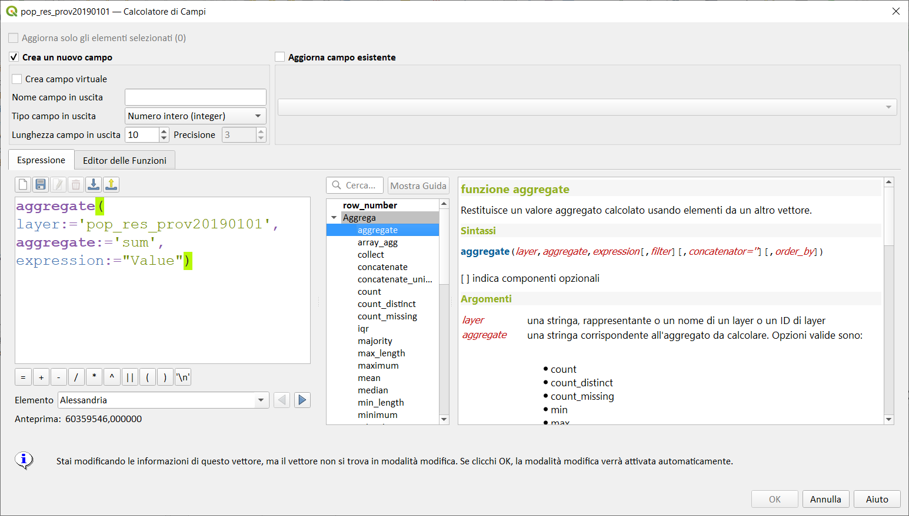](../../img/aggregate/aggregate/aggregate1.png)

Osservazioni

i nomi dei layer vanno scritti tra apici semplici (`'nome_layer'`) mentre i nomi dei campi con doppi apici (`"nome_campo"`)

[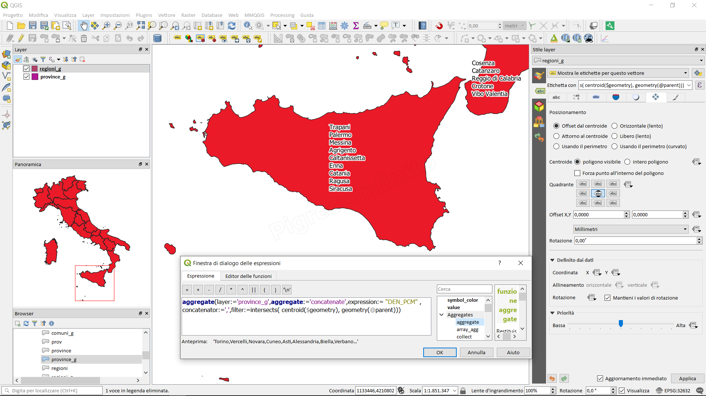](../../img/aggregate/aggregate/aggregate2.png)

Altri esempi:

Come realizzare una spatial-join con aggregazione usando solo il calcolatore di campi [qui](https://medium.com/@salvatorefiandaca/qgis-3-0-funzioni-di-aggregazione-9c8c389985c5)

---

## array_agg

Restituisce un array di valori aggregati da un campo o espressione.

Sintassi:

- array_agg(_<span style="color:red;">expression</span>[,<span style="color:red;">group_by</span>][,<span style="color:red;">filter</span>][,<span style="color:red;">order_by</span>_])

[ ] indica componenti opzionali

Argomenti:

* _<span style="color:red;">expression</span>_ sotto espressione o campo da aggregare
* _<span style="color:red;">group_by</span>_ espressione opzionale da usarsi per raggruppare i calcoli aggregati
* _<span style="color:red;">filter</span>_ espressione opzionale da usare per filtrare gli elementi usati per calcolare il valore aggregato
* _<span style="color:red;">order_by</span>_ espressione opzionale da usare per ordinare gli elementi usati per calcolare il valore aggregato. Da predefinito, gli elementi verranno restituiti in un ordine non specificato.

Esempi:

```
array_agg( "DEN_PCM" ,group_by:= "COD_REG" ) → lista di valori del "DEN_PCM", ragguppata per il campo "COD_REG"
```

[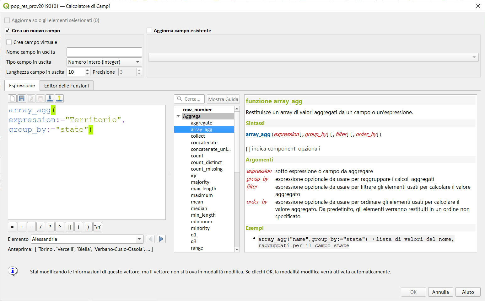](../../img/aggregate/array_agg/array_agg1.png)

Nota bene

Per prendere un valore specifico dell'array:

```
- array_agg("z")[0] → 148,03 è il primo valore dell'array, indice 0;
- array_agg("z")[1] → 164,21 è il secondo valore dell'array, indice 1;
- ecc...
```

dove `"z"` è un attributo

!!! Success "Osservazioni:" 
    - la funzione `array_agg` permette di trasformare un attributo (colonna di una tabella) in un array!!!
    - la funzione [attributes](..\record_e_attributi\record_e_attributi_unico.md#attributes) permette di trasformare una feature (riga di una tabella) in una maps e quindi in un array!!!

---

## collect

Restituisce la geometria a parti multiple di geometrie aggregate da una espressione

Sintassi:

- collect(_<span style="color:red;">expression</span>[,<span style="color:red;">group_by</span>][,<span style="color:red;">filter</span>_])

Argomenti:

* _<span style="color:red;">expression</span>_ espressione geometria da aggregare
* _<span style="color:red;">group_by</span>_ espressione opzionale da usarsi per raggruppare i calcoli aggregati
* _<span style="color:red;">filter</span>_ espressione opzionale da usare per filtrare gli elementi usati per calcolare il valore aggregato

Esempi:

```
collect( $geometry ) → geometria a parti multiple delle geometrie aggregate
collect( centroid($geometry), group_by:="region", filter:= "use" = 'civilian' ) → centroidi aggregati degli elementi civili basati sul relativo valore regionale
```

[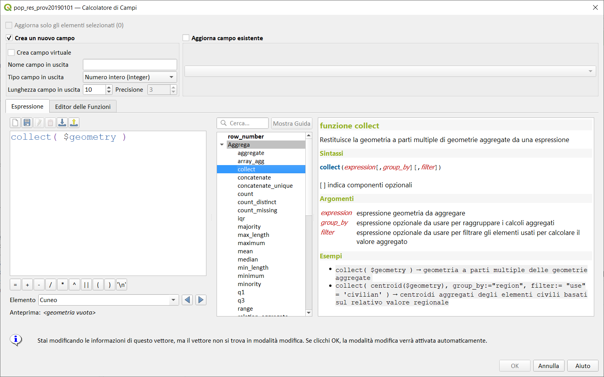](../../img/aggregate/collect/collect1.png)

--

[](../../img/aggregate/collect/collect2.png)

[](../../img/aggregate/collect/collect3.png)

---

## concatenate

Restituisce tutte le stringhe aggregate da un campo o un'espressione unite da un separatore.

Sintassi:

- concatenate(_<span style="color:red;">expression</span>[,<span style="color:red;">group_by</span>][,<span style="color:red;">filter</span>][,<span style="color:red;">concatenator</span>_][,_<span style="color:red;">order_by</span>_])

Argomenti:

* _<span style="color:red;">expression</span>_ sotto espressione o campo da aggregare
* _<span style="color:red;">group_by</span>_ espressione opzionale da usarsi per raggruppare i calcoli aggregati
* _<span style="color:red;">filter</span>_ espressione opzionale da usare per filtrare gli elementi usati per calcolare il valore aggregato
* _<span style="color:red;">concatenator</span>_ stringa opzionale da usarsi per unire i valori
* _<span style="color:red;">order_by</span>_ espressione opzionale da usare per ordinare gli elementi usati per calcolare il valore aggregato. Da predefinito, gli elementi verranno restituiti in un ordine non specificato.

[ ] indica componenti opzionali

Esempi:

```
concatenate("town_name",group_by:="state",concatenator:=',') → lista separata da virgola di town_names, raggruppata per campo state
```

[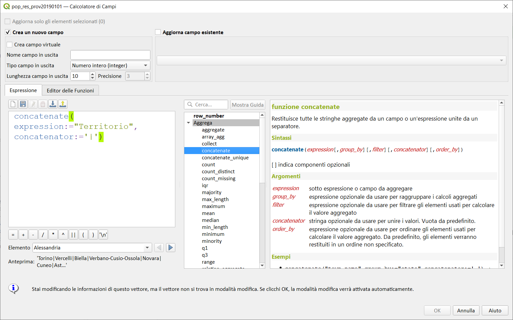](../../img/aggregate/concatenate/concatenate1.png)

---

## concatenate_unique

Restituisce tutte le stringhe univoche di un campo o di un'espressione unite da un delimitatore.

Sintassi:

- concatenate(_<span style="color:red;">expression</span>[,<span style="color:red;">group_by</span>][,<span style="color:red;">filter</span>][,<span style="color:red;">concatenator</span>_][,_<span style="color:red;">order_by</span>]_)

Argomenti:

* _<span style="color:red;">expression</span>_ sotto espressione o campo da aggregare
* _<span style="color:red;">group_by</span>_ espressione opzionale da usarsi per raggruppare i calcoli aggregati
* _<span style="color:red;">filter</span>_ espressione opzionale da usare per filtrare gli elementi usati per calcolare il valore aggregato
* _<span style="color:red;">concatenator</span>_ stringa opzionale da usarsi per unire i valori
* _<span style="color:red;">order_by</span>_ espressione opzionale da usare per ordinare gli elementi usati per calcolare il valore aggregato. Da predefinito, gli elementi verranno restituiti in un ordine non specificato.

[ ] indica componenti opzionali

Esempi:

```
concatenate_unique("town_name",group_by:="state",concatenator:=',') → lista separata da virgola di town_names univoci, raggruppata per campo state
```

[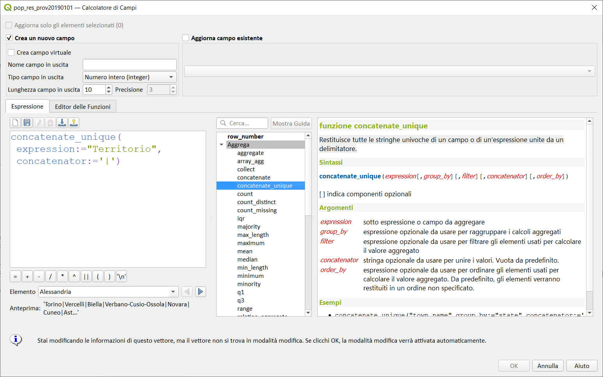](../../img/aggregate/concatenate_unique/concatenate_unique1.png)

---

## count

Restituisce il conteggio degli elementi corrispondenti.

Sintassi:

- count(_<span style="color:red;">expression</span>[,<span style="color:red;">group_by</span>][,<span style="color:red;">filter</span>]_)

[ ] indica componenti opzionali

Argomenti:

* _<span style="color:red;">expression</span>_ sotto espressione o campo da aggregare
* _<span style="color:red;">group_by</span>_ espressione opzionale da usarsi per raggruppare i calcoli aggregati
* _<span style="color:red;">filter</span>_ espressione opzionale da usare per filtrare gli elementi usati per calcolare il valore aggregato

Esempi:

```
count("stations",group_by:="state") → conta le stazioni, raggruppate per il campo state
```

[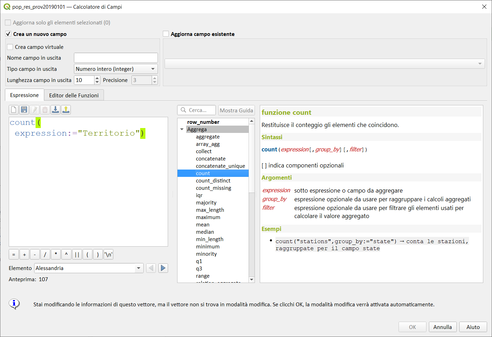](../../img/aggregate/count/count1.png)

Nota bene:

La sintassi prevede due possibilità:

1. quella classica, senza l'uso dei paramentri denominati (l'ordine è fondamentale);

    1. count(_<span style="color:red;">expression</span>, <span style="color:red;">group_by</span>, <span style="color:red;">filter</span>_)
   
2. con i parametri denominati (l'ordine non è più fondamentale):

    1. count(_<span style="color:red;">filter:=</span> ,<span style="color:red;">expression:=</span> ,<span style="color:red;">group_by:=</span>_ )

---

## count_distinct

Restituisce il conteggio dei valori differenti.

Sintassi:

- count_distinct(_<span style="color:red;">expression</span>[,<span style="color:red;">group_by</span>][,<span style="color:red;">filter</span>]_)

[ ] indica componenti opzionali

Argomenti:

* _<span style="color:red;">expression</span>_ sotto espressione o campo da aggregare
* _<span style="color:red;">group_by</span>_ espressione opzionale da usarsi per raggruppare i calcoli aggregati
* _<span style="color:red;">filter</span>_ espressione opzionale da usare per filtrare gli elementi usati per calcolare il valore aggregato

Esempi:

```
count_distinct("stations",group_by:="state") → conta i valori differenti delle stazioni, raggruppate per il campo state
```

[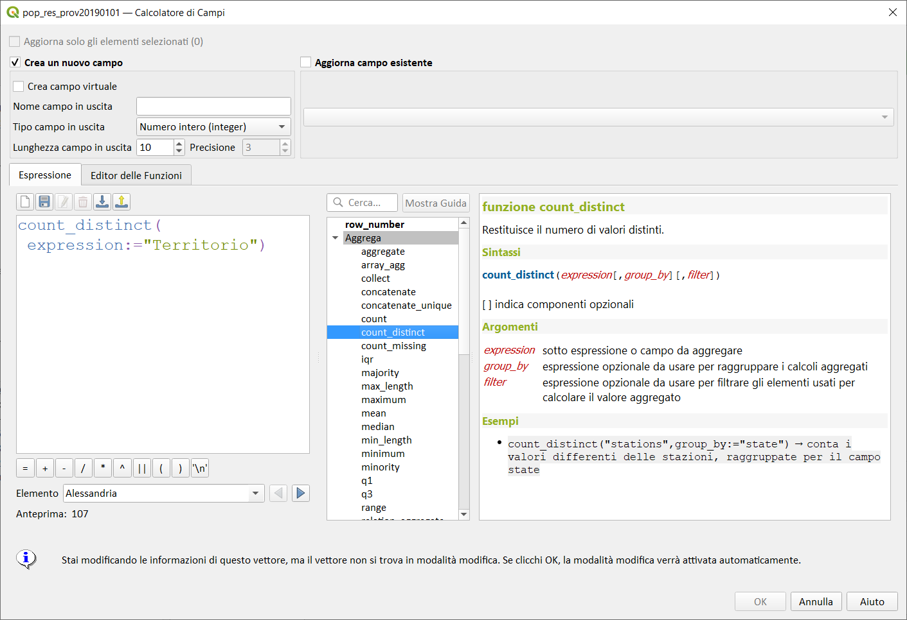](../../img/aggregate/count_distinct/count_distinct1.png)

Nota bene:

La sintassi prevede due possibilità:

1. quella classica, senza l'uso dei paramentri denominati (l'ordine è fondamentale);

    1. count_distinct(_<span style="color:red;">expression</span>, <span style="color:red;">group_by</span>, <span style="color:red;">filter</span>_)
   
2. con i parametri denominati (l'ordine non è più fondamentale):

    1. count_distinct(_<span style="color:red;">filter:=</span> ,<span style="color:red;">expression:=</span> ,<span style="color:red;">group_by:=</span>_ )

--

[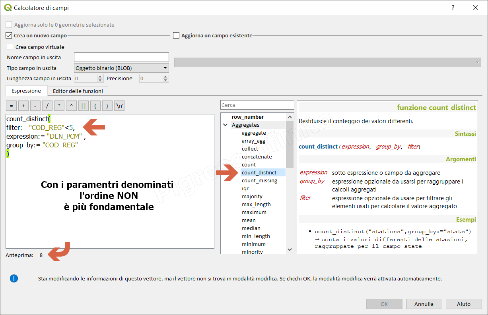](../../img/aggregate/count_distinct/count_distinct2.png)

---

## count_missing

Restituisce il numero di valori nulli (NULL).

Sintassi:

- count_missing(_<span style="color:red;">expression</span>[,<span style="color:red;">group_by</span>][,<span style="color:red;">filter</span>]_)

[ ] indica componenti opzionali

Argomenti:

* _<span style="color:red;">expression</span>_ sotto espressione o campo da aggregare
* _<span style="color:red;">group_by</span>_ espressione opzionale da usarsi per raggruppare i calcoli aggregati
* _<span style="color:red;">filter</span>_ espressione opzionale da usare per filtrare gli elementi usati per calcolare il valore aggregato

Esempi:

```
count_missing("stations",group_by:="state") → conta i valori mancanti (NULL) delle stazioni, raggruppati per il campo state
```

[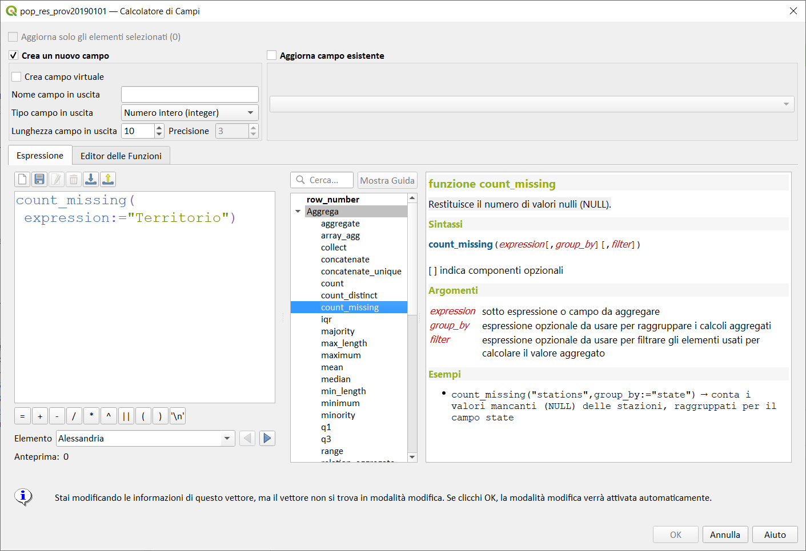](../../img/aggregate/count_missing/count_missing1.png)

Nota bene:

La sintassi prevede due possibilità:

1. quella classica, senza l'uso dei paramentri denominati (l'ordine è fondamentale);

    1. count_missing(_<span style="color:red;">expression</span>, <span style="color:red;">group_by</span>, <span style="color:red;">filter</span>_)
   
2. con i parametri denominati (l'ordine non è più fondamentale):

    1. count_missing(_<span style="color:red;">filter:=</span> ,<span style="color:red;">expression:=</span> ,<span style="color:red;">group_by:=</span>_ )

---

## iqr

Restituisce lo scarto interquartile calcolato da un campo o espressione.

Sintassi:

- iqr(_<span style="color:red;">expression</span>[,<span style="color:red;">group_by</span>][,<span style="color:red;">filter</span>]_)

[ ] indica componenti opzionali

Argomenti:

* _<span style="color:red;">expression</span>_ sotto espressione o campo da aggregare
* _<span style="color:red;">group_by</span>_ espressione opzionale da usarsi per raggruppare i calcoli aggregati
* _<span style="color:red;">filter</span>_ espressione opzionale da usare per filtrare gli elementi usati per calcolare il valore aggregato

Esempi:

```
iqr("population",group_by:="state") → scarto interquartile del valore popolazione, raggruppato per il campo state
```

[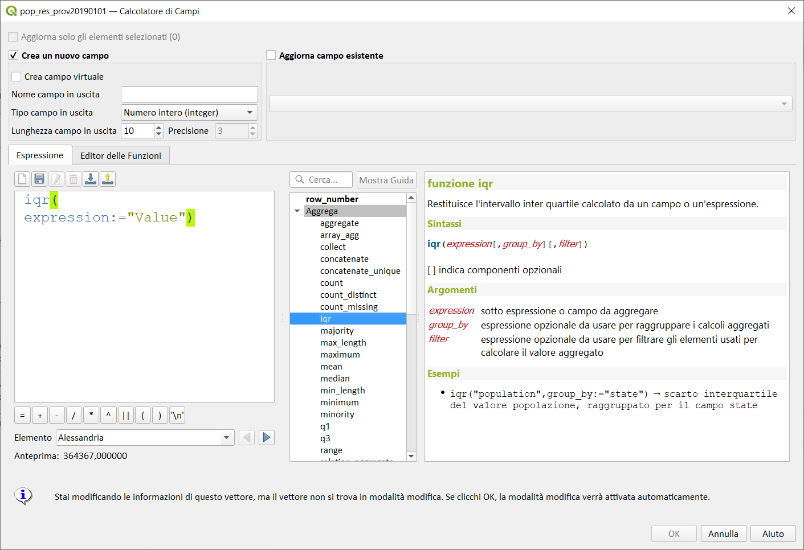](../../img/aggregate/iqr/irq1.png)

Nota bene:

La sintassi prevede due possibilità:

1. quella classica, senza l'uso dei paramentri denominati (l'ordine è fondamentale);

    1. iqr(_<span style="color:red;">expression</span>, <span style="color:red;">group_by</span>, <span style="color:red;">filter</span>_)
   
2. con i parametri denominati (l'ordine non è più fondamentale):

    1. iqr(_<span style="color:red;">filter:=</span> ,<span style="color:red;">expression:=</span> ,<span style="color:red;">group_by:=</span>_ )

---

## majority

Restituisce la maggioranza aggregata di valori (valore più comunemente presente) da un campo o espressione.

Sintassi:

- majority(_<span style="color:red;">expression</span>[,<span style="color:red;">group_by</span>][,<span style="color:red;">filter</span>]_)

[ ] indica componenti opzionali

Argomenti:

* _<span style="color:red;">expression</span>_ sotto espressione o campo da aggregare
* _<span style="color:red;">group_by</span>_ espressione opzionale da usarsi per raggruppare i calcoli aggregati
* _<span style="color:red;">filter</span>_ espressione opzionale da usare per filtrare gli elementi usati per calcolare il valore aggregato

Esempi:

```
majority("class",group_by:="state") → valore di classe più comunemente presente, raggruppato per il campo state
```

[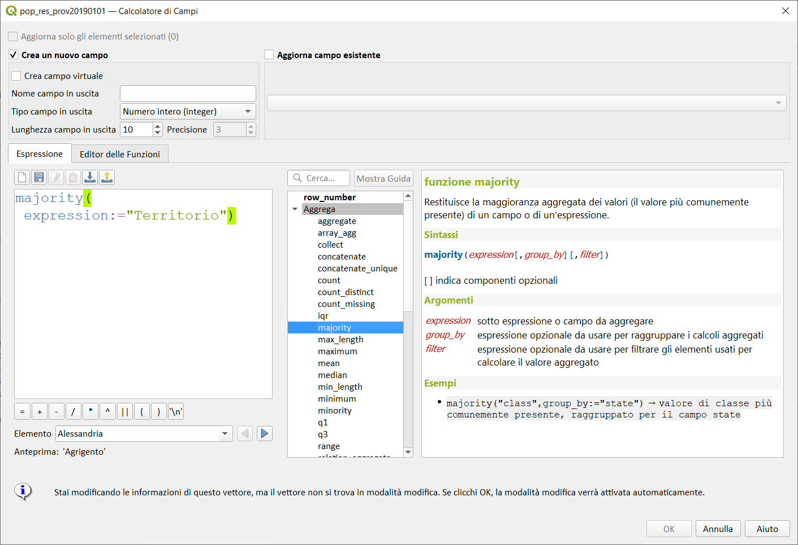](../../img/aggregate/majority/majority1.png)

Nota bene:

La sintassi prevede due possibilità:

1. quella classica, senza l'uso dei paramentri denominati (l'ordine è fondamentale);

    1. majority(_<span style="color:red;">expression</span>, <span style="color:red;">group_by</span>, <span style="color:red;">filter</span>_)
   
2. con i parametri denominati (l'ordine non è più fondamentale):

    1. majority(_<span style="color:red;">filter:=</span> ,<span style="color:red;">expression:=</span> ,<span style="color:red;">group_by:=</span>_ )

---

## max_length

Restituisce la lunghezza massima delle stringhe di un campo o espressione.

Sintassi:

- max_length(_<span style="color:red;">expression</span>[,<span style="color:red;">group_by</span>][,<span style="color:red;">filter</span>]_)

[ ] indica componenti opzionali

Argomenti:

* _<span style="color:red;">expression</span>_ sotto espressione o campo da aggregare
* _<span style="color:red;">group_by</span>_ espressione opzionale da usarsi per raggruppare i calcoli aggregati
* _<span style="color:red;">filter</span>_ espressione opzionale da usare per filtrare gli elementi usati per calcolare il valore aggregato

Esempi:

```
max_length("town_name",group_by:="state") → lunghezza massima di town_name, raggruppato per il campo state
```

[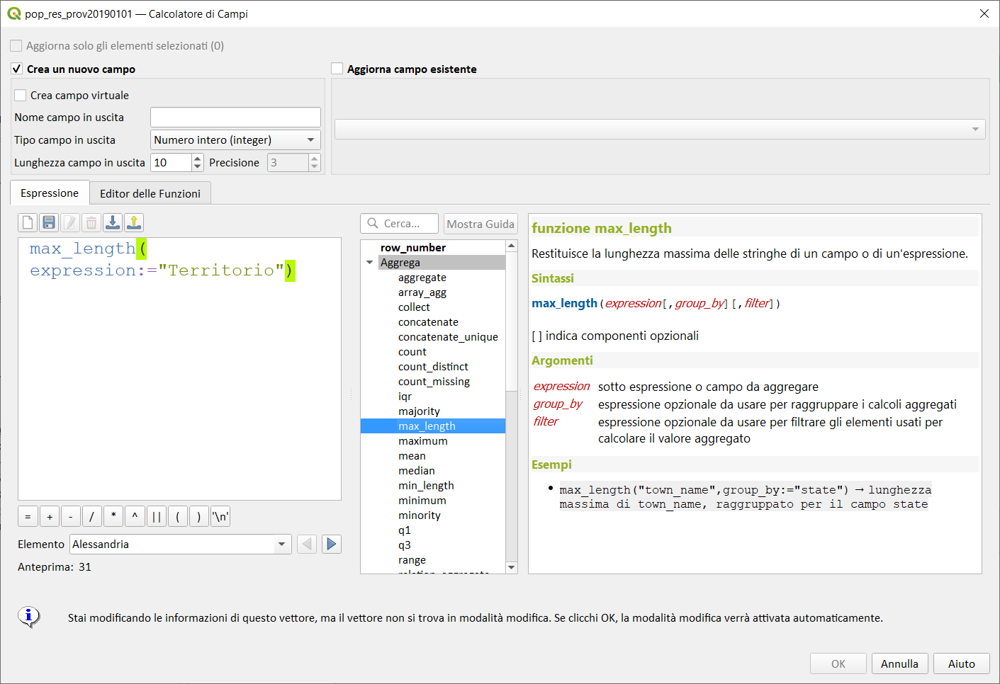](../../img/aggregate/max_length/max_length1.png)

Nota bene:

La sintassi prevede due possibilità:

1. quella classica, senza l'uso dei paramentri denominati (l'ordine è fondamentale);

    1. max_length(_<span style="color:red;">expression</span>, <span style="color:red;">group_by</span>, <span style="color:red;">filter</span>_)
   
2. con i parametri denominati (l'ordine non è più fondamentale):

    1. max_length(_<span style="color:red;">filter:=</span> ,<span style="color:red;">expression:=</span> ,<span style="color:red;">group_by:=</span>_ )

---

## maximum

Restituisce il valore massimo aggregato da un campo o espressione.

Sintassi:

- maximum(_<span style="color:red;">expression</span>, <span style="color:red;">group_by</span>, <span style="color:red;">filter</span>_)

[ ] indica componenti opzionali

Argomenti:

* _<span style="color:red;">expression</span>_ sotto espressione o campo da aggregare
* _<span style="color:red;">group_by</span>_ espressione opzionale da usarsi per raggruppare i calcoli aggregati
* _<span style="color:red;">filter</span>_ espressione opzionale da usare per filtrare gli elementi usati per calcolare il valore aggregato

Esempi:

```
maximum("population",group_by:="state") → valore massimo di population, raggruppato per il campo state
```

[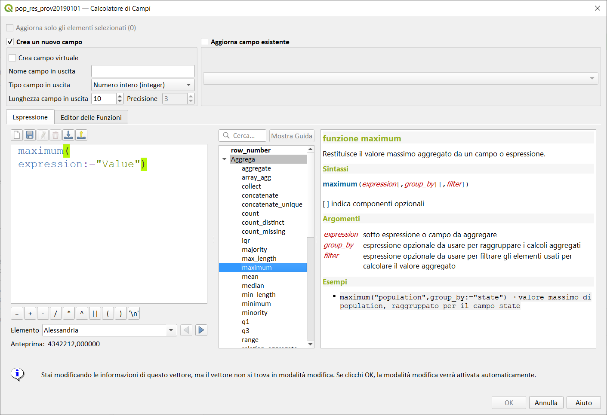](../../img/aggregate/maximum/maximum1.png)

Nota bene:

La sintassi prevede due possibilità:

1. quella classica, senza l'uso dei paramentri denominati (l'ordine è fondamentale);

    1. maximum(_<span style="color:red;">expression</span>, <span style="color:red;">group_by</span>, <span style="color:red;">filter</span>_)
   
2. con i parametri denominati (l'ordine non è più fondamentale):

    1. maximum(_<span style="color:red;">filter:=</span> ,<span style="color:red;">expression:=</span> ,<span style="color:red;">group_by:=</span>_ )

---

## mean

Restituisce il valore medio aggregato da un campo o espressione.

Sintassi:

- mean(_<span style="color:red;">expression</span>, <span style="color:red;">group_by</span>, <span style="color:red;">filter</span>_)

[ ] indica componenti opzionali

Argomenti:

* _<span style="color:red;">expression</span>_ sotto espressione o campo da aggregare
* _<span style="color:red;">group_by</span>_ espressione opzionale da usarsi per raggruppare i calcoli aggregati
* _<span style="color:red;">filter</span>_ espressione opzionale da usare per filtrare gli elementi usati per calcolare il valore aggregato

Esempi:

```
mean("population",group_by:="state") → valore medio di population, raggruppato per il campo state
```

[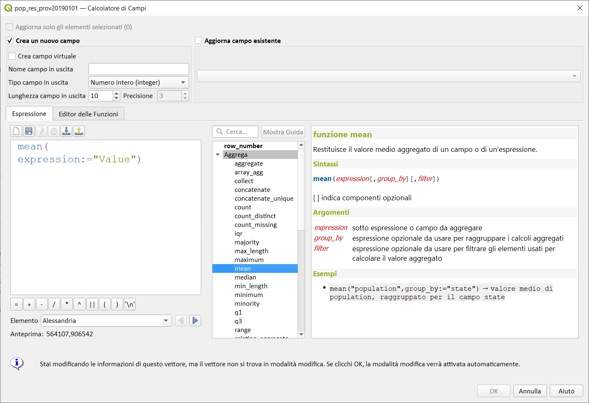](../../img/aggregate/mean/mean1.png)

Nota bene:

La sintassi prevede due possibilità:

1. quella classica, senza l'uso dei paramentri denominati (l'ordine è fondamentale);

    1. mean(_<span style="color:red;">expression</span>, <span style="color:red;">group_by</span>, <span style="color:red;">filter</span>_)
   
2. con i parametri denominati (l'ordine non è più fondamentale):

    1. mean(_<span style="color:red;">filter:=</span> ,<span style="color:red;">expression:=</span> ,<span style="color:red;">group_by:=</span>_ )

---

## median

Restituisce il valore mediano aggregato da un campo o espressione.

Sintassi:

- median(_<span style="color:red;">expression</span>, <span style="color:red;">group_by</span>, <span style="color:red;">filter</span>_)

[ ] indica componenti opzionali

Argomenti:

* _<span style="color:red;">expression</span>_ sotto espressione o campo da aggregare
* _<span style="color:red;">group_by</span>_ espressione opzionale da usarsi per raggruppare i calcoli aggregati
* _<span style="color:red;">filter</span>_ espressione opzionale da usare per filtrare gli elementi usati per calcolare il valore aggregato

Esempi:

```
median("population",group_by:="state") → mediana della popolazione, raggruppato per il campo state
```

[](../../img/aggregate/median/median1.png)

Nota bene:

La sintassi prevede due possibilità:

1. quella classica, senza l'uso dei paramentri denominati (l'ordine è fondamentale);

    1. median(_<span style="color:red;">expression</span>, <span style="color:red;">group_by</span>, <span style="color:red;">filter</span>_)
   
2. con i parametri denominati (l'ordine non è più fondamentale):

    1. median(_<span style="color:red;">filter:=</span> ,<span style="color:red;">expression:=</span> ,<span style="color:red;">group_by:=</span>_ )

---

## min_length

Restituisce la lunghezza minima delle stringhe di un campo o espressione.

Sintassi:

- min_length(_<span style="color:red;">expression</span>, <span style="color:red;">group_by</span>, <span style="color:red;">filter</span>_)

[ ] indica componenti opzionali

Argomenti:

* _<span style="color:red;">expression</span>_ sotto espressione o campo da aggregare
* _<span style="color:red;">group_by</span>_ espressione opzionale da usarsi per raggruppare i calcoli aggregati
* _<span style="color:red;">filter</span>_ espressione opzionale da usare per filtrare gli elementi usati per calcolare il valore aggregato

Esempi:

```
min_length("town_name",group_by:="state") → lunghezza minima di town_name, raggruppato per il campo state
```

[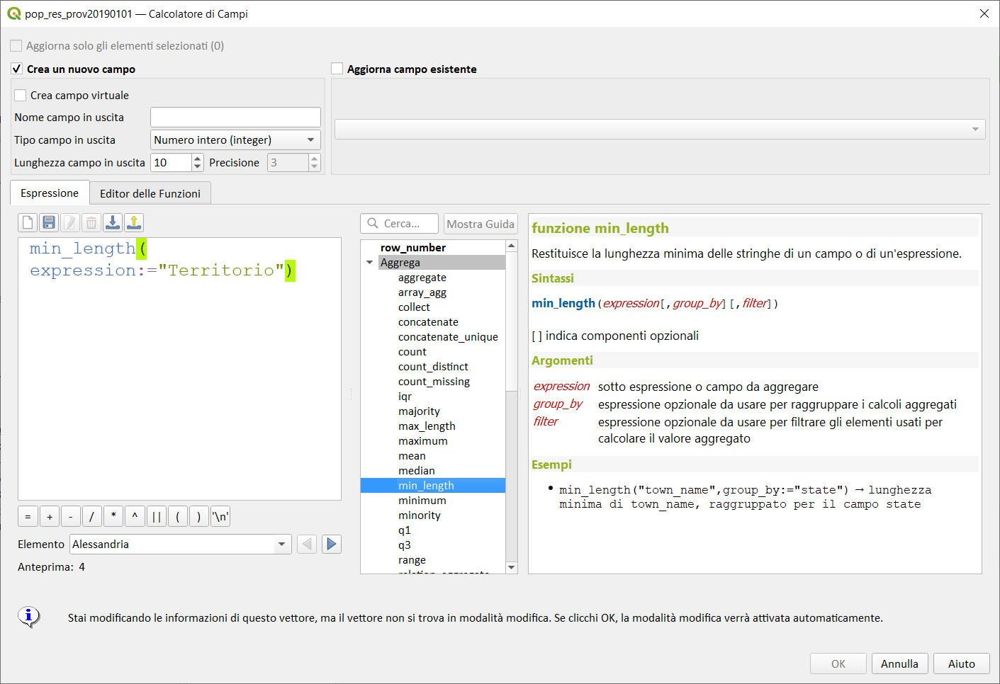](../../img/aggregate/min_length/min_length1.png)

Nota bene:

La sintassi prevede due possibilità:

1. quella classica, senza l'uso dei paramentri denominati (l'ordine è fondamentale);

    1. min_length(_<span style="color:red;">expression</span>, <span style="color:red;">group_by</span>, <span style="color:red;">filter</span>_)
   
2. con i parametri denominati (l'ordine non è più fondamentale):

    1. min_length(_<span style="color:red;">filter:=</span> ,<span style="color:red;">expression:=</span> ,<span style="color:red;">group_by:=</span>_ )

---

## minimum

Restituisce il valore minimo aggregato da un campo o espressione.

Sintassi:

- minimum(_<span style="color:red;">expression</span>, <span style="color:red;">group_by</span>, <span style="color:red;">filter</span>_)

[ ] indica componenti opzionali

Argomenti:

* _<span style="color:red;">expression</span>_ sotto espressione o campo da aggregare
* _<span style="color:red;">group_by</span>_ espressione opzionale da usarsi per raggruppare i calcoli aggregati
* _<span style="color:red;">filter</span>_ espressione opzionale da usare per filtrare gli elementi usati per calcolare il valore aggregato

Esempi:

```
minimum("population",group_by:="state") → valore minimo di population, raggruppato per il campo state
```

[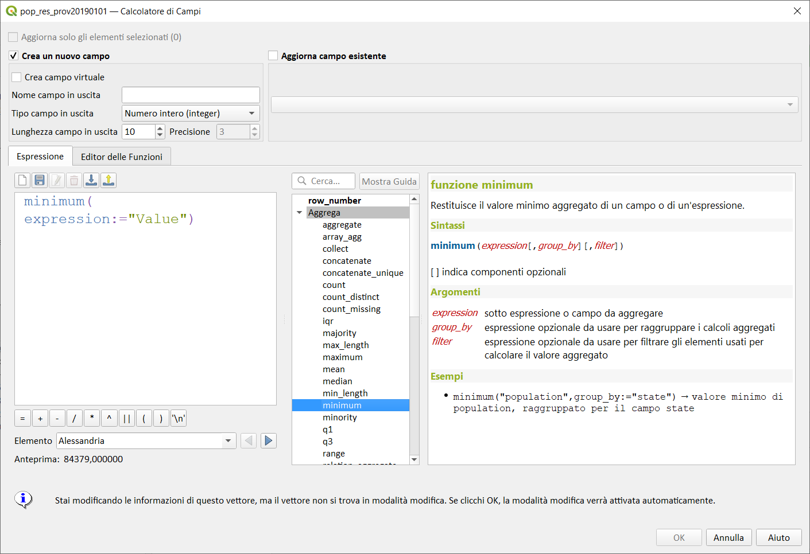](../../img/aggregate/minimum/minimum1.png)

Nota bene:

La sintassi prevede due possibilità:

1. quella classica, senza l'uso dei paramentri denominati (l'ordine è fondamentale);

    1. minimum(_<span style="color:red;">expression</span>, <span style="color:red;">group_by</span>, <span style="color:red;">filter</span>_)
   
2. con i parametri denominati (l'ordine non è più fondamentale):

    1. minimum(_<span style="color:red;">filter:=</span> ,<span style="color:red;">expression:=</span> ,<span style="color:red;">group_by:=</span>_ )

Esempio:

Selezionare le Province con minor area per ogni Regione

`$area = minimum(expression:=$area,group_by:="COD_REG")`

[](../../img/aggregate/minimum/minimum2.png)

---

## minority

Restituisce la minoranza aggregata di valori (valore meno comunemente presente) da un campo o espressione.

Sintassi:

- minority(_<span style="color:red;">expression</span>, <span style="color:red;">group_by</span>, <span style="color:red;">filter</span>_)

[ ] indica componenti opzionali

Argomenti:

* _<span style="color:red;">expression</span>_ sotto espressione o campo da aggregare
* _<span style="color:red;">group_by</span>_ espressione opzionale da usarsi per raggruppare i calcoli aggregati
* _<span style="color:red;">filter</span>_ espressione opzionale da usare per filtrare gli elementi usati per calcolare il valore aggregato

Esempi:

```
minority("class",group_by:="state") → valore di classe meno presente, ragguppato per il campo state
```

[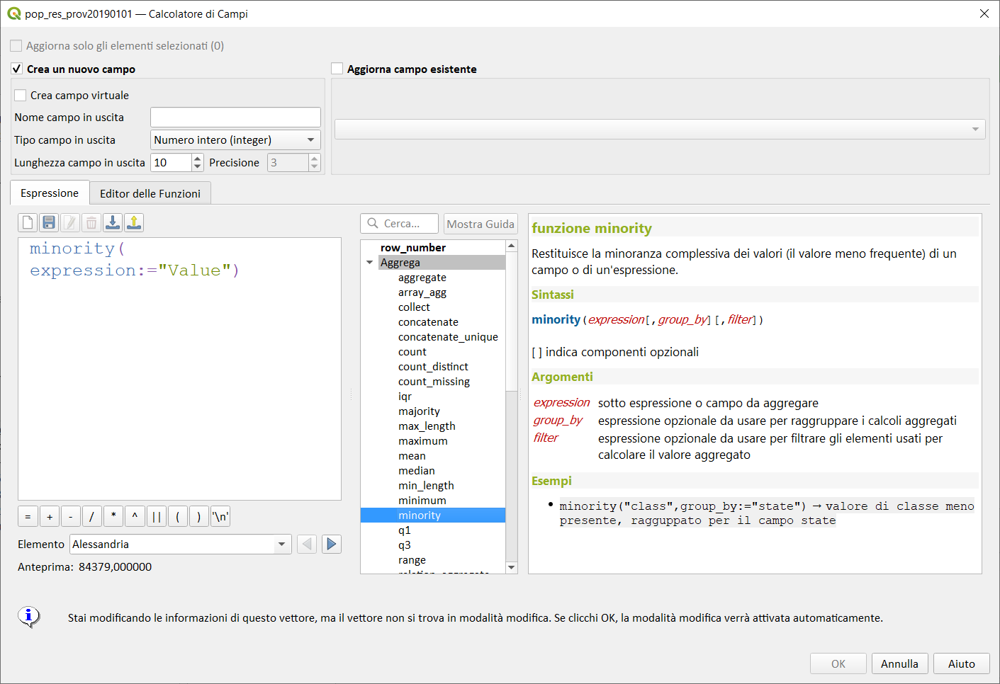](../../img/aggregate/minority/minority1.png)

Nota bene:

La sintassi prevede due possibilità:

1. quella classica, senza l'uso dei paramentri denominati (l'ordine è fondamentale);

    1. minority(_<span style="color:red;">expression</span>, <span style="color:red;">group_by</span>, <span style="color:red;">filter</span>_)
   
2. con i parametri denominati (l'ordine non è più fondamentale):

    1. minority(_<span style="color:red;">filter:=</span> ,<span style="color:red;">expression:=</span> ,<span style="color:red;">group_by:=</span>_ )

---

## q1

Restituisce il primo quartile calcolato da un campo o espressione.

Sintassi:

- q1(_<span style="color:red;">expression</span>, <span style="color:red;">group_by</span>, <span style="color:red;">filter</span>_)

[ ] indica componenti opzionali

Argomenti:

* _<span style="color:red;">expression</span>_ sotto espressione o campo da aggregare
* _<span style="color:red;">group_by</span>_ espressione opzionale da usarsi per raggruppare i calcoli aggregati
* _<span style="color:red;">filter</span>_ espressione opzionale da usare per filtrare gli elementi usati per calcolare il valore aggregato

Esempi:

```
q1("population",group_by:="state") → primo quartile del valore popolazione, raggruppato per il campo state
```

[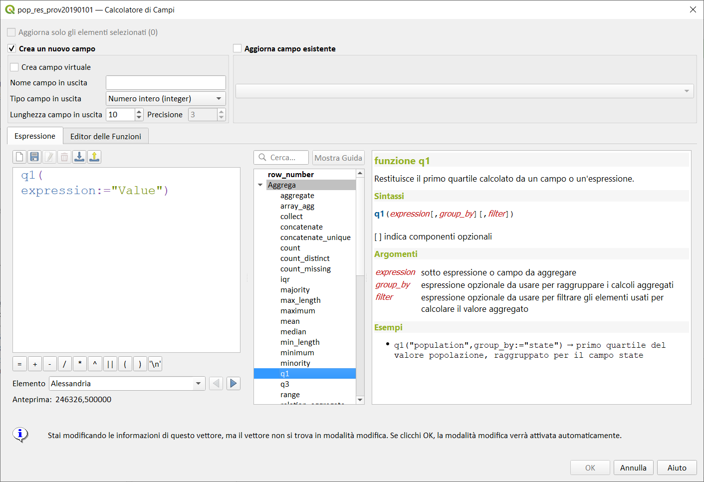](../../img/aggregate/q1/q11.png)

Nota bene:

La sintassi prevede due possibilità:

1. quella classica, senza l'uso dei paramentri denominati (l'ordine è fondamentale);

    1. q1(_<span style="color:red;">expression</span>, <span style="color:red;">group_by</span>, <span style="color:red;">filter</span>_)
   
2. con i parametri denominati (l'ordine non è più fondamentale):

    1. q1(_<span style="color:red;">filter:=</span> ,<span style="color:red;">expression:=</span> ,<span style="color:red;">group_by:=</span>_ )

---

## q3

Restituisce il terzo quartile calcolato da un campo o espressione.

Sintassi:

- q3(_<span style="color:red;">expression</span>, <span style="color:red;">group_by</span>, <span style="color:red;">filter</span>_)

[ ] indica componenti opzionali

Argomenti:

* _<span style="color:red;">expression</span>_ sotto espressione o campo da aggregare
* _<span style="color:red;">group_by</span>_ espressione opzionale da usarsi per raggruppare i calcoli aggregati
* _<span style="color:red;">filter</span>_ espressione opzionale da usare per filtrare gli elementi usati per calcolare il valore aggregato

Esempi:

```
q3("population",group_by:="state") → terzo quartile del valore popolazione, raggruppato per il campo state
```

[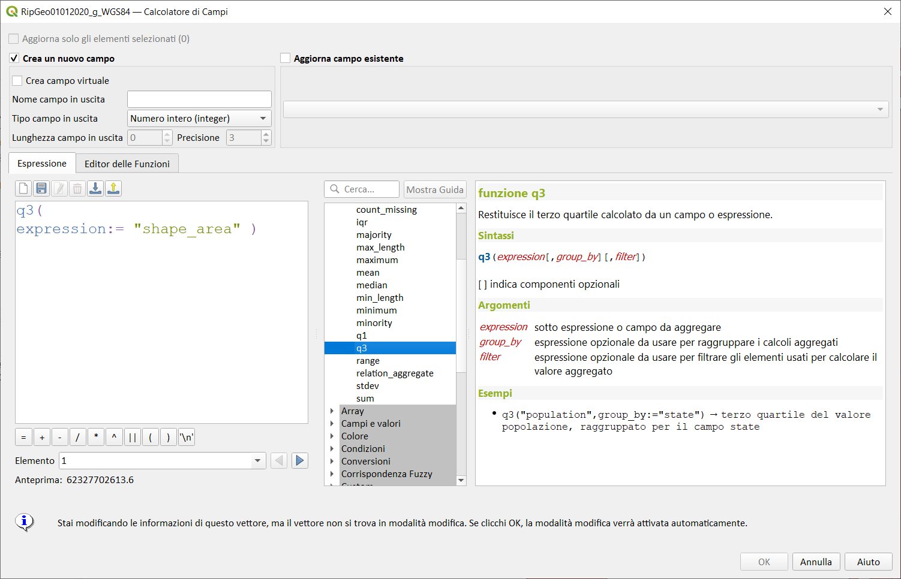](../../img/aggregate/q3/q31.png)

Nota bene:

La sintassi prevede due possibilità:

1. quella classica, senza l'uso dei paramentri denominati (l'ordine è fondamentale);

    1. q3(_<span style="color:red;">expression</span>, <span style="color:red;">group_by</span>, <span style="color:red;">filter</span>_)
   
2. con i parametri denominati (l'ordine non è più fondamentale):

    1. q3(_<span style="color:red;">filter:=</span> ,<span style="color:red;">expression:=</span> ,<span style="color:red;">group_by:=</span>_ )

---

## range

Restituisce l'intervallo aggregato di valori (massimo - minimo) da un campo o espressione.

Sintassi:

- range(_<span style="color:red;">expression</span>, <span style="color:red;">group_by</span>, <span style="color:red;">filter</span>_)

[ ] indica componenti opzionali

Argomenti:

* _<span style="color:red;">expression</span>_ sotto espressione o campo da aggregare
* _<span style="color:red;">group_by</span>_ espressione opzionale da usarsi per raggruppare i calcoli aggregati
* _<span style="color:red;">filter</span>_ espressione opzionale da usare per filtrare gli elementi usati per calcolare il valore aggregato

Esempi:

```
range("population",group_by:="state") → intervallo di valori di popolazione, raggruppato per il campo state
```

[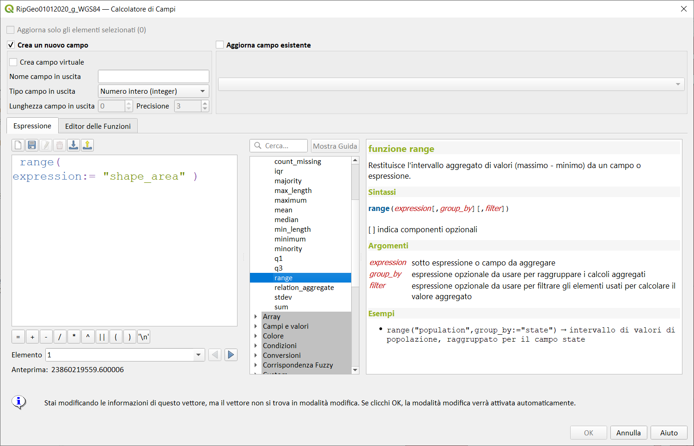](../../img/aggregate/range/range1.png)

Nota bene:

La sintassi prevede due possibilità:

1. quella classica, senza l'uso dei paramentri denominati (l'ordine è fondamentale);

    1. range(_<span style="color:red;">expression</span>, <span style="color:red;">group_by</span>, <span style="color:red;">filter</span>_)
   
2. con i parametri denominati (l'ordine non è più fondamentale):

    1. range(_<span style="color:red;">filter:=</span> ,<span style="color:red;">expression:=</span> ,<span style="color:red;">group_by:=</span>_ )

---

## relation_aggregate

Restituisce un valore aggregato calcolato usando tutti gli elementi figli corrispondenti da una relazione di layer.

Sintassi:

- relation_aggregate(_<span style="color:red;">relation</span>, <span style="color:red;">aggregate</span>, <span style="color:red;">expression</span>[,<span style="color:red;">concatenator</span>][,<span style="color:red;">order_by</span>]_)

Argomenti:

* <span style="color:red;">_relation_</span> una stringa, rappresentante un ID di relazione
* <span style="color:red;">_aggregate_</span> una stringa corrispondente all'aggregato da calcolare. Opzioni valide sono:

    * count
    * count_distinct
    * count_missing
    * min
    * max
    * sum
    * mean
    * median
    * stdev
    * stdevsample
    * range
    * minority
    * majority
    * q1: primo quartile
    * q3: terzo quartile
    * iqr: scarto interquartile
    * min_length: minima lunghezza stringa
    * max_length: massima lunghezza stringa
    * concatenate: unisci stringhe con un concatenatore
    
* <span style="color:red;">_expression_</span> sotto espressione o nome campo da aggregare
* <span style="color:red;">_concatenator_</span> stringa opzionale da usare per unire i valori per il raggruppamento 'concatenate'
* _<span style="color:red;">order_by</span>_ espressione filtro opzionale atta ad ordinare gli elementi usati per calcolare il valore aggregato. Campi e geometria provengono dagli elementi del vettore unito. In modo predefinito, gli elementi verranno restituiti senza un ordine specifico.

Esempi:

```
relation_aggregate(relation:='my_relation',aggregate:='mean',expression:="passengers") → valore medio di tutti gli elementi figli corrispondenti usando la relazione 'my_relation'
relation_aggregate('my_relation','sum', "passengers"/7) → somma del campo passengers diviso per 7 per tutti gli elementi figli corrispondenti usando la relazione 'my_relation' 
relation_aggregate('my_relation','concatenate', "towns", concatenator:=',') → elenco separato da virgole del campo towns per tutte le geometrie figlie corrispondenti che usano la relation 'my_relation'
relation_aggregate('my_relation','array_agg', "id") → array del campo id derivato da tutti gli elementi figlio corrispondenti usando la relazione 'my_relation'
```

[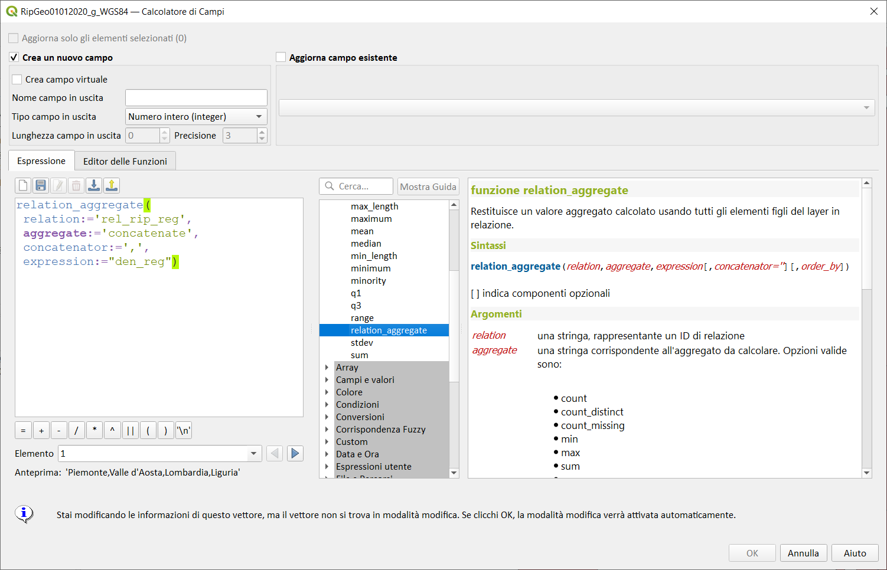](../../img/aggregate/relation_aggregate/relation_aggregate1.png)

Nota bene:

La sintassi prevede due possibilità:

1. quella classica, senza l'uso dei paramentri denominati (l'ordine è fondamentale);

    1. relation_aggregate(_<span style="color:red;">relation</span>, <span style="color:red;">aggregate</span>, <span style="color:red;">expression</span>[,<span style="color:red;">concatenator</span>][,<span style="color:red;">order_by</span>]_)
   
2. con i parametri denominati (l'ordine non è più fondamentale):

    1. relation_aggregate(_<span style="color:red;">filter:=</span> ,<span style="color:red;">expression:=</span> ,<span style="color:red;">group_by:=</span>_ )

--

[](../../img/aggregate/relation_aggregate/relation_aggregate2.png)

---

## stdev

Restituisce il valore di deviazione standard aggregato da un campo o espressione.

Sintassi:

- stdev(_<span style="color:red;">expression</span>, <span style="color:red;">group_by</span>, <span style="color:red;">filter</span>_)

[ ] indica componenti opzionali

Argomenti:

* _<span style="color:red;">expression</span>_ sotto espressione o campo da aggregare
* _<span style="color:red;">group_by</span>_ espressione opzionale da usarsi per raggruppare i calcoli aggregati
* _<span style="color:red;">filter</span>_ espressione opzionale da usare per filtrare gli elementi usati per calcolare il valore aggregato


Esempi:

```
stdev("population",group_by:="state") → deviazione standard di un valore popolazione, raggruppato per il campo state
```

[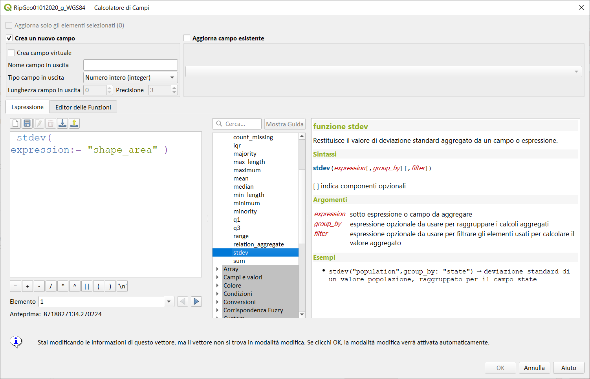](../../img/aggregate/stdev/stdev1.png)

Nota bene:

La sintassi prevede due possibilità:

1. quella classica, senza l'uso dei paramentri denominati (l'ordine è fondamentale);

    1. stdev(_<span style="color:red;">expression</span>, <span style="color:red;">group_by</span>, <span style="color:red;">filter</span>_)
   
2. con i parametri denominati (l'ordine non è più fondamentale):

    1. stdev(_<span style="color:red;">filter:=</span> ,<span style="color:red;">expression:=</span> ,<span style="color:red;">group_by:=</span>_ )

---

## sum

Restituisce il valore sommato aggregato da un campo o espressione.

Sintassi:

- sum(_<span style="color:red;">expression</span>, <span style="color:red;">group_by</span>, <span style="color:red;">filter</span>_)

[ ] indica componenti opzionali

Argomenti:

* <span style="color:red;">_expression_</span> sotto espressione o campo da aggregare
* <span style="color:red;">_group_by_</span> espressione opzionale da usarsi per raggruppare i calcoli aggregati
* <span style="color:red;">_filter_</span> espressione opzionale da usare per filtrare gli elementi usati per calcolare il valore aggregato

Esempi:

```
sum("population",group_by:="state") → valore somma di population, raggruppato per il campo state
```

[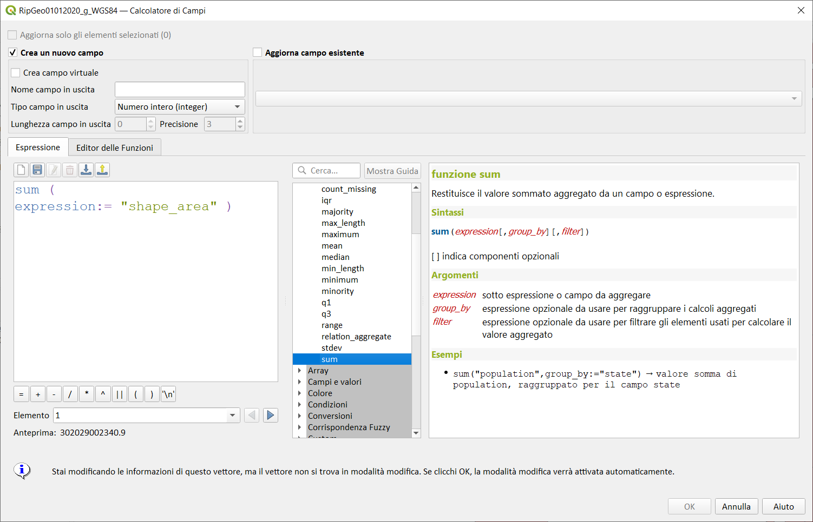](../../img/aggregate/sum/sum1.png)

Nota bene:

La sintassi prevede due possibilità:

1. quella classica, senza l'uso dei paramentri denominati (l'ordine è fondamentale);

    1. stdev(_<span style="color:red;">expression</span>, <span style="color:red;">group_by</span>, <span style="color:red;">filter</span>_)
   
2. con i parametri denominati (l'ordine non è più fondamentale):

    1. stdev(_<span style="color:red;">filter:=</span> ,<span style="color:red;">expression:=</span> ,<span style="color:red;">group_by:=</span>_ )

---
