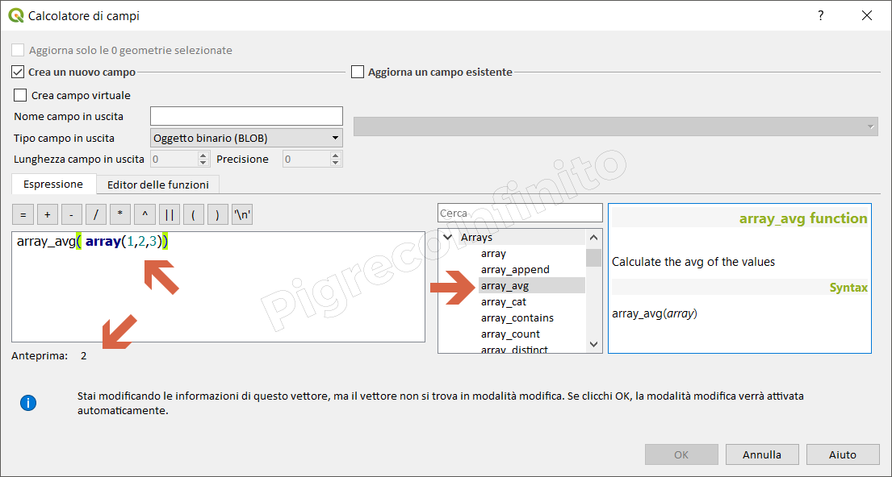
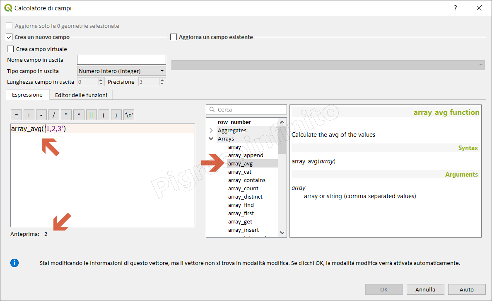
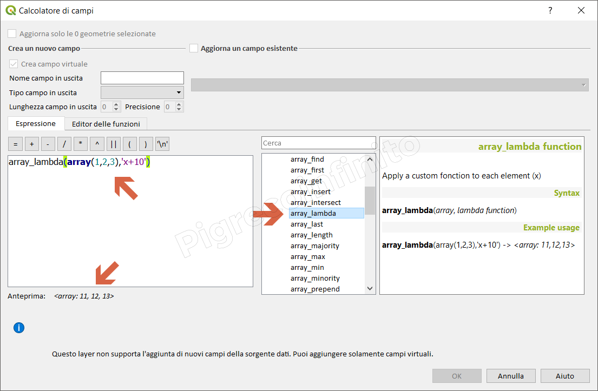
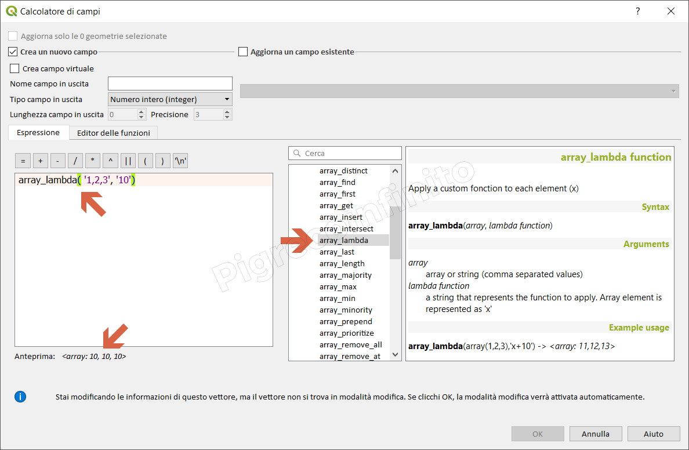
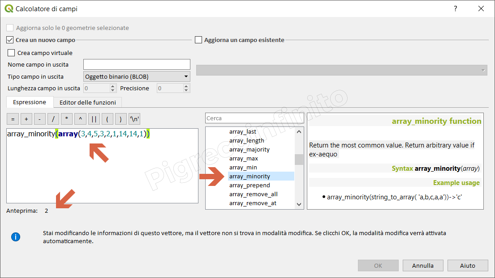
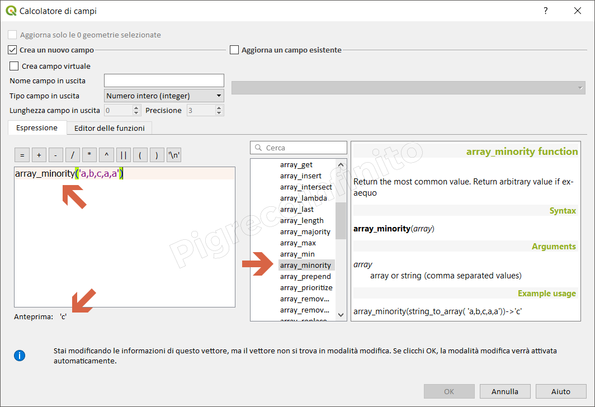
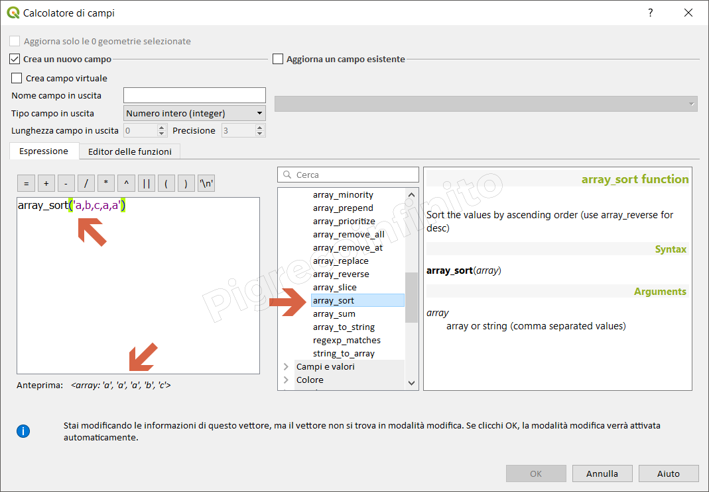

# Gruppo Array

Questo gruppo contiene funzioni espressione per la creazione e la manipolazione di array (noti anche come strutture dati ad elenco). L'ordine dei valori all'interno dell'array è importante, al contrario della struttura dati 'a mappa', in cui l'ordine delle coppie chiave-valore è irrilevante e i valori vengono identificati dalle loro chiavi.

## array

Restituisce un array contenente tutti i valori passati come parametro.

Sintassi:

- array(_value1, value2, …_)

Argomenti:

* _value_ un valore

Esempi:

* `array(2,10) → array: 2, 10`

Nota bene

--

Osservazioni

---

## array_all

Restituisce true se un array contiene tutti i valori di un determinato array.

Sintassi:

- array_all(_array_a, array_b, …_)

Argomenti:

* *array_a* un array
* *array_b* un array di valori da cercare

Esempi:

* `array_all(array(1,2,3),array(2,3)) → vero`
* `array_all(array(1,2,3),array(1,2,4)) → falso`

Nota bene

--

Osservazioni

---

## array_append

Restituisce un array con il valore passato aggiunto alla fine.

Sintassi:

- array_append(_array, value_)

Argomenti:

* _array_ un array
* _value_ il valore da aggiungere

Esempi:

* `array_append(array(1,2,3),4) → array: 1,2,3,4`

Nota bene

--

Osservazioni

---

## array_avg

Calcola il valore medio di un array.

Sintassi:

- array_avg(_array_)

Argomenti:

* _array_ un array o stringa (valori separati da virgola) 

Esempi:

* `array_avg(array(1,2,3)) → 2`
* `array_avg('1,2,3') → 2` dalla versione 1.4 del plugin!!!

dalla versione 1.4 del plugin:

Nota bene

Questa funzione sarà presente, nel calcolatore, solo dopo l'installazione del plugin [ArrayPlus](https://framagit.org/jbdesbas/arrayPlus)

Osservazioni

---

## array_cat

Restituisce un array contenente tutti gli arrays passati concatenati.

Sintassi:

- array_cat(_array1, array2, …_)

Argomenti:

* _array_ un array

Esempi:

* `array_cat(array(1,2),array(2,3)) → array: 1,2,2,3`

Nota bene

--

Osservazioni

---

## array_contains

Restituisce _true_ se un array contiene il valore specificato.

Sintassi:

- array_contains(_array, value_)

Argomenti:

* _array_ un array
* _value_ il valore da cercare

Esempi:

* `array_contains(array(1,2,3),2) → true`

Nota bene

--

Osservazioni

---

## array_count

Conta il numero di occorrenze di un dato valore in un array.

Sintassi:

- array_count(_array_,_value_)

Argomenti:

* __array_ un array
* _value_ un valore da contare

Esempi:

* `array_count(array('a', 'b', 'c', 'b'), 'b') → 2`

Nota bene

Osservazioni

---

## array_distinct

Restituisce un array contenente valori distinti dell'array dato.

Sintassi:

- array_distinct(_array_)

Argomenti:

* _array_ un array

Esempi:

* `array_distinct(array(1,2,3,2,1)) → array: 1,2,3`

Nota bene

--

Osservazioni

---

## array_filter

Restituisce un array con solo gli elementi per i quali l'espressione restituisce true (vero).

Sintassi:

- array_filter(_array,expression_)

Argomenti:

* _array_ un array
* _expression_ un'espressione da valutare su ogni oggetto. La variabile `@ element` sarà sostituita dal valore corrente.

Esempi:

* `array_filter(array(1,2,3),@element < 3) → [ 1, 2 ]`

Nota bene

--

Osservazioni

---

## array_find

Restituisce l'indice (0 per il primo elemento) di un valore all'interno di un array. Restiuisce -1 se il valore non viene trovato

Sintassi:

- array_find(_array, value_)

Argomenti:

* _array_ un array
* _value_ il valore da cercare

Esempi:

* `array_find(array(1,2,3),2) → 1`

Nota bene

--

Osservazioni

---

## array_first

Restituisce il primo valore di un array.

Sintassi:

* array_first(_array_)

Argomenti:

* _array_ un array

Esempi:

* `array_first(array('a','b','c')) → 'a'`

Nota bene

--

Osservazioni

---

## array_foreach

Restituisce una matrice con l'espressione data valutata su ciascun elemento.

Sintassi:

- array_foreach(_array,expression_)

Argomenti:

* _array_ un array
* _expression_ un'espressione da valutare su ogni oggetto. La variabile `@element` sarà sostituita dal valore corrente.

Esempi:

* `array_foreach(array('a','b','c'),upper(@element)) → array: 'A', 'B', 'C'`
* `array_foreach(array(1,2,3),@element + 10) → array: 11, 12, 13`

Nota bene

--

Osservazioni

Funzione utile, assieme ad altre, nel compositore di stampe o nella decorazione copyright.

[Tweet](https://twitter.com/etrimaille/status/1032631326418067457)

---

## array_get

Restituisce l'ennesimo valore (0 per il primo) o l'ultimo -Nesimo valore (-1 per l'ultimo) di un array. Aggiornato a QGIS 3.18

Sintassi:

* array_get(_array_, _index_)

Argomenti:

* _array_ un array
* _index_ l'indice da estrarre (partendo da 0)

Esempi:

* `array_get(array('a','b','c'),-1) → 'c'`

Nota bene

--

Osservazioni

---

## array_insert

Restituisce un array con il valore passato aggiunto nella posizione indicata.

Sintassi:

* array_insert(_array, pos, value_)

Argomenti:

* _array_ un array
* _pos_ la posizione in cui aggiungere (partendo da 0)
* _value_ il valore da aggiungere

Esempi:

* `array_insert(array(1,2,3),1,100) → array: 1,100,2,3`

Nota bene

--

Osservazioni

---

## array_intersect

Restituisce true (vero) se almeno un elemento dell'_array1_ esiste in _array2_.

Sintassi:

array_intersect(_array1, array2_)

Argomenti:

* _array1_ un array
* _array2_ un altro array

Esempi:

* `array_intersect(array(1,2,3,4),array(4,0,2,5)) → true`

Nota bene

--

Osservazioni

---

## array_lambda

Applica una funzione personalizzata a ciascun elemento (x)

Sintassi:

- array_lambda(_array, lambda function_) 

Argomenti:

* _array_ un array o stringa (valori separati da virgola) 
* _lambda function_ una stringa che rappresenta la funzione da applicare. L'elemento array è rappresentato come 'x'

Esempi:

* `array_lambda(array(1,2,3),'x+10') → <array: 11,12,13>`
*  `array_lambda( '1,2,3', '10') → <array: 11,12,13>`

dalla versione 1.4 del plugin:

Nota bene

Questa funzione sarà presente, nel calcolatore, solo dopo l'installazione del plugin [ArrayPlus](https://framagit.org/jbdesbas/arrayPlus)

Osservazioni

---

## array_last

Restituisce l'ultimo valore di un array.

Sintassi:

- array_last(_array_)

Argomenti:

* _array_ un array

Esempi:

* `array_last(array('a','b','c')) → 'c'`

Nota bene

--

Osservazioni

---

## array_length

Restituisce il numero di elementi di un array.

Sintassi:

* array_length(_array_)

Argomenti:

* _array_ un array

Esempi:

* `array_length(array(1,2,3)) → 3`

Nota bene

--

Osservazioni

---

## array_majority

Restituisce un array contenente il valore più comune in un array. L'array restituito può contenere più di un valore se più valori si verificano con la stessa frequenza.

Sintassi:

- array_majority(_array_)  

Argomenti:

* _array_ un array

Esempi:

* `array_majority(array(0,1,42,42,43)) → [ 42 ]`
* `array_majority(array(0,0,1,2,2,42)) → [ 0, 2 ]`

Nota bene

Osservazioni

---

## array_max

Restituisce il valore massimo di un array.

Sintassi:

- array_max(_array_) 

Argomenti:

* _array_ un array o stringa (valori separati da virgola) 

Esempi:

* `array_max(array(0,42,4,2)) → 42`

Nota bene

Osservazioni

---

## array_mean

Restituisce la media dei valori aritmetici in un array. I valori non-numerici nell'array vengono ignorati.

Sintassi:

array_mean(_array_)  

Argomenti:

* _array_ un array

Esempi:

* `array_mean(array(0,1,7,66.6,135.4)) → 42`
* `array_mean(array(0,84,'a','b','c')) → 42`

Nota bene

Osservazioni

---

## array_median

Restituisce la mediana dei valori aritmetici in un array. I valori non-numerici nell'array vengono ignorati.

Sintassi:

- array_median(_array_)

Argomenti:

* _array_ un array

Esempi:

* `array_median(array(0,1,42,42,43)) → 42`
* `array_median(array(0,1,2,42,'a','b')) → 1.5`

Nota bene

Osservazioni

---

## array_min

Restituisce il valore minimo di un array.

Sintassi:

- array_min(_array_) 

Argomenti:

* _array__ un array o stringa (valori separati da virgola)

Esempi:

* `array_min(array(43,42,54)) → 42`

Nota bene

Osservazioni

---

## array_minority

Restituisce il valore più comune. Restituisce un valore arbitrario se ex-equo.

Sintassi:

- array_minority(_array_)  

Argomenti:

* _array_ un array o stringa (valori separati da virgola)

Esempi:

* `array_minority(string_to_array( 'a,b,c,a,a'))->'c'`
* `array_minority(array(3,4,5,3,2,1,14,14,1)) → 2`
* `array_minority('a,b,c,a,a')->'c'`

dalla versione 1.4 del plugin:

Nota bene

Questa funzione sarà presente, nel calcolatore, solo dopo l'installazione del plugin [ArrayPlus](https://framagit.org/jbdesbas/arrayPlus)

Osservazioni

---

## array_prepend

Restituisce un array con il valore dato aggiunto all'inizio.

Sintassi:

* array_prepend(_array, value_)

Argomenti:

* _array_ un array
* _value_ il valore da aggiungere

Esempi:

* `array_prepend(array(1,2,3),0) → array: 0,1,2,3`

Nota bene

--

Osservazioni

---

## array_prioritize

Ordina un array rispetto ad un altro

Sintassi:

- array_prioritize(_array_,_prioritized array_) 

Argomenti:

* _array_ un array o stringa (valori separati da virgola) 
* _prioritized array_ array o stringa (valori separati da virgola) contenenti i valori ordinati

Esempi:

* `array_prioritize( array(1,8,2,5), array(5,4,2,1,3,8) ) → <array: 5, 2, 1, 8>`
* `array_prioritize( '1,8,2,5', '5,4,2,1,3,8') → <array: '5', '2', '1', '8'>`

Nota bene

--

Osservazioni

---

## array_remove_all

Restituisce un array con tutti gli elementi del valore passato rimossi.

Sintassi:

* array_remove_all(_array, value_)

Argomenti:

* _array_ un array
* _value_ i valori da rimuovere

Esempi:

* `array_remove_all(array('a','b','c','b'),'b') → array: 'a','c'`

Nota bene

--

Osservazioni

---

## array_remove_at

Restituisce un array con l'indice passato rimosso.

Sintassi:

* array_remove_at(_array, pos_)

Argomenti:

* _array_ un array
* _pos_ la posizione da rimuovere (partendo da 0)

Esempi:

* `array_remove_at(array(1,2,3),1) → array: 1,3`

Nota bene

--

Osservazioni

---

## array_replace

Restituisce un array con il valore, l'array o la mappa dei valori forniti sostituiti.

## Valore & variante dell'array

Restituisce un array con il valore o con un array di valori forniti sostituito da un altro valore o da un altro array di valori.

Sintassi:

array_replace(_array_,_before_,_after_)

Argomenti:

- _array_ l'array in ingresso
- _before_ il valore o l'array di valori da sostituire
- _after_ il valore o l'array di valori da utilizzare come sostituzione

Esempi:

- `array_replace(array('QGIS','SHOULD','ROCK'),'SHOULD','DOES') → [ 'QGIS', 'DOES', 'ROCK' ]`
- `array_replace(array(3,2,1),array(1,2,3),array(7,8,9)) → [ 0, 2 ]`
- `array_replace(array('Q','G','I','S'),array('Q','S'),'-') → [ '-', 'G', 'I', '-' ]`

Variabile mappa

Restituisce un array con le chiavi della mappa fornite sostituite dai loro valori abbinati.

Sintassi:

- array_replace(_array_,_map_)

Argomenti:

- _array_ l'array in ingresso
- _map_ la mappa che contiene le chiavi e i valori

Esempi:

- `array_replace(array('APP', 'SHOULD', 'ROCK'),map('APP','QGIS','SHOULD','DOES')) → [ 'QGIS', 'DOES', 'ROCK' ]`

Nota bene

Osservazioni

---

## array_reverse

Restituisce l'array dato con valori dell'array in ordine inverso.

Sintassi:

* array_reverse(_array_)

Argomenti:

* _array_ un array

Esempi:

* `array_reverse(array(2,4,0,10)) → array: 10,0,4,2`

Nota bene

--

Osservazioni

---

## array_slice

Restituisce una porzione dell'array. Il taglio è definito dagli argomenti _start_pos_ e _end_pos_.

Sintassi:

* array_slice(_array, start_pos, end_pos_)

Argomenti:

* _array_ un array
* _start_pos_ l'indice della posizione iniziale della fetta (a partire da 0). L'indice start_pos è incluso nella fetta. Se si utilizza un valore negativo di start_pos, l'indice è contato dalla fine della lista (a partire da -1).
* _end_pos_ l'indice della posizione finale della fetta (a partire da 0). L'indice end_pos è incluso nella fetta. Se si utilizza un valore negativo di start_pos, l'indice è contato dalla fine della lista (a partire da -1).

Esempi:

* `array_slice(array(1,2,3,4,5),0,3) → array: 1,2,3,4`
* `array_slice(array(1,2,3,4,5),0,-1) → array: 1,2,3,4,5`
* `array_slice(array(1,2,3,4,5),-5,-1) → array: 1,2,3,4,5`
* `array_slice(array(1,2,3,4,5),0,0) → array: 1`
* `array_slice(array(1,2,3,4,5),-2,-1) → array: 4,5`
* `array_slice(array(1,2,3,4,5),-1,-1) → array: 5`
* `array_slice(array('Dufour','Valmiera','Chugiak','Brighton'),1,2) → array: 'Valmiera','Chugiak'`
* `array_slice(array('Dufour','Valmiera','Chugiak','Brighton'),-2,-1) → array: 'Chugiak','Brighton'`

Nota bene

--

Osservazioni

---

## array_sort

Ordina i valori in ordine crescente (usa _array_reverse_ per desc).

Sintassi:

array_sort(_array_) 

Argomenti:

* _array_ un array o stringa (valori separati da virgola) 

Esempi:

* `array_sort(string_to_array( 'a,b,c,a,a')) → <array: 'a', 'a', 'a', 'b', 'c'>`
* `array_sort( array(3,4,5,3,2,1,14,14,1)) → <array: 1, 1, 2, 3, 3, 4, 5, 14, 14>`
* `array_sort('a,b,c,a,a') → <array: 'a', 'a', 'a', 'b', 'c'>`

dalla versione 1.4 del plugin:

Nota bene

Questa funzione sarà presente, nel calcolatore, solo dopo l'installazione del plugin [ArrayPlus](https://framagit.org/jbdesbas/arrayPlus)

Osservazioni

---

## array_sum

Restituisce la somma dei valori aritmetici in un array. I valori non-numerici nell'array vengono ignorati.

Sintassi:

- array_sum(_array_) 

Argomenti:

* _array_ un array

Esempi:

* `array_sum(array(0,1,39.4,1.6,'a')) → 42.0`

Nota bene

Osservazioni

---

## array_to_string

Concatena gli elementi di un array in una stringa separata da un delimitatore usando una stringa opzionale per valori mancanti.

Sintassi:

* array_to_string(_array, delimiter, empty_value_)

Argomenti:

* _array_ l'array in ingresso
* _delimiter_ il delimitatore stringa usato per separare gli elementi array concatenati
* _empty_value_ la stringa opzionale da usare come sostituzione per le corrispondenze (lunghezza nulla) mancanti

Esempi:

* `array_to_string(array('1','2','3'),',') → 1,2,3'`
* `array_to_string(array('1','','3'),',','0') → 1,0,3'`

Nota bene

--

Osservazioni

---

## generate_series

La funzione crea una matrice contenente una sequenza di numeri, segue le stesse regole della funzione generate_series () di PostgreSQL.

Sintassi:

generate_series(_start,stop[,step=1]_)

[ ] contrassegna componenti opzionali

Argomenti:

* _start_ primo valore della sequenza
* _stop_  valore che termina la sequenza una volta raggiunta
* _step_ passo usato come incremento tra i valori

Esempi:

* `generate_series(1,5) → [ 1, 2, 3, 4, 5 ]`
* `generate_series(5,1,-1) → [ 5, 4, 3, 2, 1 ]`

Nota bene

--

Osservazioni

---

## regexp_matches

Restituisce un array di tutte le stringhe catturate dai gruppo, nell'ordine che i gruppi stessi compaiono con l'espressione regolare fornita con una stringa.

Sintassi:

* regexp_matches(_string, regex, empty_value_)

Argomenti:

* _string_ la stringa con cui catturare i gruppi da un'espressione regolare
* _regex_ l'espressione regolare usata per catturare gruppi
* _empty_value_ la stringa opzionale da usare come sostituzione per le corrispondenze (lunghezza nulla) mancanti

Esempi:

* `regexp_matches('QGIS=>rocks','(.*)=>(.*)') → array: 'QGIS', 'rocks'`
* `regexp_matches('key=>','(.*)=>(.*)','empty value') → array: 'key', 'empty value'`
* `regexp_matches('key=>','(.*)=>','empty value') →'array: 'key'`
* `regexp_matches('key=>7','(.*)=>(.*)','empty value') → array: 'key', '7'`

Nota bene

--

Osservazioni

---

## string_to_array

Divide la stringa in un array usando il delimitatore fornito e la stringa opzionale per valori mancanti.

Sintassi:

* string_to_array(_string, delimiter, empty_value_)

Argomenti:

* _string_ la stringa in ingresso
* _delimiter_ il delimitatore stringa usato per dividere la stringa in ingresso
* _empty_value_ la stringa opzionale da usare come sostituzione per le corrispondenze (lunghezza nulla) mancanti

Esempi:

* `string_to_array('1,2,3',',') → array: '1', '2', '3'`
* `string_to_array('1,,3',',','0') → array: '1', '0', '3`'

Nota bene

--

Osservazioni

--
