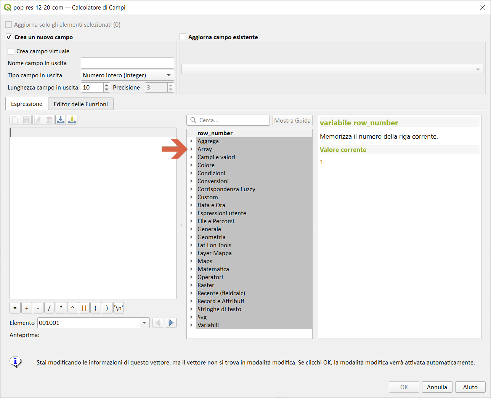

# Arrays
solo DB (es:SpatiaLite, PostGIS)

Questo gruppo contiene funzioni espressione per la creazione e la manipolazione di array (noti anche come strutture dati ad elenco). L'ordine dei valori all'interno dell'array è importante, al contrario della struttura dati 'a mappa' ([gruppo Maps](../maps)), in cui l'ordine delle coppie chiave-valore è irrilevante e i valori vengono identificati dalle loro chiavi.

| Funzione  | Descrizione|Plugin
|----------:|:-----------|--------
|[array](array.html)|Restituisce un array contenente tutti i valori passati come parametro|
|[array_append](array_append.html)|Restituisce un array con il valore passato aggiunto alla fine|
|[array_avg](array_avg.html)|Calcola il valore medio di un array|ArrayPlus
|[array_cat](array_cat.html)|Restituisce un array contenente tutti gli arrays passati concatenati|
|[array_contains](array_contains.html)|Restituisce true se un array contiene il valore specificato|
|[array_count](array_count.html)|Conta un dato valore in un array|ArrayPlus
|[array_distinct](array_distinct.html)|Restituisce un array contenente valori distinti dell'array dato|
|[array_find](array_find.html)|Restituisce l'indice di un valore all'interno di un array|
|[array_first](array_first.html)|Restituisce il primo valore di un array|
|[array_get](array_get.html)|Restituisce il valore ennesimo di un array|
|[array_insert](array_insert.html)|Restituisce un array con il valore passato aggiunto nella posizione indicata|
|[array_lambda](array_lambda.html)|Applica una funzione personalizzata a ciascun elemento (x)|ArrayPlus
|[array_intersect](array_intersect.html)|Restituisce vero se almeno un elemento dell'array1 esiste in array2|
|[array_last](array_last.html)|Restituisce l'ultimo valore di un array|
|[array_length](array_length.html)|Restituisce il numero di elementi di un array|
|[array_majority](array_majority.html)|Restituisce il valore più comune. Restituisce un valore arbitrario se ex-equo| **>=QGIS 3.18**
|[array_minority](array_minority.html)|Restituisce il valore più comune. Restituisce un valore arbitrario se ex-equo|ArrayPlus
|[array_max](array_max.html)|Restituisce il valore massimo di un array|**>=QGIS 3.18**
|[array_min](array_min.html)|Restituisce il valore minimo di un array|**>=QGIS 3.18**
|[array_prepend](array_prepend.html)|Restituisce un array con il valore dato aggiunto all'inizio|
|[array_prioritize](array_prioritize.html)|Ordina un array rispetto ad un altro QGIS >= 3.2|ArrayPlus
|[array_remove_all](array_remove_all.html)|Restituisce un array con tutti gli elementi del valore passato rimossi|
|[array_remove_at](array_remove_at.html)|Restituisce un array con l'indice passato rimosso|
|[array_replace](array_replace.html)|Ordina i valori in ordine crescente (usa _array_reverse_ per desc)|ArrayPlus
|[array_reverse](array_reverse.html)|Restituisce l'array dato con valori dell'array in ordine inverso|
|[array_slice](array_slice.html)|Restituisce una porzione dell'array|
|[array_sort](array_sort.html)|Ordina i valori in ordine crescente (usa _array_reverse_ per desc)|ArrayPlus
|[array_sum](array_sum.html)|Calcola la somma dei valori|**>=QGIS 3.18**
|[array_to_string](array_to_string.html)|Concatena gli elementi di un array in una stringa separata da un delimitatore usando una stringa opzionale per valori mancanti|
|[generate_series](generate_series.html)|La funzione crea una matrice contenente una sequenza di numeri|>= QGIS 3.4
|[regexp_matches](regexp_matches.html)|Restituisce un array di tutte le stringhe catturate dai gruppo, nell'ordine che i gruppi stessi compaiono con l'espressione regolare fornita con una stringa|
|[string_to_array](string_to_array.html)|Divide la stringa in un array usando il delimitatore fornito e la stringa opzionale per valori mancanti|

