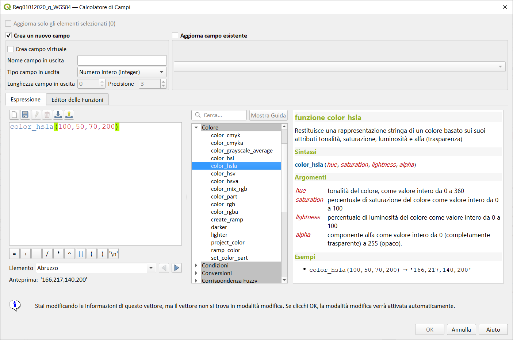

# color_hsla

Restituisce una rappresentazione stringa di un colore basato sui suoi attributi tonalità, saturazione, luminosità e alfa (trasparenza)

## Sintassi

color_hsl(_hue, saturation, lightness, alpha_)

## Argomenti

* _hue_ tonalità del colore, come valore intero da 0 a 360
* _saturation_ percentuale di saturazione del colore come valore intero da 0 a 100
* _lightness_ percentuale di luminosità del colore come valore intero da 0 a 100
* _alpha_ componente alfa come valore intero da 0 (completamente trasparente) a 255 (opaco).

## Esempi

* `color_hsla(100,50,70,200) → 166,217,140,200`

## nota bene

--

## osservazioni

`color_hsla(100,50,70,200) =  color_rgba( 166,217,140,200)`
