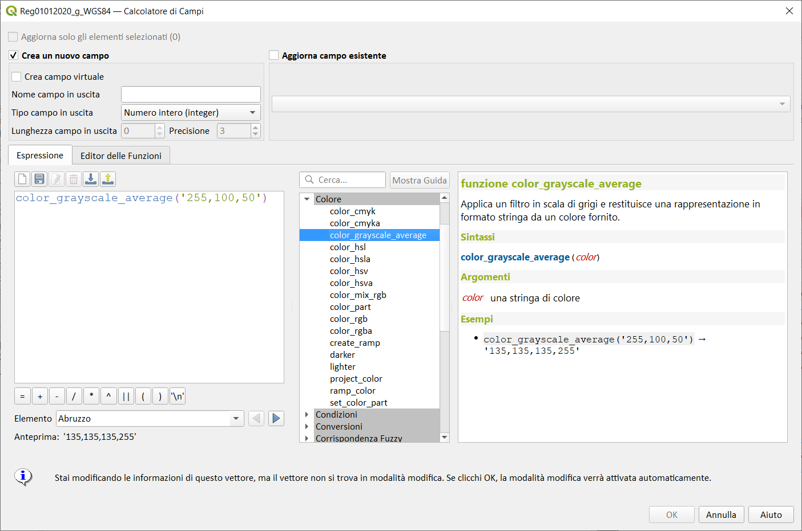
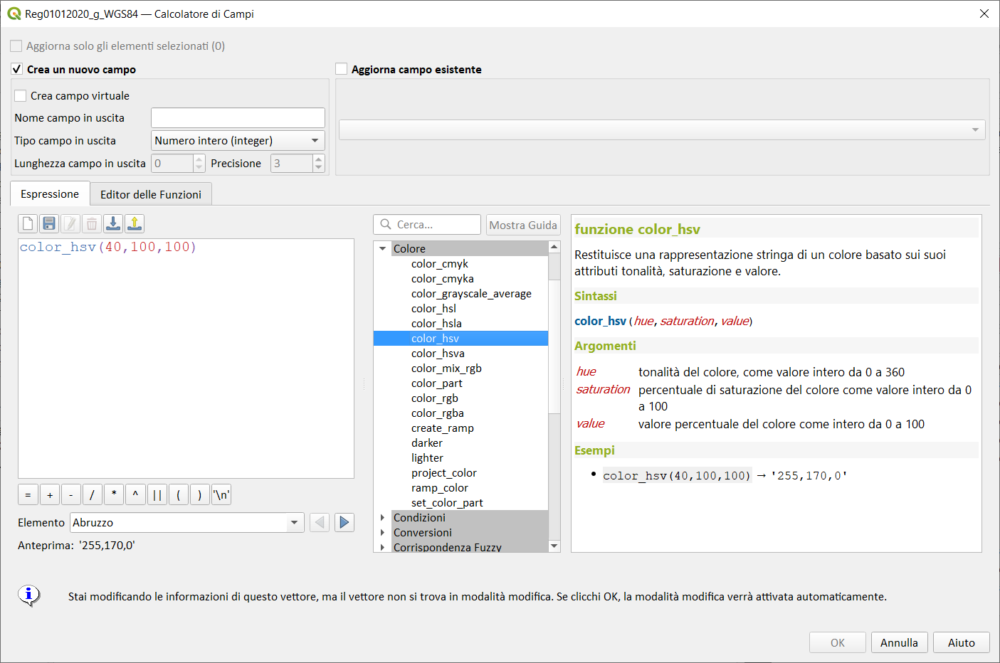
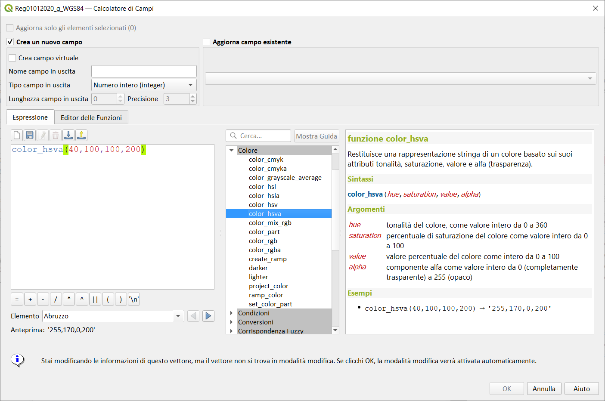
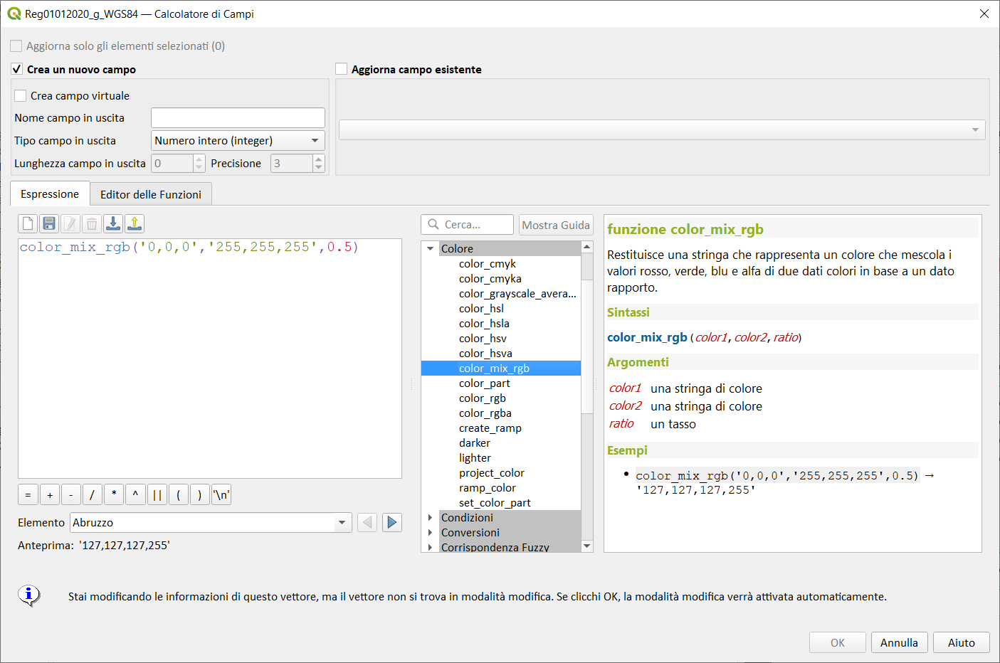
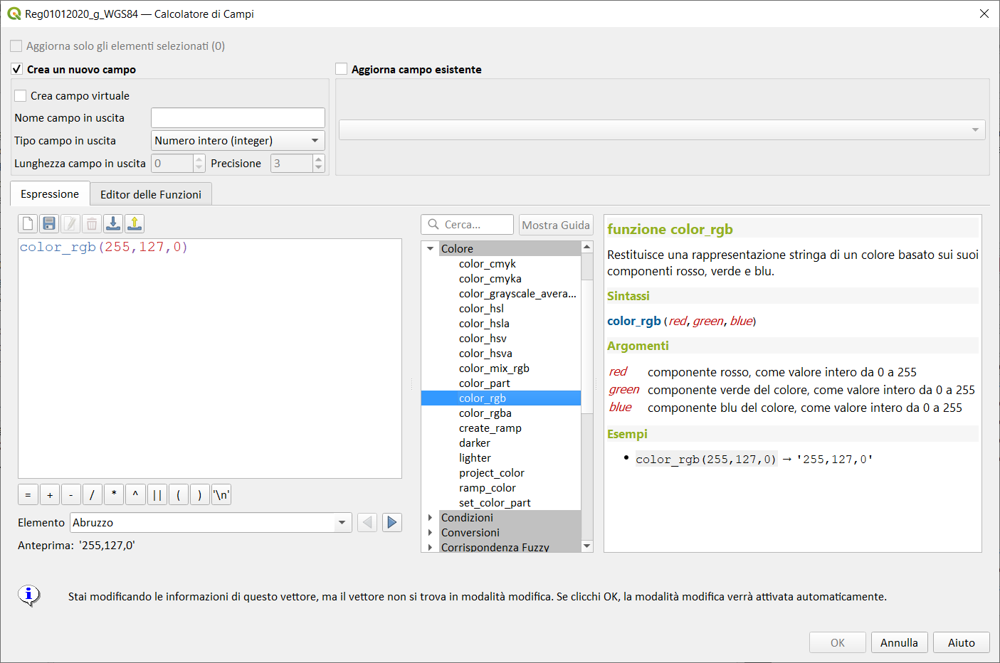
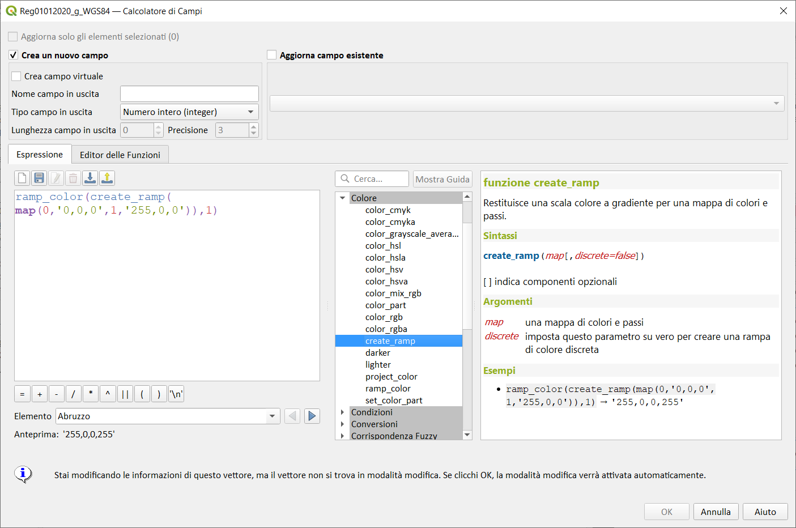
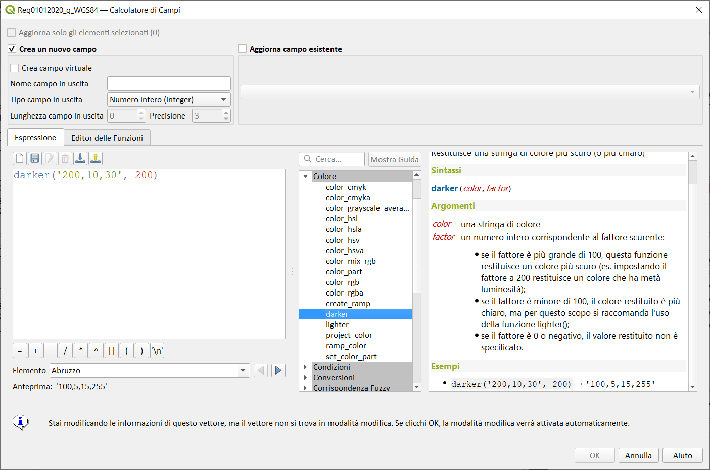
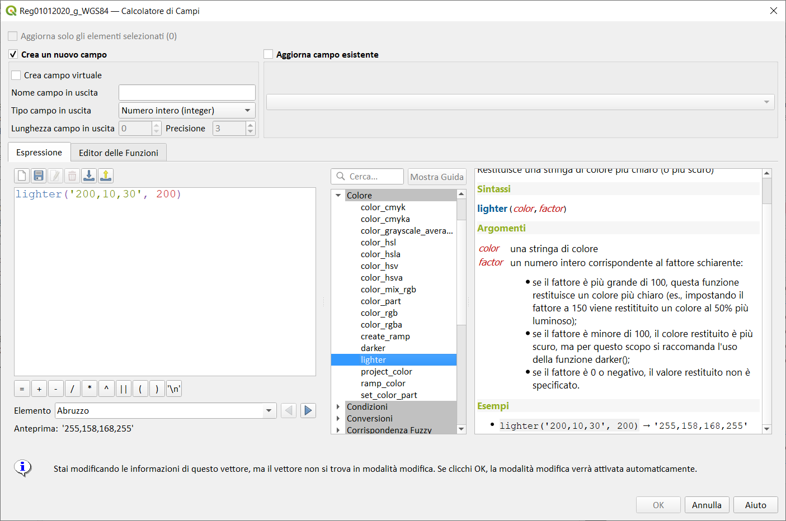
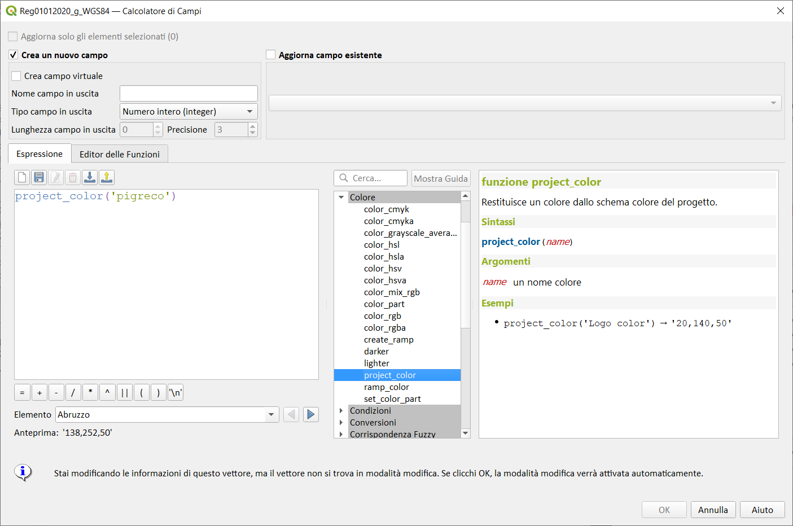
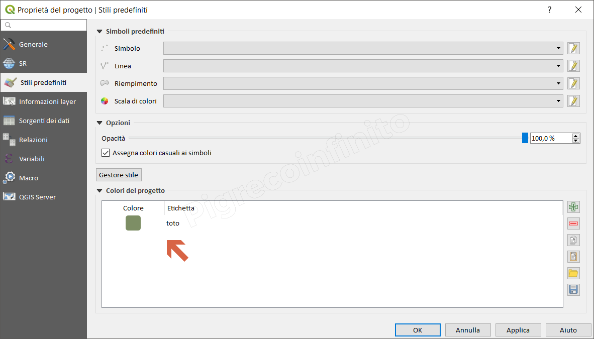

# Gruppo Colore

## color_cmyk

Restituisce una rappresentazione stringa di un colore basato sui suoi componenti ciano, magenta, giallo e nero

Sintassi:

- color_cmyk(_cyan, magenta, yellow, black_)

Argomenti:

* _cyan_ componente ciano del colore, come valore percentuale intero da 0 a 100
* _magenta_ componente magenta del colore, come valore percentuale intero da 0 a 100
* _yellow_ componente giallo del colore, come valore percentuale intero da 0 a 100
* _black_ componente nero del colore, come valore percentuale intero da 0 a 100

Esempi:

* `color_cmyk(100,50,0,10) → 0,115,230`

nota bene

--

osservazioni

- `color_cmyk(100,50,0,10) = color_rgb( 0,115,230 )`

---

## color_cmyka

Restituisce una rappresentazione stringa di un colore basato sui suoi componenti ciano, magenta, giallo, nero e alfa (trasparenza)

Sintassi:

- color_cmyka(_cyan, magenta, yellow, black, alpha_)

Argomenti:

* _cyan_ componente ciano del colore, come valore percentuale intero da 0 a 100
* _magenta_ componente magenta del colore, come valore percentuale intero da 0 a 100
* _yellow_ componente giallo del colore, come valore percentuale intero da 0 a 100
* _black_ componente nero del colore, come valore percentuale intero da 0 a 100
* _alpha_ componente alfa come valore intero da 0 (completamente trasparente) a 255 (opaco).

Esempi:

* `color_cmyka(100,50,0,10,200) → 0,115,230,2000`

nota bene

--

osservazioni

- `color_cmyka(100,50,0,10,200) = color_rgba(0,115,230,200)`

---

## color_grayscale_average

Applica un filtro in scala di grigio e restituisce una rappresentazione di stringa da un colore fornito.

Sintassi:

- color_grayscale_average(_color_)

Argomenti:

* _color_ una stringa di colore

Esempi:

* `color_grayscale_average('255,100,50') → '135,135,135,255'`

nota bene

--

osservazioni

---

## color_hsl

Restituisce una rappresentazione stringa di un colore basato sui suoi attributi tonalità, saturazione e luminosità.

Sintassi:

- color_hsl(_hue, saturation, lightness_)

Argomenti:

* _hue_ tonalità del colore, come valore intero da 0 a 360
* _saturation_ percentuale di saturazione del colore come valore intero da 0 a 100
* _lightness_ percentuale di luminosità del colore come valore intero da 0 a 100

Esempi:

* `color_hsl(100,50,70) → 166,217,140`

nota bene

--

osservazioni

- `color_hsl(100,50,70) =  color_rgb( 166,217,140)`

---

## color_hsla

Restituisce una rappresentazione stringa di un colore basato sui suoi attributi tonalità, saturazione, luminosità e alfa (trasparenza)

Sintassi:

- color_hsl(_hue, saturation, lightness, alpha_)

Argomenti:

* _hue_ tonalità del colore, come valore intero da 0 a 360
* _saturation_ percentuale di saturazione del colore come valore intero da 0 a 100
* _lightness_ percentuale di luminosità del colore come valore intero da 0 a 100
* _alpha_ componente alfa come valore intero da 0 (completamente trasparente) a 255 (opaco).

Esempi:

* `color_hsla(100,50,70,200) → 166,217,140,200`

nota bene

--

osservazioni

- `color_hsla(100,50,70,200) =  color_rgba( 166,217,140,200)`

---

## color_hsv

Restituisce una rappresentazione stringa di un colore basato sui suoi attributi tonalità, saturazione e valore.

Sintassi:

- color_hsv(_hue, saturation, value_)

Argomenti:

* _hue_ tonalità del colore, come valore intero da 0 a 360
* _saturation_ percentuale di saturazione del colore come valore intero da 0 a 100
* _value_ valore percentuale del colore come intero da 0 a 100

Esempi:

* `color_hsv(40,100,100) → 255,170,0`

nota bene

--

osservazioni

- `color_hsv(40,100,100) =  color_rgb( 255,170,0 )`

---

## color_hsva

Restituisce una rappresentazione stringa di un colore basato sui suoi attributi tonalità, saturazione, valore e alfa (trasparenza).

Sintassi:

- color_hsva(_hue, saturation, value, alpha_)

Argomenti:

* _hue_ tonalità del colore, come valore intero da 0 a 360
* _saturation_ percentuale di saturazione del colore come valore intero da 0 a 100
* _value_ valore percentuale del colore come intero da 0 a 100
* _alpha_ componente alfa come valore intero da 0 (completamente trasparente) a 255 (opaco)

Esempi:

* `color_hsva(40,100,100,200) → 255,170,0,200`

nota bene

--

osservazioni

- `color_hsva(40,100,100,200) = color_rgba( 255,170,0,200 )`

---

## color_mix_rgb

Restituisce una stringa che rappresenta un colore che mescola i valori rosso, verde, blu e alfa di due colori forniti in base a un determinato rapporto.

Sintassi:

- color_mix_rgb(_color1,color2,ratio_)

Argomenti:

* _color1_ una stringa di colore
* _color2_ una stringa di colore
* _ratio_ un rapporto

Esempi:

* `color_mix_rgb('0,0,0','255,255,255',0.5) → 127,127,127,255`

nota bene

--

osservazioni

---

## color_part

Restituisce uno specifico componente colore da una stringa colore, es. la componente rosso o alfa.

Sintassi:

- color_part(_color, component_)

Argomenti:

* _color_ una stringa di colore
* _component_ una stringa corrispondente al componente colore da restituire. Opzioni valide sono:

    * red: componente rosso RGB (0-255)
    * green: componente verde RGB (0-255)
    * blue: componente blu RGB (0-255)
    * alpha: valore alfa (trasparenza) (0-255)
    * hue: tonalità HSV (0-360)
    * saturation: saturazione HSV (0-100)
    * value: valore HSV (0-100)
    * hsl_hue: tonalità HSL (0-360)
    * hsl_saturation: saturazione HSL (0-100)
    * lightness: luminosità HSL (0-100)
    * cyan: componente ciano CMYK (0-100)
    * magenta: componente magenta CMYK (0-100)
    * yellow: componente giallo CMYK (0-100)
    * black: componente nero CMYK (0-100)

Esempi:

* `color_part('200,10,30','green') → 10`

nota bene

--

osservazioni

---

## color_rgb

Restituisce una rappresentazione stringa di un colore basato sui suoi componenti rosso, verde e blu.

Sintassi:

- color_rgb(_red, green, blue_)

Argomenti:

* _red_ componente rosso del colore, come valore intero da 0 a 255
* _green_ componente verde del colore, come valore intero da 0 a 255
* _blue_ componente blu del colore, come valore intero da 0 a 255

Esempi:

* `color_rgb(255,127,0) → 255,127,0`

nota bene

--

osservazioni

---

## color_rgba

Restituisce una rappresentazione stringa di un colore basato sui suoi componenti rosso, verde, blue ed alpha (trasparenza).

Sintassi:

- color_rgba(_red, green, blue_)

Argomenti:

* _red_ componente rosso del colore, come valore intero da 0 a 255
* _green_ componente verde del colore, come valore intero da 0 a 255
* _blue_ componente blu del colore, come valore intero da 0 a 255
* _alpha_ componente alfa come valore intero da 0 (completamente trasparente) a 255 (opaco).

Esempi:

* `color_rgba(255,127,0,200) → 255,127,0,2000`

nota bene

--

osservazioni

---

## create_ramp

Restituisce una scala di colori a gradiente per una mappa di colori e passi.

Sintassi:

- create_ramp(_map, discrete_)

Argomenti:

* _map_ una mappa di colori e passi
* _discrete_ dichiara se la scala di colori è discreta

Esempi:

* `ramp_color(create_ramp(map(0,'0,0,0',1,'255,0,0')),1) → 255,0,0,255`

nota bene

--

osservazioni

---

## darker

Restituisce una stringa di colore più scuro (o più chiaro)

Sintassi:

- darker(_color, factor_)

Argomenti:

* _color_ una stringa di colore
* _factor_ un numero intero corrispondente al fattore scurente:
    * se il fattore è più grande di 100, questa funzione restituisce un colore più scuro (per es., impostando il fattore a 300 viene restitituito un colore che ha un terzo della luminosità);
    * se il fattore è minore di 100, il colore restituito è più chiaro, ma per questo scopo si raccomanda l'uso della funzione lighter();
    * se il fattore è 0 o negativo, il valore restituito non è specificato.

Esempi:

* `darker('200,10,30',300) → '66,3,10,255'`

nota bene

--

osservazioni

---

## lighter

Restituisce una stringa di colore più chiaro (o più scuro)

Sintassi:

- lighter(_color, factor_)

Argomenti:

* color una stringa di colore
* factor un numero intero corrispondente al fattore schiarente:
    * se il fattore è più grande di 100, questa funzione restituisce un colore più chiaro (per es., impostando il fattore a 150 viene restitituito un colore al 50% più luminoso);
    * se il fattore è minore di 100, il colore restituito è più scuro, ma per questo scopo si raccomanda l'uso della funzione darker();
    * se il fattore è 0 o negativo, il valore restituito non è specificato.

Esempi:

* `lighter('200,10,30',200) → '255,158,168,255'`

nota bene

--

osservazioni

---

## project_color

Restituisce un colore dallo schema colore del progetto.

Sintassi:

- project_color(_name_)

Argomenti:

* _name_ un nome colore

Esempi:

* `project_color('Logo color') → 20,140,50`

nota bene

--

osservazioni

---

## ramp_color

Restituisce una stringa rappresentante un colore ottenuto da una scala colore.

### Variante di scala salvata

Restituisce una stringa che rappresenta un colore da una scala salvata

Sintassi:

- ramp_color(_ramp_name, value_)

Argomenti:

* _ramp_name_ il nome della scala colore come stringa, peesempi:o 'Spectral'
* _value_ la posizione nella scala colore da cui selezionare il colore come numero reale fra 0 e 1

Esempi:

* `ramp_color('Spectral',0.3) → '253,190,115,255'`

nota

Le scale di colore disponibili differiscono fra le varie installazioni di QGIS. Questa funzione potrebbe non restituire il risultato atteso se sposti i tuoi progetti QGIS fra le diverse installazioni.

### Variante di scala creata con un'espressione

Restituisce una stringa che rappresenta un colore da una scala creata con un'espressione

Sintassi:

ramp_color(_ramp, value_)

Argomenti:

* _ramp_ la scala di colori
* _value_ la posizione nella scala colore da cui selezionare il colore come numero reale fra 0 e 1

Esempi:

* `ramp_color(create_ramp(map(0,'0,0,0',1,'255,0,0')),1) →255,0,0,255`

osservazioni

---

## set_color_part

Imposta uno specifico componente colore per una stringa colore, es. la componente rosso o alpha.

Sintassi:

- set_color_part(_color, component, value_)

Argomenti:

* _color_ una stringa di colore
* _component_ una stringa corrispondente al componente colore da impostare. Opzioni valide sono:

    * red: componente rosso RGB (0-255)
    * green: componente verde RGB (0-255)
    * blue: componente blu RGB (0-255)
    * alpha: valore alfa (trasparenza) (0-255)
    * hue: tonalità HSV (0-360)
    * saturation: saturazione HSV (0-100)
    * value: valore HSV (0-100)
    * hsl_hue: tonalità HSL (0-360)
    * hsl_saturation:saturazione HSL (0-100)
    * lightness: luminosità HSL (0-100)
    * cyan: componente ciano CMYK (0-100)
    * magenta: componente magente CMYK (0-100)
    * yellow: componente giallo CMYK (0-100)
    * black: componente nero CMYK (0-100)

* _value_ nuovo valore per il componente colore, rispettando gli intervalli listati sopra

Esempi:

* `set_color_part('200,10,30','green',50) → 200,50,30`

nota bene

--

osservazioni

---
