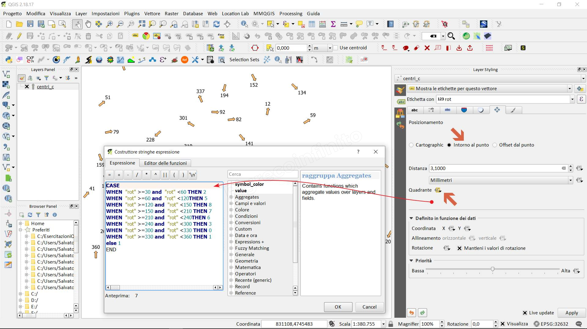

# CASE

Valuta un'espressione e restituisce un risultato diverso, sia esso vero o falso. Puoi testare più condizioni

## Sintassi

```
CASE
WHEN condizione THEN risultato
[ ...n ]
[ ELSE risultato ]
END
```
[ ] indica componenti opzionali

## Argomenti

* _<span style="color:red;">WHEN condizione</span>_ - L'espressione di condizione da valutare. 

* _<span style="color:red;">THEN risultato</span>_ - Se _condizione_ valutata a True (vero) allora risultato viene valutato e restituito. 

* _<span style="color:red;">ELSE risultato</span>_ - Se nessuna delle condizioni valutate sopra restituisce True (vero) allora _risultato_ viene valutato e restituito.

## Esempi
```
CASE
WHEN "column" IS NULL THEN 'None'
END
```
```
CASE 
WHEN  "COD_REG" =19 or  "COD_REG"  = 20
THEN  "DEN_REG" 
ELSE 'NON SONO ISOLE' 
END
```


```
CASE 
WHEN   length( "DEN_REG") >15  THEN 'LUNGO'
WHEN   length( "DEN_REG") <15   AND length( "DEN_REG") >10 THEN 'MEDIO'
ELSE 'CORTA' 
END
```


## Altri esempi

### popolare un campo un funzione di un altro

```
CASE 
WHEN "livello3" ILIKE 'A%' THEN 'ciao'
WHEN "livello3" ILIKE 'B%' THEN 'arrivederci'
WHEN "livello3" ILIKE 'C%' THEN 'ciaone'
ELSE 'CUCU'
END
```
In questo esempio viene popolato un campo (dove è usata l'espressione) in funzione del campo _livello3_: se il campo contiene un valore che inizia per _A_ allora scriverà _ciao_, se contiene un valore che inizia con _B_ scriverà _arrivederci_; se contiene un valore che inizia per _C_ scriverà _ciaone_ in tutti gli altri casi scriverà _CUCU_

---

### posizionamento etichetta 



<p align="center">
  
</p>
