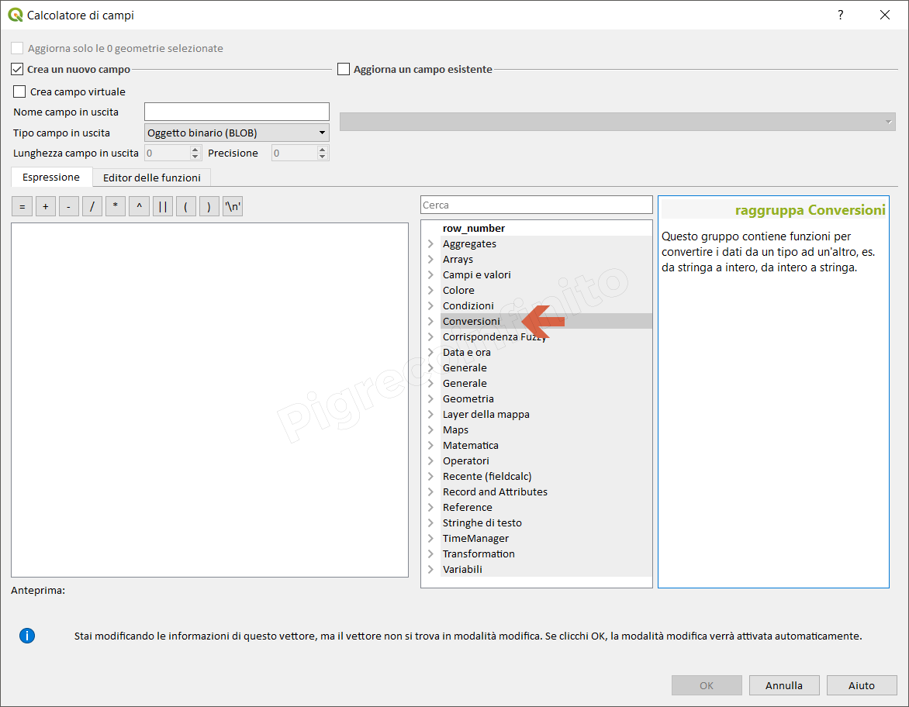

# Conversioni

Questo gruppo contiene funzioni per convertire i dati da un tipo ad un'altro, es. da stringa a intero, da intero a stringa. 

| Funzione  | Descrizione| Info
|----------:|:-----------|-----
|[hash](hash.html)|Crea un hash da una stringa con un determinato metodo|>= QGIS 3.12
|[md5](md5.html)|Crea un hash md5 da una stringa.|>= QGIS 3.12
|[sha256](sha256.html)|Crea un hash sha256 da una stringa|>= QGIS 3.12
|[to_date](to_date.html)|	Converte una stringa in un oggetto data|
|[to_datetime](to_datetime.html)|Converte una stringa in un oggetto datetime|
|[to_dm](to_dm.html)|Converte una coordinata in gradi, minuti| >= QGIS 3.4
|[to_dms](to_dms.html)|Converte una coordinata in gradi, minuti e secondi| >= QGIS 3.4
|[to_int](to_int.html)|Converte una stringa in un numero intero. Non viene restituito nulla se un valore non può essere convertito ad intero (es. '123asd' non è valido)|
|[to_interval](to_interval.html)|Converte una stringa in un tipo intervallo. Può essere usata per estrarre giorni, ore, mese, etc. da una data.|
|[to_real](to_real.html)|Converte una stringa in un numero reale. Non viene restituito nulla se un valore non può essere convertito a reale (es. '123.56asd' non è valido). I numeri sono arrotondati dopo aver salvato le modifiche se la precisione è minore del risultato della conversione|
|[to_string](to_string.html)|	Converte un numero in stringa|
|[to_time](to_time.html)|Converti una stringa in un oggetto time|
|[to_time](to_time.html)|Converti una stringa in un oggetto time|

