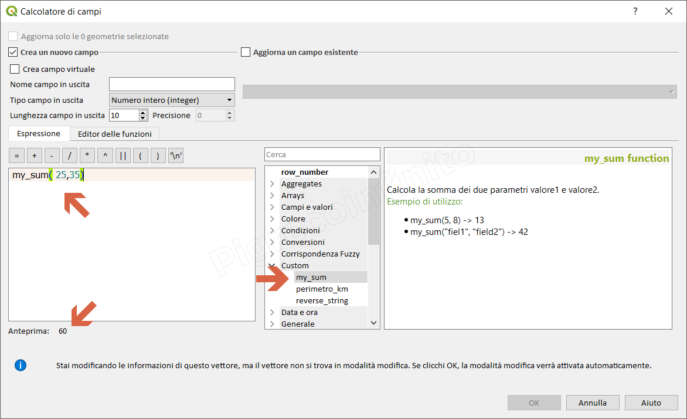
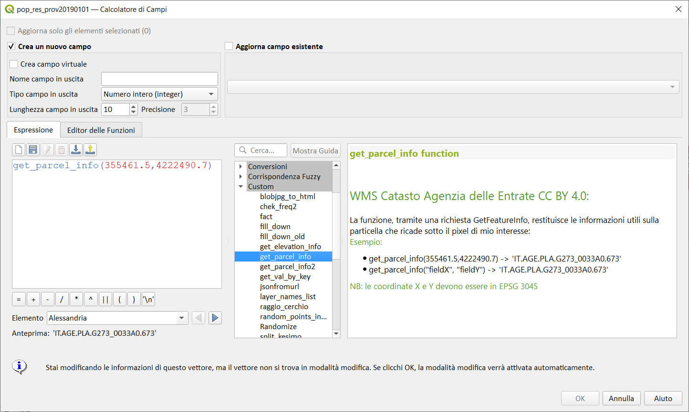

# Gruppo Custom

!!! Abstract
  **Questo gruppo contiene funzioni Python create in modo personalizzato dall'utente.**

---

## fattoriale

Calcola il fattoriale di un numero definito come il prodotto di tutti i numeri tra 1 e n.
Per convenzione il fattoriale di 0 = 1 la notazione matematica per fattoriale è n!
La funzione è compresa nel modulo math
NB: valore massimo memorizzabile in un campo numerico è 20! (2432902008176640000)

Esempio:

* `fact(10)→ 3628800`


Codice Python:

```
from qgis.core import *
from qgis.gui import *
import math

@qgsfunction(args='auto', group='Custom')
def fact(n, feature, parent):
    """
    Calcola il fattoriale di un numero
    definito come il prodotto di tutti
    i numeri tra 1 e n.<ul> </ul>
    Per convenzione il fattoriale di 0 = 1
    la notazione matematica per fattoriale è n!
    La funzione è compresa nel modulo math
    NB: valore massimo memorizzabile 20!
    <ul> </ul>
    <h2>Example usage:</h2>
    <ul>
      <li>Fattoriale(5) -> 120</li>
      <li>in simboli 5! = 120</li>
    </ul>
    """
    return math.factorial(n)
```

Lo script Python è stato realizzato da [Giulio Fattori](https://github.com/Korto19)

---

## my_sum

Calcola la somma dei due parametri valore1 e valore2. 

Esempio:

* `my_sum(5, 8) -> 13 `
* `my_sum("fiel1", "field2") -> 42 `



Codice Python:

Da copiare ed incollare

```
from qgis.core import *
from qgis.gui import *

@qgsfunction(args='auto', group='Custom')
def my_sum(value1, value2, feature, parent):
    """
    Calcola la somma dei due parametri valore1 e valore2.
    <h2>Esempio di utilizzo:</h2>
    <ul>
      <li>my_sum(5, 8) -> 13</li>
      <li>my_sum("fiel1", "field2") -> 42</li>
    </ul>
    """
    return value1 + value2
```

---

## perimetro_km()

Questa funzione ritorna il valore del perimetro della geometria in km 

Esempio:

* `perimetro_km() - > 25 `

.png)

Codice Python:

Da copiare ed incollare

```
from qgis.core import *
from qgis.gui import *

@qgsfunction(args='auto', group='Custom')
def perimetro_km( feature, parent):
    """ 
	Questa funzione ritorna il valore del perimetro della geometria in km
	<ul>
      <li>perimetro_km() - > 25</li>
    </ul>
	"""
    geom_perimetro_km = feature.geometry().length()/1000
    return geom_perimetro_km
```

---

## reverse_string

Questa funzione ritorna il valore rovesciato di un testo

Esempio:

``` 
reverse_string('Pigrecoinfinito) - > 'otinifniocergiP' `
```


Codice Python:

Da copiare ed incollare

```
from qgis.core import *
from qgis.gui import *

@qgsfunction(args='auto', group='Custom')
def reverse_string(string_to_reverse, feature, parent):
   """ 
   Questa funzione ritorna il valore rovesciato di un testo
	<ul>
      <li>reverse_string('Pigrecoinfinito) - > 'otinifniocergiP'</li>
    </ul>
	"""
   return string_to_reverse[::-1]
```

---

## get_parcel_info

WMS Catasto Agenzia delle Entrate CC BY 4.0:

La funzione, tramite una richiesta GetFeatureInfo, restituisce le informazioni utili sulla particella che ricade sotto il pixel di mio interesse:

Sintassi:

- get_parcel_info(_<span style="color:red;">x</span>_,_<span style="color:red;">y</span>_)

Argomenti:

- _<span style="color:red;">x</span>_ coordinata x di un punto
- _<span style="color:red;">y</span>_ coordinata x di un punto

Esempio:

```
get_parcel_info(355461.5,4222490.7) → 'IT.AGE.PLA.G273_0033A0.673'
```
Funzione personalizzata:

```py
# -*- coding: utf-8 -*-
"""
/***************************************************************************
 WMS Catasto Agenzia delle Entrate CC BY 4.0
                              -------------------
        copyright            : (C) 2020 by Giulio Fattori
        email                : giulio.fattori@tin.it
 ***************************************************************************/
"""

from qgis.core import *
from qgis.gui import *
import requests


@qgsfunction(args='auto', group='Custom')
def get_parcel_info(xx, yy, feature, parent):
    """
    <h1>WMS Catasto Agenzia delle Entrate CC BY 4.0:</h1><br>    
    La funzione, tramite una richiesta GetFeatureInfo, restituisce le informazioni utili sulla particella che ricade sotto il pixel di mio interesse:
    <h2>Esempio:</h2>
    <ul>
      <li>get_parcel_info(355461.5,4222490.7) -> 'IT.AGE.PLA.G273_0033A0.673'</li>
      <li>get_parcel_info("fieldX", "fieldY") -> 'IT.AGE.PLA.G273_0033A0.673'</li>
    </ul>
    <h2>NB: le coordinate X e Y devono essere in EPSG 3045</h2>
    """
    req = "https://wms.cartografia.agenziaentrate.gov.it/inspire/wms/ows01.php?REQUEST=GetFeatureInfo&SERVICE=WMS&SRS=EPSG:3045&STYLES=&VERSION=1.1&FORMAT=image/png&BBOX="+str(xx-1)+","+str(yy-1)+","+str(xx+1)+","+str(yy+1)+"&HEIGHT=9&WIDTH=9&LAYERS=CP.CadastralParcel&QUERY_LAYERS=CP.CadastralParcel&INFO_FORMAT=text/html&X=5&Y=5"

    r = requests.get(req, auth=('user', 'pass'))
    a = r.text.partition("InspireId localId</th><td>")[2]
    b = a.partition("</td>")[0]
    return b
```


