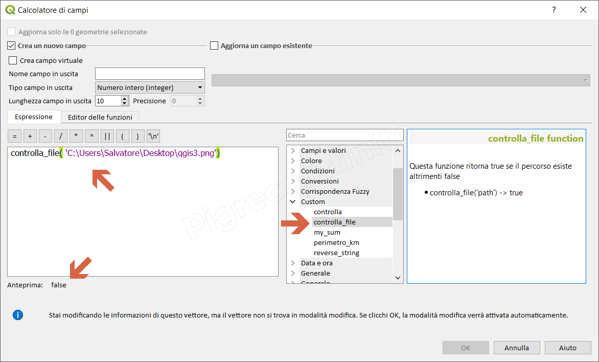
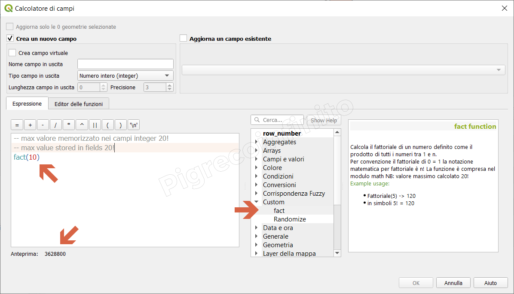
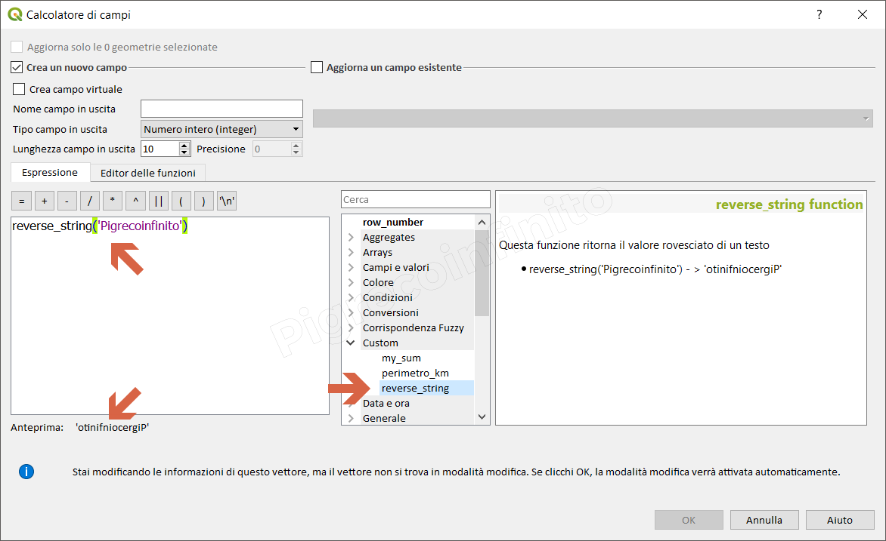

# Gruppo Custom

!!! Abstract
  **Questo gruppo contiene funzioni Python create in modo personalizzato dall'utente.**

---

## controlla_file

Questa funzione ritorna true se il percorso esiste altrimenti false.

Esempio:

* `controlla_file('path') -> true `



Codice Python:

```
from qgis.core import *
from qgis.gui import *
from  os.path import *

@qgsfunction(args='auto', group='Custom')
def controlla_file(value1, feature, parent):
	""" 
	Questa funzione ritorna true se il percorso esiste altrimenti false
	<ul>
      <li>controlla_file('path') -> true</li>
    </ul>
	"""
	return os.path.exists(value1)
```

---

## fattoriale

Calcola il fattoriale di un numero definito come il prodotto di tutti i numeri tra 1 e n.
Per convenzione il fattoriale di 0 = 1 la notazione matematica per fattoriale è n!
La funzione è compresa nel modulo math
NB: valore massimo memorizzabile in un campo numerico è 20! (2432902008176640000)

Esempio:

* `fact(10)→ 3628800`



Codice Python:

```
from qgis.core import *
from qgis.gui import *
import math

@qgsfunction(args='auto', group='Custom')
def fact(n, feature, parent):
    """
    Calcola il fattoriale di un numero
    definito come il prodotto di tutti
    i numeri tra 1 e n.<ul> </ul>
    Per convenzione il fattoriale di 0 = 1
    la notazione matematica per fattoriale è n!
    La funzione è compresa nel modulo math
    NB: valore massimo memorizzabile 20!
    <ul> </ul>
    <h2>Example usage:</h2>
    <ul>
      <li>Fattoriale(5) -> 120</li>
      <li>in simboli 5! = 120</li>
    </ul>
    """
    return math.factorial(n)
```

Lo script Python è stato realizzato da [Giulio Fattori](https://github.com/Korto19)

---

## my_sum

Calcola la somma dei due parametri valore1 e valore2. 

Esempio:

* `my_sum(5, 8) -> 13 `
* `my_sum("fiel1", "field2") -> 42 `


Codice Python:

Da copiare ed incollare

```
from qgis.core import *
from qgis.gui import *

@qgsfunction(args='auto', group='Custom')
def my_sum(value1, value2, feature, parent):
    """
    Calcola la somma dei due parametri valore1 e valore2.
    <h2>Esempio di utilizzo:</h2>
    <ul>
      <li>my_sum(5, 8) -> 13</li>
      <li>my_sum("fiel1", "field2") -> 42</li>
    </ul>
    """
    return value1 + value2
```

---

## perimetro_km()

Questa funzione ritorna il valore del perimetro della geometria in km 

Esempio:

* `perimetro_km() - > 25 `

.png)

Codice Python:

Da copiare ed incollare

```
from qgis.core import *
from qgis.gui import *

@qgsfunction(args='auto', group='Custom')
def perimetro_km( feature, parent):
    """ 
	Questa funzione ritorna il valore del perimetro della geometria in km
	<ul>
      <li>perimetro_km() - > 25</li>
    </ul>
	"""
    geom_perimetro_km = feature.geometry().length()/1000
    return geom_perimetro_km
```

---

## reverse_string

Questa funzione ritorna il valore rovesciato di un testo

Esempio:
 
* `reverse_string('Pigrecoinfinito) - > 'otinifniocergiP' `



Codice Python:

Da copiare ed incollare

```
from qgis.core import *
from qgis.gui import *

@qgsfunction(args='auto', group='Custom')
def reverse_string(string_to_reverse, feature, parent):
   """ 
   Questa funzione ritorna il valore rovesciato di un testo
	<ul>
      <li>reverse_string('Pigrecoinfinito) - > 'otinifniocergiP'</li>
    </ul>
	"""
   return string_to_reverse[::-1]
```

---
