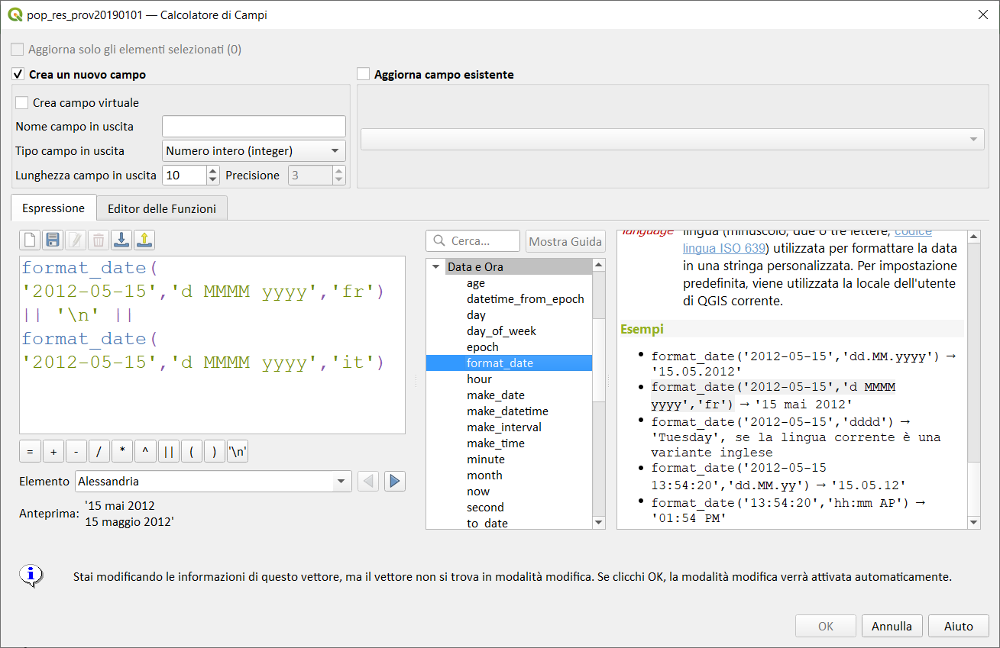

# format_date

Formatta un tipo di data o stringa in un formato stringa personalizzato. Usa stringhe nel formato data/ora Qt. Vedi [QDateTime::toString](https://doc.qt.io/qt-5/qdatetime.html#toString).

## Sintassi

* format_date(_<span style="color:red;">datetime</span>_, _<span style="color:red;">format</span>_[,_<span style="color:red;">language</span>_]_)

## Argomenti

* _<span style="color:red;">datetime</span>_ valora data, ora, o data/ora
* _<span style="color:red;">format</span>_ Modello di stringhe usato per formattare la stringa. 

Espressione|In uscita
----------:|---------
d|il giorno in numero senza lo zero iniziale (da 1 a 31)
dd|il giorno in numero con lo zero iniziale (da 01 a 31)
ddd|il nome locale del giorno abbreviato (es. da 'Mon' a 'Sun')
dddd|il nome locale del giorno per esteso (es. da 'Monday' a 'Sunday')
M|il mese in numero senza lo zero iniziale (1-12)
MM|il mese in numero con lo zero iniziale (01-12)
MMM|il nome locale del mese abbreviato (es. da 'Jan' a 'Dec')
MMMM|il nome locale del mese per esteso (es. da 'January' a 'December')
yy|l'anno come un numero a due cifre (00-99)
yyyy|l'anno come un numero a quattro cifre

Queste espressioni possono essere usate per la parte time della stringa da formattare:

Espressione|In uscita
----------:|---------
h|l'ora senza lo zero iniziale (da 0 a 23 o da 1 a 12 se visualizzi AM/PM)
hh|l'ora con lo zero iniziale (da 00 a 23 o da 01 a 12 se visualizzi AM/PM)
H|l'ora senza lo zero iniziale (da 0 a 23, anche se visualizzi AM/PM)
HH|l'ora con lo zero iniziale (da 00 a 23, anche se visualizzi AM/PM)
m|il minuto senza lo zero iniziale (da 0 a 59)
mm|il minuto con lo zero iniziale (da 00 a 59)
s|il secondo senza lo zero iniziale (da 0 a 59)
ss|il secondo con lo zero iniziale (da 00 a 59)
z|i millisecondi senza gli zeri iniziali (da 0 a 999)
zzz|i millisecondi con gli zeri iniziali (da 000 a 999)
AP o A|interpretato come un orario nel formato AM/PM. AP deve essere "AM" oppure "PM".
ap o a|interpretato come un orario nel formato AM/PM. ap deve essere "am" oppure "pm".


* _<span style="color:red;">language</span>_ linguaggio (minuscolo, due o tre lettere, codice ISO 639) utilizzato per formattare la data in una stringa personalizzata (**>= QGIS 3.12**)


## Esempi
```
* format_date('2012-05-15','dd.MM.yyyy') → '15.05.2012'
* format_date('2012-06-15','d MMMM yyyy','fr') → '15 juin 2012'
* format_date('2012-06-15','d MMMM yyyy','it') → '15 giugno 2012'
```



