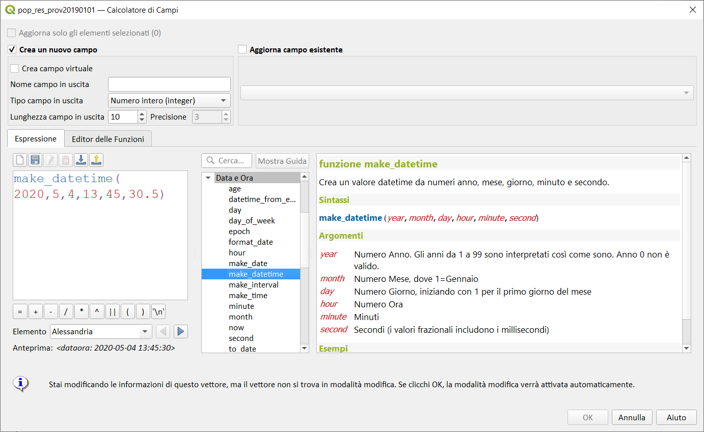

# make_datetime

Crea un valore datetime da anno, mese, giorno, ora, minuti e secondi numeri.

## Sintassi

* make_datetime(_year_,_month_,_day_,_hour_,_minute_,_second_)

## Argomenti

* year Numero dell'anno. Gli anni da 1 a 99 vengono interpretati così come sono. L'anno 0 non è valido.
* month Numero del mese, dove 1 = gennaio
* day Day Numero del giorno, che inizia con 1 per il primo giorno del mese;
* hour numero ore;
* minute minuti;
* second secondi (i valori frazionari includono millisecondi).

## Esempi

* `make_datetime(2020,5,4,13,45,30.5) → datetime value 2020-05-04 13:45:30.500`

## Osservazioni

--
