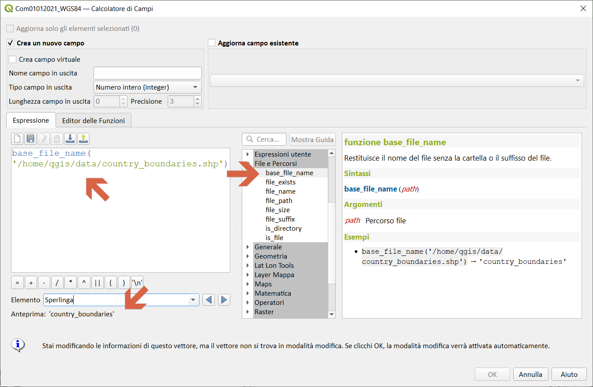
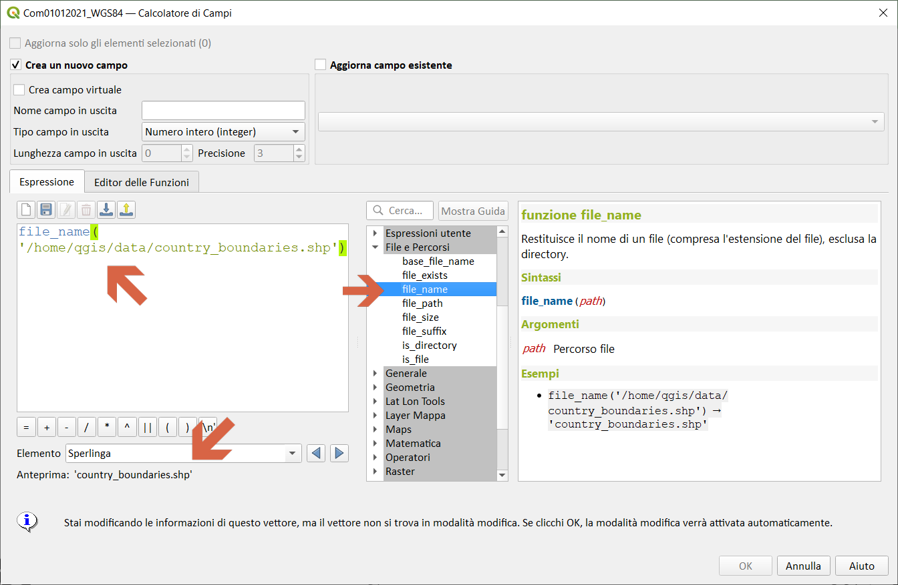
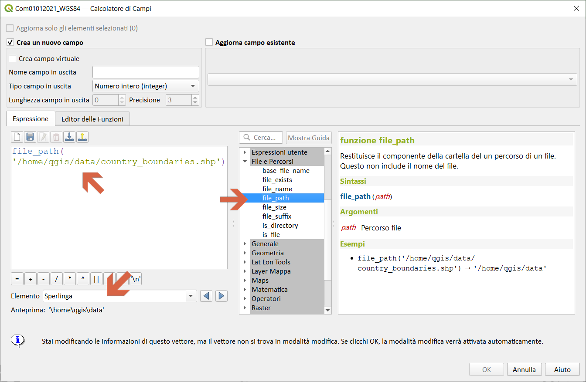
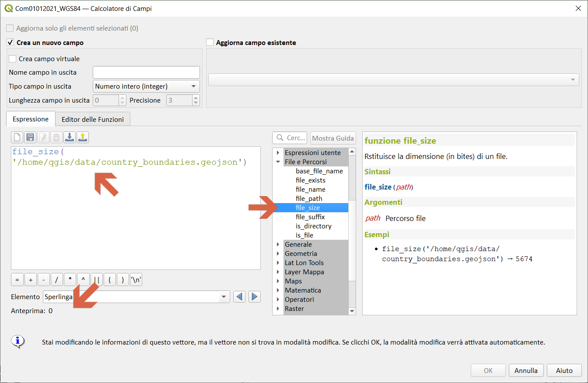
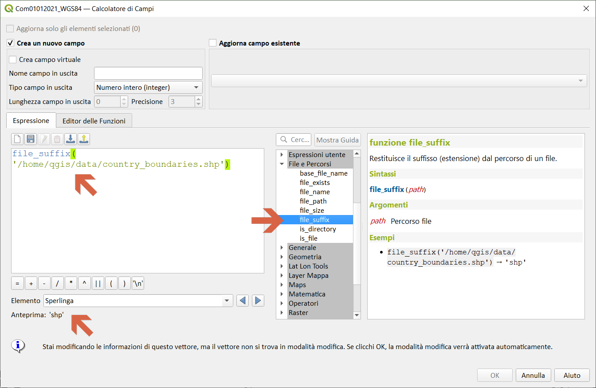
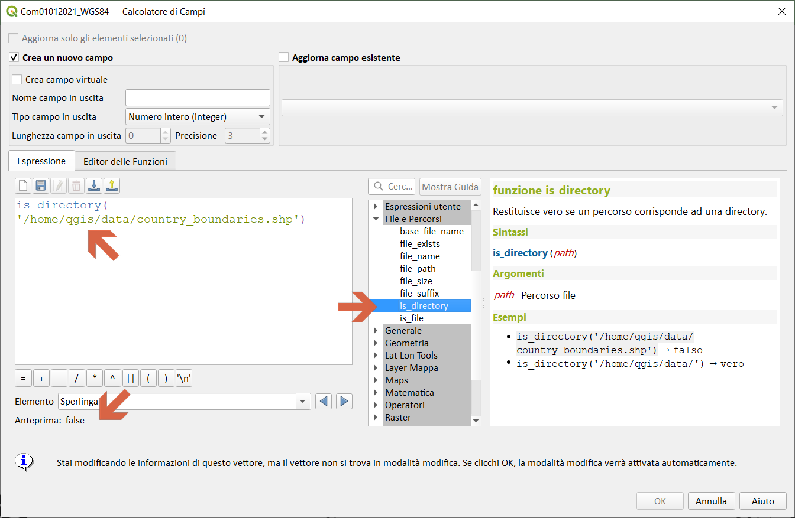
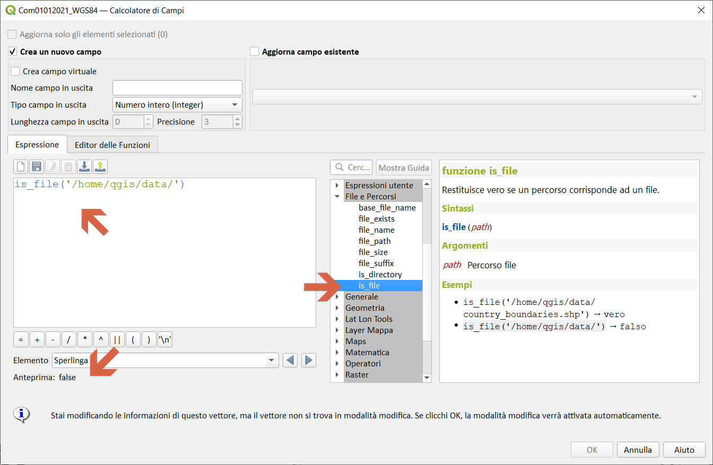

# Gruppo File e Percorsi

!!! Abstract
    **Contiene funzioni che manipolano nomi di file e di percorsi.**

---

## base_file_name

Restituisce il nome del file senza la cartella o il suffisso del file. 

Sintassi:

- base_file_name(_<span style="color:red;">path</span>_)

Argomenti:

- _<span style="color:red;">path</span>_ Percorso file

Esempi:

```
base_file_name('/home/qgis/data/country_boundaries.shp') → 'country_boundaries'
```

[](../../img/file_e_percorsi/base_file_name1.png)

## exif

Recupera i valori dei tag exif da un file immagine.

Sintassi:

- exif(_<span style="color:red;">path</span><span style="color:red;">[,tag]</span>_)

[ ] indica componenti opzionali

Argomenti


- _<span style="color:red;">path</span>_ Un percorso di file immagine.
- _<span style="color:red;">tag</span>_ Il tag da restituire. Se vuoto, verrà restituita una mappa con tutti i valori dei tag exif.

elenco completo dei tag:

```
Exif.GPSInfo.GPSAltitude
Exif.GPSInfo.GPSAltitudeRef
Exif.GPSInfo.GPSDateStamp
Exif.GPSInfo.GPSLatitude
Exif.GPSInfo.GPSLatitudeRef
Exif.GPSInfo.GPSLongitude
Exif.GPSInfo.GPSLongitudeRef
Exif.GPSInfo.GPSProcessingMethod
Exif.GPSInfo.GPSTimeStamp
Exif.GPSInfo.GPSVersionID
Exif.Image.0xea1c
Exif.Image.Artist
Exif.Image.DateTime
Exif.Image.ExifTag
Exif.Image.GPSTag
Exif.Image.ImageLength
Exif.Image.ImageWidth
Exif.Image.Make
Exif.Image.Model
Exif.Image.ResolutionUnit
Exif.Image.Software
Exif.Image.XPKeywords
Exif.Image.XResolution
Exif.Image.YCbCrPositioning
Exif.Image.YResolution
Exif.Iop.InteroperabilityVersion
Exif.Iop.RelatedImageLength
Exif.Iop.RelatedImageWidth
Exif.Photo.0xea1c
Exif.Photo.ColorSpace
Exif.Photo.ComponentsConfiguration
Exif.Photo.Contrast
Exif.Photo.DateTimeDigitized
Exif.Photo.DateTimeOriginal
Exif.Photo.DigitalZoomRatio
Exif.Photo.ExifVersion
Exif.Photo.ExposureBiasValue
Exif.Photo.ExposureMode
Exif.Photo.ExposureProgram
Exif.Photo.ExposureTime
Exif.Photo.FNumber
Exif.Photo.Flash
Exif.Photo.FlashpixVersion
Exif.Photo.FocalLength
Exif.Photo.GainControl
Exif.Photo.ISOSpeedRatings
Exif.Photo.ImageUniqueID
Exif.Photo.InteroperabilityTag
Exif.Photo.LightSource
Exif.Photo.MaxApertureValue
Exif.Photo.MeteringMode
Exif.Photo.PixelXDimension
Exif.Photo.PixelYDimension
Exif.Photo.Saturation
Exif.Photo.SceneCaptureType
Exif.Photo.Sharpness
Exif.Photo.UserComment
Exif.Photo.WhiteBalance
Exif.Thumbnail.Compression
Exif.Thumbnail.JPEGInterchangeFormat
Exif.Thumbnail.JPEGInterchangeFormatLength
Exif.Thumbnail.ResolutionUnit
Exif.Thumbnail.XResolution
Exif.Thumbnail.YResolution
```
Esempi

```
exif('/my/photo.jpg','Exif.Image.Orientation') → 0
```

[](../../img/file_e_percorsi/exif1.png)

## file_exists

Restituisce vero se un percorso del file esiste. 

Sintassi:

- file_exists(_<span style="color:red;">path</span>_)

Argomenti:

- _<span style="color:red;">path</span>_ Percorso file

Esempi:

```
file_exists('/home/qgis/data/country_boundaries.shp') → vero
```

[](../../img/file_e_percorsi/file_exists1.png)

## file_name

Restituisce il nome di un file (compresa l'estensione del file), esclusa la directory.

Sintassi:

- file_name(_<span style="color:red;">path</span>_)

Argomenti:

- _<span style="color:red;">path</span>_ Percorso file

Esempi:

```
file_name('/home/qgis/data/country_boundaries.shp') → 'country_boundaries.shp'
```

[](../../img/file_e_percorsi/file_name1.png)

## file_path

Restituisce il componente della cartella del un percorso di un file. Questo non include il nome del file.

Sintassi:

- file_path(_<span style="color:red;">path</span>_)

Argomenti:

- _<span style="color:red;">path</span>_ Percorso file

Esempi:

```
file_path('/home/qgis/data/country_boundaries.shp') → '/home/qgis/data'
```

[](../../img/file_e_percorsi/file_path1.png)

## file_size

Restituisce la dimensione (in bites) di un file.

Sintassi:

- file_size(_<span style="color:red;">path</span>_)

Argomenti:

- _<span style="color:red;">path</span>_ Percorso file

Esempi:

```
file_size('/home/qgis/data/country_boundaries.geojson') → 5674
```

[](../../img/file_e_percorsi/file_size1.png)

## file_suffix

Restituisce il suffisso (estensione) dal percorso di un file.

Sintassi:

- file_suffix(_<span style="color:red;">path</span>_)

Argomenti:

- _<span style="color:red;">path</span>_ Percorso file

Esempi:

```
file_suffix('/home/qgis/data/country_boundaries.shp') → 'shp'
```

[](../../img/file_e_percorsi/file_suffix1.png)

## is_directory

Restituisce vero se un percorso corrisponde ad una directory.

Sintassi:

- is_directory(_<span style="color:red;">path</span>_)

Argomenti:

- _<span style="color:red;">path</span>_ Percorso file

Esempi:

```
is_directory('/home/qgis/data/country_boundaries.shp') → falso
is_directory('/home/qgis/data/') → vero
```

[](../../img/file_e_percorsi/is_directory1.png)

## is_file

Restituisce vero se un percorso corrisponde ad un file.

Sintassi:

- is_file(_<span style="color:red;">path</span>_)

Argomenti:

- _<span style="color:red;">path</span>_ Percorso file

Esempi:

```
is_file('/home/qgis/data/country_boundaries.shp') → vero
is_file('/home/qgis/data/') → falso
```

[](../../img/file_e_percorsi/is_file1.png)

---
