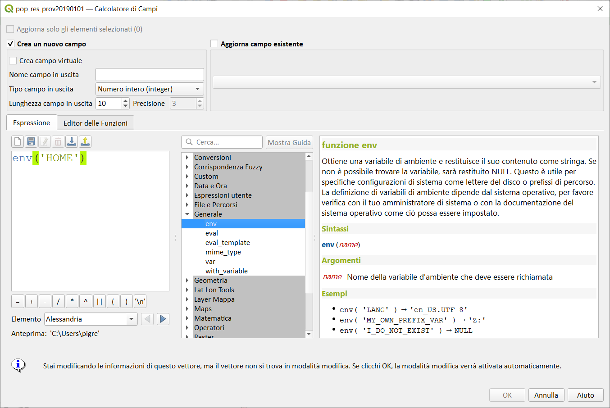
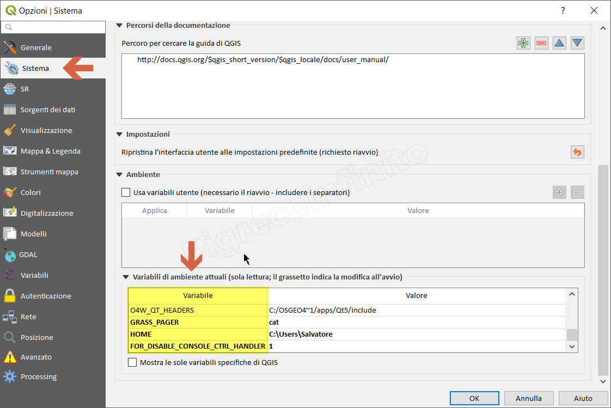
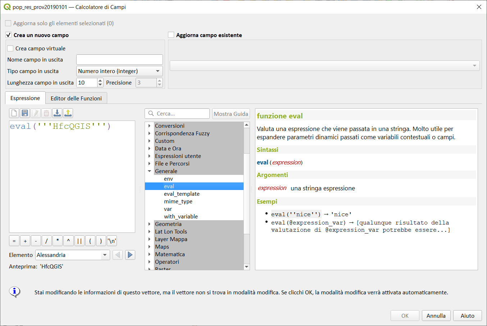
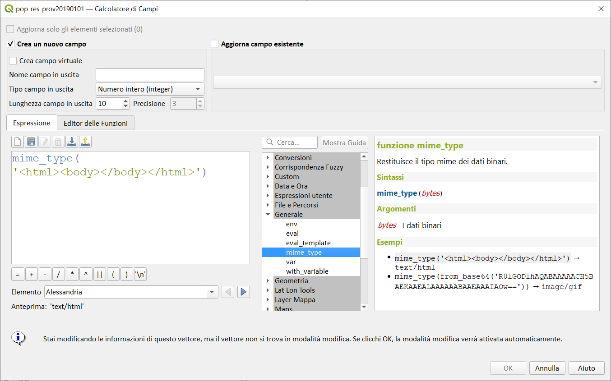
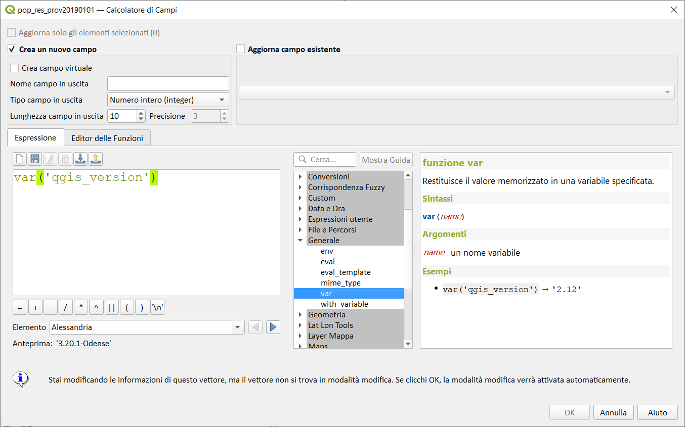

# Gruppo Generale

!!! Abstract
    **Questo gruppo contiene un assortimento di funzioni generiche.**

---

## env

Ottiene una variabile di ambiente e restituisce il suo contenuto come stringa. Se non è possibile trovare la variabile, sarà restituito `NULL`. Questo è utile per specifiche configurazioni di sistema come lettere del disco o prefissi di percorso. La definizione di variabili di ambiente dipende dal sistema operativo, per favore verifica con il tuo amministratore di sistema o con la documentazione del sistema operativo come ciò possa essere impostato.

Sintassi:

* env(*<span style="color:red;">name</span>*)

Argomento:

* *<span style="color:red;">name</span>* Nome della variabile d'ambiente che deve essere richiamata

Esempi:

```
env( 'LANG' ) → 'en_US.UTF-8'
env( 'MIO_PREFISSO_VARIABILE' ) → 'Z:'
env( 'I_DO_NOT_EXIST' ) → NULL
env( 'COMPUTERNAME') → LENOVO_PC (è il mio notebook)
env('home') → 'C:\Users\Salvatore'
```



alcune varibili li trovate qui: Impostazioni | Opzioni | Sistema



---

## eval

Valuta una espressione che viene passata in una stringa. Molto utile per espandere parametri dinamici passati come variabili contestuali o campi.

Sintassi:

* eval(*<span style="color:red;">expression</span>*)

Argomento:

* *<span style="color:red;">expression</span>* una stringa espressione

Esempi:

```
eval(''nice'') → 'nice'
eval(@expression_var) → [qualsiasi risultato che dalla valutazione di @expression_var potrebbe assumere...]
eval( '@row_number  +10') → 11
```



---

## eval_template

Valuta un modello che viene passato in una stringa. Molto utile per espandere parametri dinamici passati come variabili contestuali o campi.

Sintassi:

* eval_template(*<span style="color:red;">template</span>*)

Argomento:

* *<span style="color:red;">template</span>* una stringa modello

Esempi:

```
eval_template('QGIS [% upper(\'rocks\') %]') → QGIS ROCKS
```


---

## mime_type

Restituisce il tipo mime dei dati binari.

Sintassi:

* mime_type(_<span style="color:red;">bytes</span>_)

Argomento:

* _<span style="color:red;">bytes</span>_ I dati binari

Esempi:

```
mime_type('<html><body></body></html>') → text/html
mime_type(from_base64('R0lGODlhAQABAAAAACH5BAEKAAEALAAAAAABAAEAAAIAOw==')) → image/gif
```



---

## var

Restituisce il valore memorizzato in una variabile specificata.

Sintassi:

* var(*<span style="color:red;">name</span>*)

Argomento:

* <span style="color:red;">name</span> un nome variabile

Esempi:

```
var('qgis_version') → '3.0.2-Girona'
var('user_account_name') → 'Salvatore'
```

Osservazioni

Come argomento va usato il nome della variabile senza la chioccila altrimenti non funziona.



---

## with_variable

Questa funzione imposta una variabile per qualunque codice di espressione che sarà fornita come argomento terzo. Questo è utile solamente per espressioni complicate, in cui lo stesso valore calcolato deve essere usato in posti differenti.

Sintassi:

* with_variable(*<span style="color:red;">name</span>, <span style="color:red;">value</span>, <span style="color:red;">expression</span>*)

Argomento:

* *<span style="color:red;">name</span>* il nome della variabile da impostare
* *<span style="color:red;">value</span>* il valore da impostare
* *<span style="color:red;">expression</span>* l'espressione per la quale la variabile sarà disponibile

Esempi:

```
with_variable('my_sum', 1 + 2 + 3, @my_sum * 2 + @my_sum * 5) → 42
with_variable('duepigreco',2*3.1415, @duepigreco * 2 +@duepigreco*5 ) → 43.981
```


---
