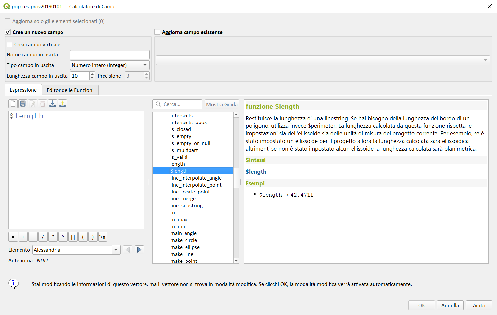
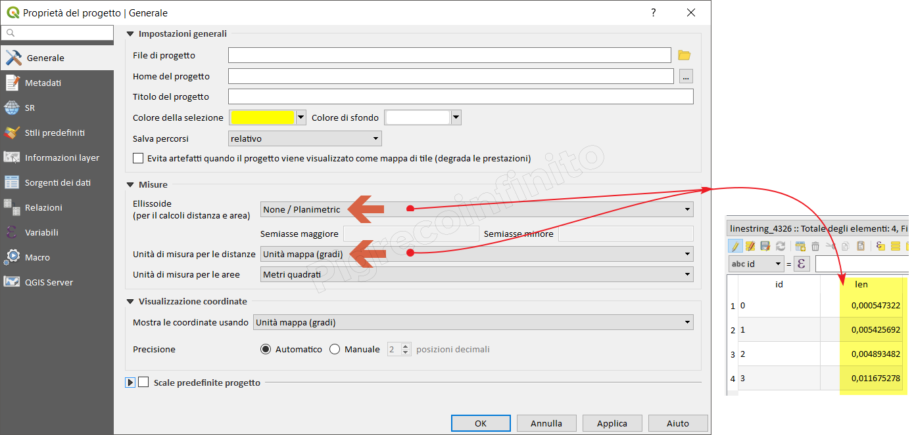

# $length

Restituisce la lunghezza di una linestring. Se hai bisogno della lunghezza del bordo di un poligono, utilizza invece _$perimeter_. La lunghezza calcolata da questa funzione rispetta le impostazioni sia dell'ellissoide sia delle unità di misura del progetto corrente. Per esempio, se è stato impostato un ellissoide per il progetto allora la lunghezza calcolata sarà ellisoidica altrimenti se non è stato impostato alcun ellissoide la lunghezza calcolata sarà planimetrica.

## Sintassi

$length

## Esempi

* $length → 42.4711 

## nota bene

Come evidenziano nella definizione della funzione, `$length` calcola la lunghezza rispettando le impostazioni di progetto:

Occorre cambiare entrambe le impostazioni, sia quelle dell'ellissoide → 'None/Planimetric' sia le Unità di misura per le distanze' → Gradi

Queste modofiche non valgono per l'etichettatura, la lunghezza sarà quella relativa alla geometria e quindi al suo SR.

## osservazioni

il $ indica che è relativo all'elemento corrente e non ha bisogno di argomenti.
