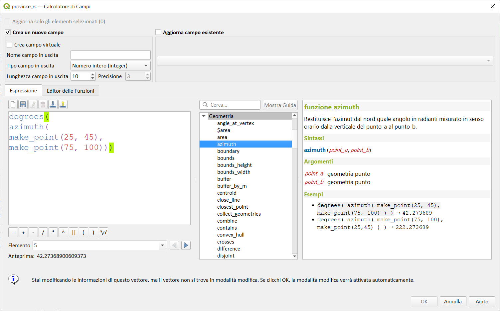

# Azimuth

Restituisce l'azimut dal nord quale angolo in radianti misurato in senso orario dalla verticale del punto_a al punto_b.

## Sintassi

azimuth(<span style="color:red;">point_a</span>, <span style="color:red;">point_b</span>)

## Argomenti

* <span style="color:red;">point_a</span> geometria punto
* <span style="color:red;">point_b</span> geometria punto

## Esempi

```
* degrees( azimuth( make_point(25, 45), make_point(75, 100) ) ) → 42.273689
* degrees( azimuth( make_point(75, 100), make_point(25,45) ) ) → 222.273689
```





## nota bene

**Azimuth** per definizione restituisce un angolo in radianti, per trasformarlo in gradi usare la funzione [degrees()](../matematica/degrees.md)


