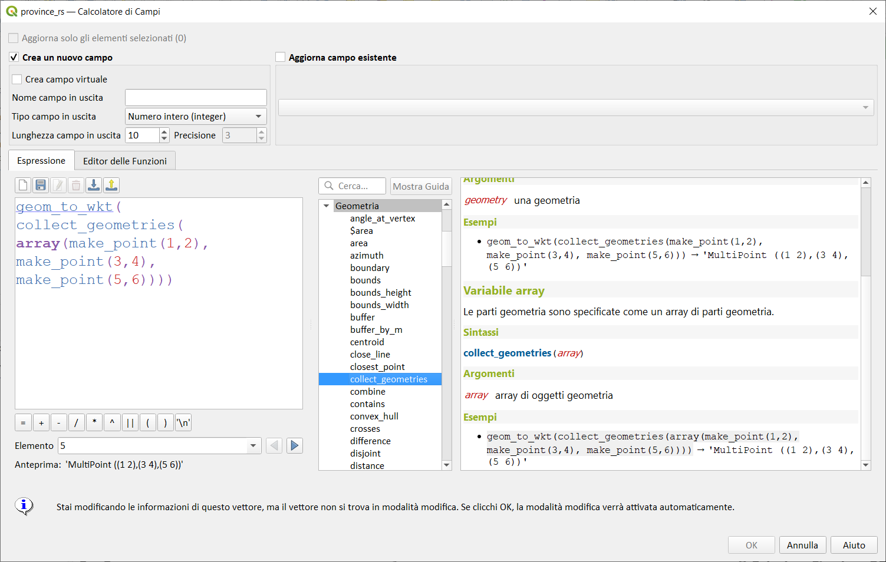
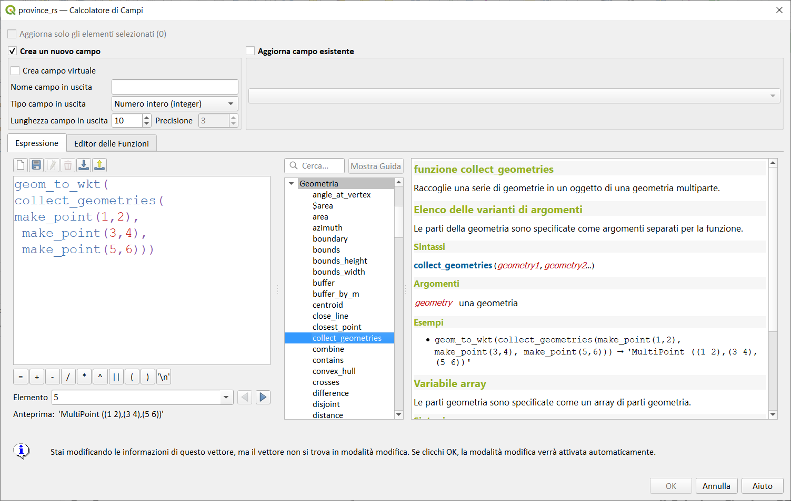

# collect_geometries

Raccoglie un set di geometrie in un oggetto geometria multiparte.

## Variante geometry

## Sintassi

- collect_geometries(_geometry1_, _geometry2_...)

## Argomenti

* _geometry_ geometria sulla quale cercare il punto più vicino

## Esempi

* `geom_to_wkt(collect_geometries(make_point(1,2), make_point(3,4), make_point(5,6))) → 'MultiPoint ((1 2),(3 4),(5 6))'`

## Variante con array

## Sintassi

- collect_geometries(_array_)

## Argomenti

* _array_ array con oggetti geometrici

## Esempi

* `geom_to_wkt(collect_geometries(array(make_point(1,2), make_point(3,4), make_point(5,6)))) → 'MultiPoint ((1 2),(3 4),(5 6))'`

## nota bene

--

## osservazioni

