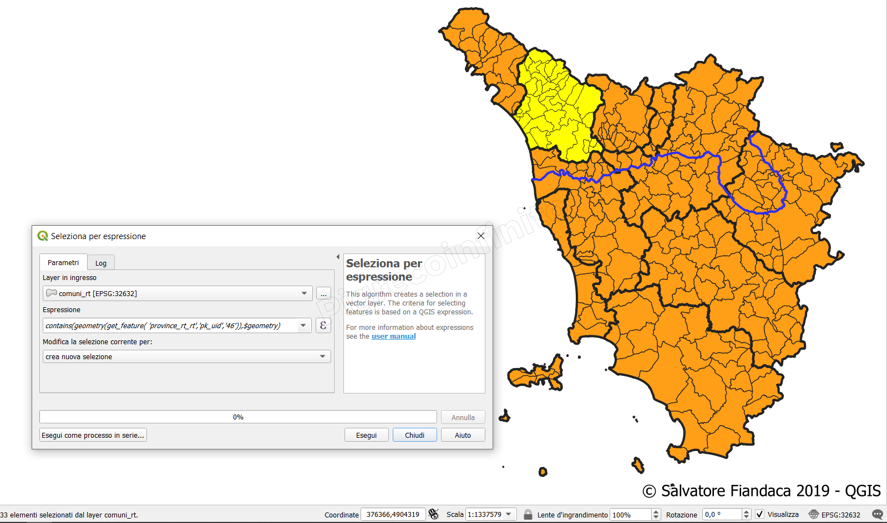

# contains

Verifica se una geometria ne contiene un'altra. Restituisce vero (1) se, e solo se, nessun punto della _geometria b_ giace all'esterno della _geometria a_, ed almeno un punto dell'interno di _b_ si trova all'interno di _a_.

## Sintassi

contains(_geometry a, geometry b_)

## Argomenti

* _geometry a_ una geometria
* _geometry b_ una geometria

## Esempi

* `contains( geom_from_wkt( 'POLYGON((0 0, 0 1, 1 1, 1 0, 0 0))' ), geom_from_wkt( 'POINT(0.5 0.5 )' ) ) → vero`
* `contains( geom_from_wkt( 'POLYGON((0 0, 0 1, 1 1, 1 0, 0 0))' ), geom_from_wkt( 'LINESTRING(3 3, 4 4, 5 5)' ) ) → falso`

## nota bene

--

## osservazioni

Usando algoritmo `Seleziona per espressione` presente in strumenti di processing oppure  (ctrl+F3):

espressione usata:

`contains(geometry(get_feature( 'province_rt_rt','pk_uid','46')),$geometry)`

dove:

* _geometry a_ è `geometry(get_feature( 'province_rt_rt','pk_uid','46'))`
* _geometry b_ è `$geometry`

seleziono tutti i comuni `contains` (contenuti) nella provincia con `pk_uid`46 (Lucca)

**PS:** potrei anche negare (`NOT`) l'espressione per selezionare il complementare (tutti i comuni tranne quelli contenuti nella provincia di Lucca).

`NOT contains(geometry(get_feature( 'province_rt_rt','pk_uid','46')),$geometry)`
