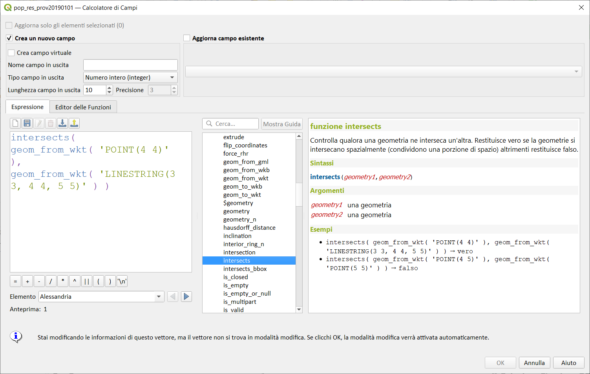

# intersects

Controlla qualora una geometria ne interseca un'altra. Restituisce true (1) se la geometrie si intersecano spazialmente (condividono una porzione di spazio) altrimenti da false (0).

## Sintassi

intersects(_geometry a_, _geometry b_)

## Argomenti

* _geometry a_ una geometria
* _geometry b_ una geometria

## Esempi

* `intersects( geom_from_wkt( 'POINT(4 4)' ), geom_from_wkt( 'LINESTRING(3 3, 4 4, 5 5)' ) ) → vero`
* `intersects( geom_from_wkt( 'POINT(4 5)' ), geom_from_wkt( 'POINT(5 5)' ) ) → falso`

## nota bene

--

## osservazioni

Usando algoritmo `Seleziona per espressione` presente in strumenti di processing oppure  (ctrl+F3):

espressione usata:

`intersects(geometry(get_feature( 'province_rt_rt','pk_uid','46')),$geometry)`

dove:

* _geometry a_ è `geometry(get_feature( 'province_rt_rt','pk_uid','46'))`
* _geometry b_ è `$geometry`

seleziono tutti i comuni `intersects` (interseca) nella provincia con `pk_uid`46 (Lucca)

**PS:** potrei anche negare (`NOT`) l'espressione per selezionare il complementare (tutti i comuni tranne quelli intersecati con la provincia di Lucca).

`NOT intersects(geometry(get_feature( 'province_rt_rt','pk_uid','46')),$geometry)`
