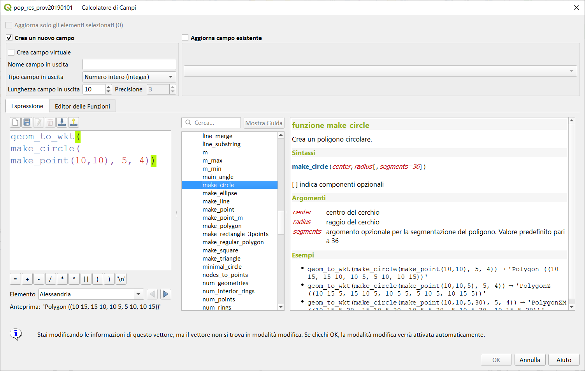
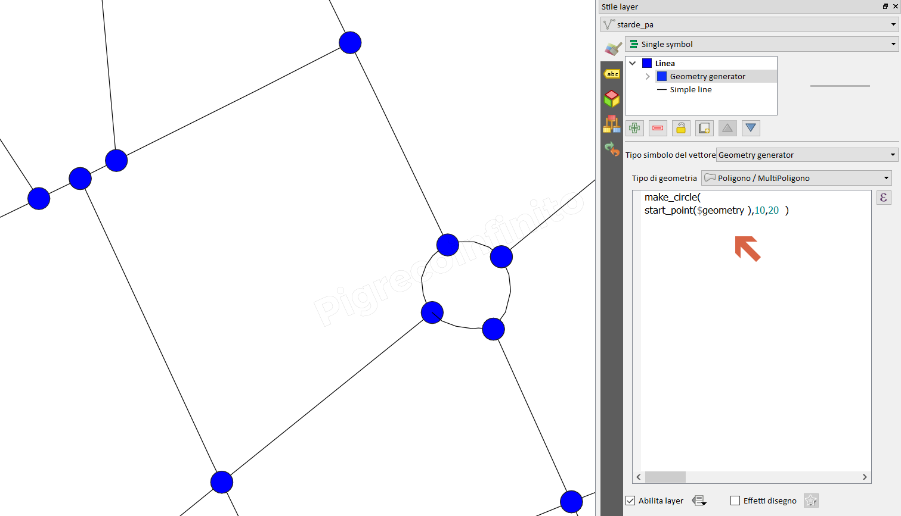

# make_circle

Crea un poligono circolare.

## Sintassi

- make_circle(_center_, _radius_[, _segments=36_])

[ ] indica componenti opzionali

## Argomenti

* _center_ centro del cerchio
* _radius_ raggio del cerchio
* _segments_ argomento opzionale per la segmentazione del poligono. Valore predefinito pari a 36

## Esempi

* `geom_to_wkt(make_circle(make_point(10,10), 5, 4)) → 'Polygon ((10 15, 15 10, 10 5, 5 10, 10 15))'`
* `geom_to_wkt(make_circle(make_point(10,10,5), 5, 4)) → 'PolygonZ ((10 15 5, 15 10 5, 10 5 5, 5 10 5, 10 15 5))''`
* `geom_to_wkt(make_circle(make_point(10,10,5,30), 5, 4)) → 'PolygonZM ((10 15 5 30, 15 10 5 30, 10 5 5 30, 5 10 5 30, 10 15 5 30))'`

## nota bene

--

## osservazioni

--

