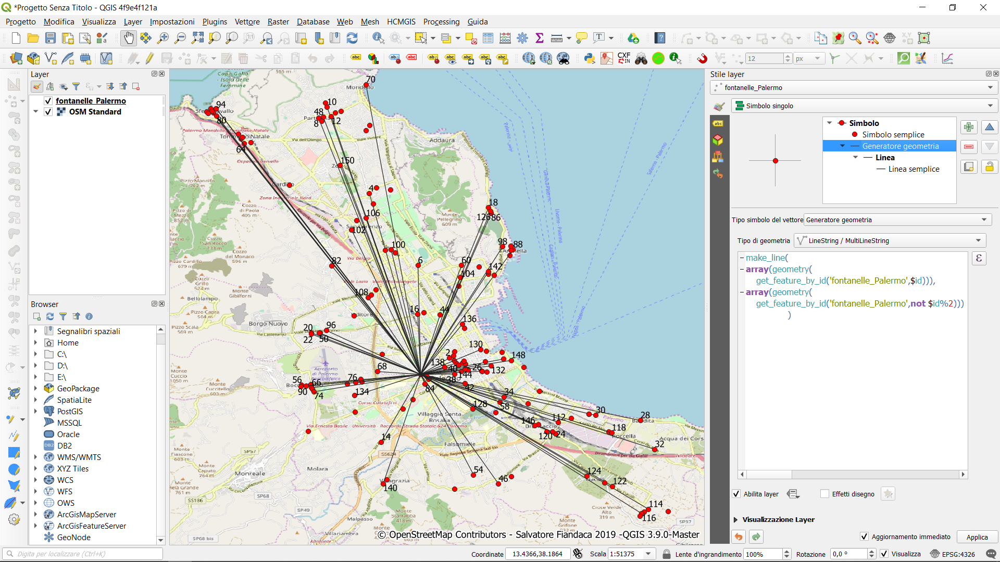

# make_line

Crea una geometria linea da una serie di geometrie punto.

## Sintassi

- make_line(_<span style="color:red;">point1</span>_, _<span style="color:red;">point2</span>_, …_)

## Argomenti

* _<span style="color:red;">point</span>_ una geometria punto

## Esempi

* `geom_to_wkt(make_line(make_point(2,4),make_point(3,5))) → 'LineString (2 4, 3 5)'`
* `geom_to_wkt(make_line(make_point(2,4),make_point(3,5),make_point(9,7))) → 'LineString (2 4, 3 5, 9 7)'`


## Array variant >= QGIS 3.10

I vertici di linea sono specificati come una matrice di punti.

## Sintassi

- make_line(_<span style="color:red;">array</span>_)

## Argomenti

* _<span style="color:red;">array</span>_ Matrice di punti

## Esempio

* `geom_to_wkt(make_line(array(make_point(2,4),make_point(3,5),make_point(9,7)))) → 'LineString (2 4, 3 5, 9 7)'`



**Espressione usata**

```
make_line(
array(geometry(
	get_feature_by_id('fontanelle_Palermo',$id))),
array(geometry(
	get_feature_by_id('fontanelle_Palermo',not $id%2)))
		) 
```

## nota bene

--

## osservazioni

--


