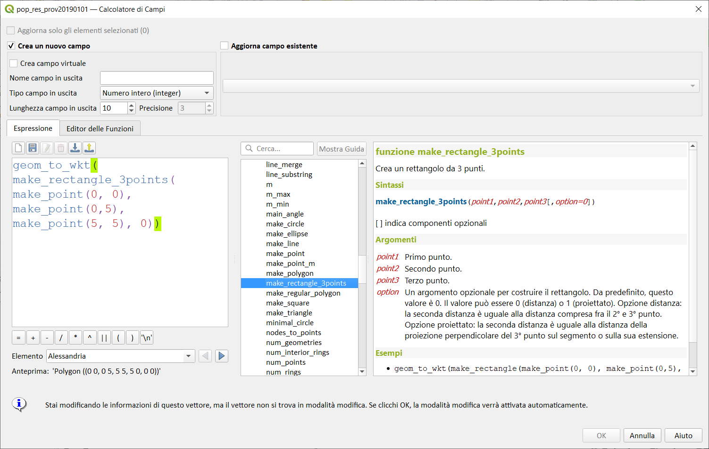

# make_rectangle_3points

Crea un rettangolo da 3 punti.

## Sintassi

- make_rectangle_3points(_point1_,_point2_,_point3_[,option=0]…)

## Argomenti

* _point1_ Primo punto
* _point2_ Secondo punto
* _point3_ Terzo punto
* _option_ Un argomento facoltativo per costruire il rettangolo. Di default questo valore è 0. Il valore può essere 0 (distanza) o 1 (proiettato). Distanza opzione: la seconda distanza è uguale alla distanza tra il 2 ° e il 3 ° punto. Opzione proiettata: la seconda distanza è uguale alla distanza della proiezione perpendicolare del terzo punto sul segmento o della sua estensione.

## Esempi

* `geom_to_wkt(make_rectangle_3points(make_point(0, 0), make_point(0,5), make_point(5, 5), 0))) → 'Polygon ((0 0, 0 5, 5 5, 5 0, 0 0))'`
* `geom_to_wkt(make_rectangle_3points(make_point(0, 0), make_point(0,5),make_point(5, 3), 1))) → 'Polygon ((0 0, 0 5, 5 5, 5 0, 0 0))'`

## nota bene

--

## osservazioni

--

