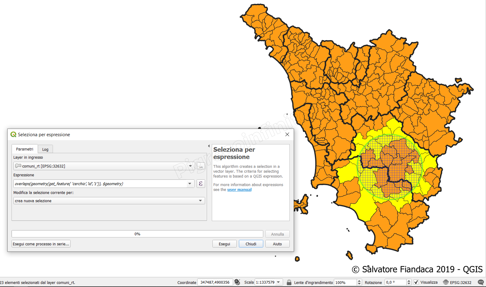

# overlaps

Controlla qualora una geometria si sovrapponga ad un'altra. Restituisce true (1) se le geometrie condividono aree, ma non sono completamente contenute una nell'altra.

## Sintassi

- overlaps(_geometry1_, _geometry2_)

## Argomenti

* _geometry1_ una geometria
* _geometry2_ una geometria

## Esempi

* `overlaps( geom_from_wkt( 'LINESTRING(3 5, 4 4, 5 5, 5 3)' ), geom_from_wkt( 'LINESTRING(3 3, 4 4, 5 5)' ) ) → 1`
* `overlaps( geom_from_wkt( 'LINESTRING(0 0, 1 1)' ), geom_from_wkt( 'LINESTRING(3 3, 4 4, 5 5)' ) ) → 0`

## nota bene

--

## osservazioni

Usando algoritmo `Seleziona per espressione` presente in strumenti di processing oppure  (ctrl+F3):

espressione usata:

`overlaps(geometry(get_feature( 'cerchio','id','1')), $geometry)`

dove:

* _geometry1_ è `geometry(get_feature('cerchio','id','1'))`
* _geometry2_ è `$geometry`

seleziono tutti i comuni `overlaps` (sovrapposti) al cerchio in figura.

**PS:** potrei anche negare (`NOT`) l'espressione per selezionare il complementare (tutti i comuni tranne quelli sovrapposti con il cerchio).

`NOT overlaps(geometry(get_feature('cerchio','id','1')),$geometry)`
