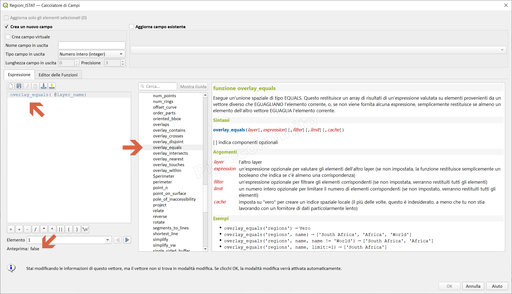

# overlay_equals

Restituisce se l'elemento corrente è spazialmente uguale ad almeno un elemento da un layer target o un array di risultati basati su espressioni per gli elementi nel layer target che sono spazialmente uguali all'elemento corrente.

Ulteriori informazioni sul predicato GEOS "Equals" sottostante, come descritto nella funzione PostGIS [ST_Equals](https://postgis.net/docs/ST_Equals.html).

## Sintassi

- overlay_equals(_<span style="color:red;">layer</span>_[,_<span style="color:red;">expression</span>_][,_<span style="color:red;">filter</span>_][,_<span style="color:red;">limit</span>_][,_<span style="color:red;">cache=false</span>_]_)

[ ] indica componenti opzionali

## Argomenti

* _<span style="color:red;">layer</span>_ l'altro layer;
* _<span style="color:red;">expression</span>_ un'espressione opzionale per valutare gli elementi dell'altro layer (se non impostata, la funzione restituisce semplicemente un booleano che indica se c'è almeno una corrispondenza);
* _<span style="color:red;">filter</span>_ un'espressione opzionale per filtrare gli elementi corrispondenti (se non impostata, verranno restituiti tutti gli elementi);
* _<span style="color:red;">limit</span>_ un numero intero opzionale per limitare il numero di elementi corrispondenti (se non impostato, verranno restituiti tutti gli elementi);
* _<span style="color:red;">cache</span>_ imposta su "vero" per creare un indice spaziale locale (il più delle volte, questo è indesiderato, a meno che tu non stia lavorando con un fornitore di dati particolarmente lento);

[ ] indica componenti opzionali

## Esempi

```
* overlay_equals('regions') → true se l'elemento corrente è spazialmente uguale ad una regione
* overlay_equals('regions', filter:= population > 10000) → vero se l'elemento corrente è spazialmente uguale ad una regione con una popolazione maggiore di 10000
* overlay_equals('regions', name) → un array di nomi, per le regioni spazialmente uguali all'elemento corrente
* array_to_string(overlay_equals('regions', name)) → una stringa come lista di nomi separati da virgole, per le regioni spazialmente uguali all'elemento corrente
* overlay_equals('regions', name)[0] → una stringa con il nome della regione spazialmente uguale all'elemento corrente
* array_sort(overlay_equals(layer:='regions', expression:="name", filter:= population > 10000)) → un array ordinato di nomi, per le regioni spazialmente uguali all'elemento corrente e con una popolazione superiore a 10000
* overlay_equals(layer:='regions', expression:= geom_to_wkt($geometry), limit:=2) → un array di geometrie (in WKT), per un massimo di due regioni spazialmente uguali all'elemento corrente
```



## nota bene

--

## osservazioni

--
