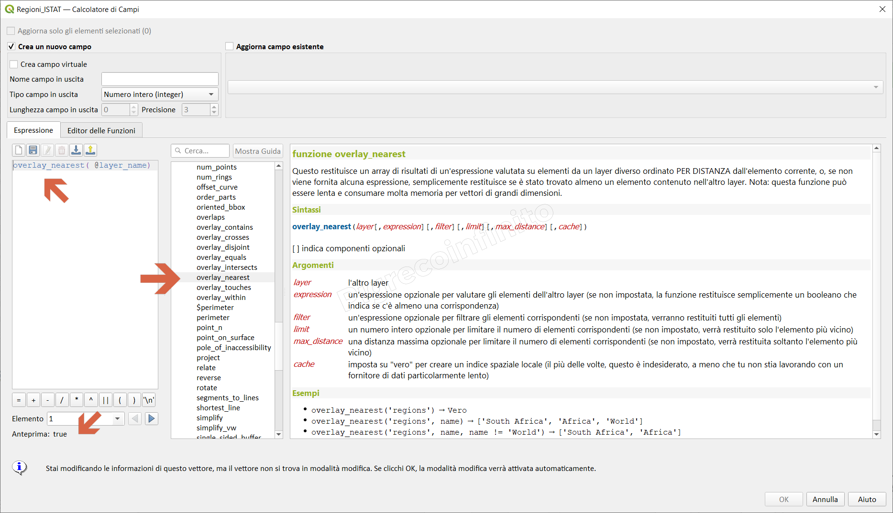

# overlay_nearest

Restituisce se l'elemento corrente ha elementi da un layer target entro una data distanza o un array di risultati basati su espressioni per gli elementi nel layer di target entro una distanza dall'elemento corrente.

Nota: questa funzione può essere lenta e consuma molta memoria per layer con molte feature.

## Sintassi

- overlay_contains(_<span style="color:red;">layer</span>_[,_<span style="color:red;">expression</span>_][,_<span style="color:red;">filter</span>_][,_<span style="color:red;">limit=1</span>_][,_<span style="color:red;">max_distance</span>_][,_<span style="color:red;">cache</span>_]_)

[ ] indica componenti opzionali

## Argomenti

* _<span style="color:red;">layer</span>_ l'altro layer;
* _<span style="color:red;">expression</span>_ un'espressione opzionale per valutare gli elementi dell'altro layer (se non impostata, la funzione restituisce semplicemente un booleano che indica se c'è almeno una corrispondenza);
* _<span style="color:red;">filter</span>_ un'espressione opzionale per filtrare gli elementi corrispondenti (se non impostata, verranno restituiti tutti gli elementi);
* _<span style="color:red;">limit</span>_ un numero intero opzionale per limitare il numero di elementi corrispondenti (se non impostato, verranno restituiti tutti gli elementi);
* _<span style="color:red;">max_distance</span>_ una distanza opzionale per limitare la ricerca di elementi corrispondenti. Se non impostato, verranno usati tutti gli elementi nel layer di destinazione.
* _<span style="color:red;">cache</span>_ imposta su "vero" per creare un indice spaziale locale (il più delle volte, questo è indesiderato, a meno che tu non stia lavorando con un fornitore di dati particolarmente lento);

[ ] indica componenti opzionali

## Esempi

```
* overlay_nearest('airports') → true se il layer "airports" ha almeno un elemento
* overlay_nearest('airports', max_distance:= 5000) → vero se è presente un aeroporto entro una distanza di 5000 unità di mappa dall'elemento corrente
* overlay_nearest('airports', name) → il nome dell'aereoporto più vicino all'elemento corrente, come array
* array_to_string(overlay_nearest('airports', name)) → il nome dell'aereoporto più vicino all'elemento corrente, come stringa
* overlay_nearest(layer:='airports', expression:= name, max_distance:= 5000) → il nome dell'aereoporto più vicino entro una distanza di 5000 unità di mappa dall'elemento corrente, come array
* overlay_nearest(layer:='airports', expression:="name", filter:= "Use"='Civilian', limit:=3) → un array di nomi, per un massimo di tre aeroeporti civili più vicini ordinati per distanza
* overlay_nearest(layer:='airports', expression:="name", limit:= -1, max_distance:= 5000) → un array di nomi, per tutti gli aeroporti entro una distanza di 5000 unità di mappa dall'elemento corrente, ordinato per distanza.
```



## nota bene

--

## osservazioni

Esempio 45: <http://hfcqgis.opendatasicilia.it/it/latest/esempi/linea_min_distanza2.html>
